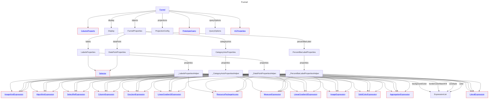

```mermaid
---
title: Funnel
---
graph 
AggregationExpression[<a href='/layout/erd/AggregationExpression'>AggregationExpression</a>]
style AggregationExpression stroke:#ff0000,stroke-width:1px
AlgorithmExpression[<a href='/layout/erd/AlgorithmExpression'>AlgorithmExpression</a>]
style AlgorithmExpression stroke:#ff0000,stroke-width:1px
CategoryAxisProperties[CategoryAxisProperties]
ColumnExpression[<a href='/layout/erd/ColumnExpression'>ColumnExpression</a>]
style ColumnExpression stroke:#ff0000,stroke-width:1px
ColumnProperty[<a href='/layout/erd/ColumnProperty'>ColumnProperty</a>]
style ColumnProperty stroke:#ff0000,stroke-width:1px
DataPointProperties[DataPointProperties]
Display[Display]
ExpressionList[ExpressionList]
Funnel[<a href='/layout/erd/Funnel'>Funnel</a>]
FunnelProperties[FunnelProperties]
GeoJsonExpression[<a href='/layout/erd/GeoJsonExpression'>GeoJsonExpression</a>]
style GeoJsonExpression stroke:#ff0000,stroke-width:1px
ImageExpression[<a href='/layout/erd/ImageExpression'>ImageExpression</a>]
style ImageExpression stroke:#ff0000,stroke-width:1px
ImageKindExpression[<a href='/layout/erd/ImageKindExpression'>ImageKindExpression</a>]
style ImageKindExpression stroke:#ff0000,stroke-width:1px
LabelsProperties[LabelsProperties]
LinearGradient2Expression[<a href='/layout/erd/LinearGradient2Expression'>LinearGradient2Expression</a>]
style LinearGradient2Expression stroke:#ff0000,stroke-width:1px
LinearGradient3Expression[<a href='/layout/erd/LinearGradient3Expression'>LinearGradient3Expression</a>]
style LinearGradient3Expression stroke:#ff0000,stroke-width:1px
LiteralExpression[<a href='/layout/erd/LiteralExpression'>LiteralExpression</a>]
style LiteralExpression stroke:#ff0000,stroke-width:1px
MeasureExpression[<a href='/layout/erd/MeasureExpression'>MeasureExpression</a>]
style MeasureExpression stroke:#ff0000,stroke-width:1px
PercentBarLabelProperties[PercentBarLabelProperties]
ProjectionConfig[ProjectionConfig]
PrototypeQuery[<a href='/layout/erd/PrototypeQuery'>PrototypeQuery</a>]
style PrototypeQuery stroke:#ff0000,stroke-width:1px
QueryOptions[QueryOptions]
ResourcePackageAccess[<a href='/layout/erd/ResourcePackageAccess'>ResourcePackageAccess</a>]
style ResourcePackageAccess stroke:#ff0000,stroke-width:1px
SelectRefExpression[<a href='/layout/erd/SelectRefExpression'>SelectRefExpression</a>]
style SelectRefExpression stroke:#ff0000,stroke-width:1px
Selector[<a href='/layout/erd/Selector'>Selector</a>]
style Selector stroke:#ff0000,stroke-width:1px
SolidColorExpression[<a href='/layout/erd/SolidColorExpression'>SolidColorExpression</a>]
style SolidColorExpression stroke:#ff0000,stroke-width:1px
VCProperties[<a href='/layout/erd/VCProperties'>VCProperties</a>]
style VCProperties stroke:#ff0000,stroke-width:1px
_CategoryAxisPropertiesHelper[_CategoryAxisPropertiesHelper]
_DataPointPropertiesHelper[_DataPointPropertiesHelper]
_LabelsPropertiesHelper[_LabelsPropertiesHelper]
_PercentBarLabelPropertiesHelper[_PercentBarLabelPropertiesHelper]
_PercentBarLabelPropertiesHelper ---> SelectRefExpression
PercentBarLabelProperties --->|properties| _PercentBarLabelPropertiesHelper
_CategoryAxisPropertiesHelper ---> ResourcePackageAccess
_DataPointPropertiesHelper ---> GeoJsonExpression
_LabelsPropertiesHelper ---> ColumnExpression
_PercentBarLabelPropertiesHelper ---> LinearGradient3Expression
_PercentBarLabelPropertiesHelper ---> ImageKindExpression
_LabelsPropertiesHelper ---> MeasureExpression
_PercentBarLabelPropertiesHelper ---> ColumnExpression
_CategoryAxisPropertiesHelper ---> ImageKindExpression
_DataPointPropertiesHelper ---> ImageKindExpression
Funnel --->|objects| FunnelProperties
_DataPointPropertiesHelper ---> ImageExpression
_PercentBarLabelPropertiesHelper ---> AlgorithmExpression
_DataPointPropertiesHelper ---> MeasureExpression
FunnelProperties --->|labels| LabelsProperties
_CategoryAxisPropertiesHelper ---> SelectRefExpression
_DataPointPropertiesHelper ---> AlgorithmExpression
Funnel --->|projections| ProjectionConfig
DataPointProperties ---> Selector
_CategoryAxisPropertiesHelper ---> AlgorithmExpression
_CategoryAxisPropertiesHelper ---> LinearGradient3Expression
_LabelsPropertiesHelper ---> GeoJsonExpression
Funnel --->|queryOptions| QueryOptions
FunnelProperties --->|dataPoint| DataPointProperties
_PercentBarLabelPropertiesHelper --->|color| ExpressionList
_DataPointPropertiesHelper ---> ResourcePackageAccess
FunnelProperties --->|categoryAxis| CategoryAxisProperties
_CategoryAxisPropertiesHelper ---> LiteralExpression
_PercentBarLabelPropertiesHelper ---> LinearGradient2Expression
_CategoryAxisPropertiesHelper ---> GeoJsonExpression
_PercentBarLabelPropertiesHelper ---> ImageExpression
_CategoryAxisPropertiesHelper ---> SolidColorExpression
Funnel --->|display| Display
_DataPointPropertiesHelper ---> LinearGradient2Expression
FunnelProperties --->|percentBarLabel| PercentBarLabelProperties
_DataPointPropertiesHelper ---> ColumnExpression
_PercentBarLabelPropertiesHelper ---> AggregationExpression
_DataPointPropertiesHelper ---> AggregationExpression
_LabelsPropertiesHelper ---> LinearGradient3Expression
_CategoryAxisPropertiesHelper ---> ColumnExpression
_LabelsPropertiesHelper ---> AlgorithmExpression
Funnel ---> PrototypeQuery
_CategoryAxisPropertiesHelper --->|axisStyle| ExpressionList
_DataPointPropertiesHelper ---> SelectRefExpression
_LabelsPropertiesHelper ---> SelectRefExpression
_PercentBarLabelPropertiesHelper ---> ResourcePackageAccess
Funnel ---> ColumnProperty
DataPointProperties --->|properties| _DataPointPropertiesHelper
_PercentBarLabelPropertiesHelper ---> SolidColorExpression
LabelsProperties --->|properties| _LabelsPropertiesHelper
Funnel ---> VCProperties
_DataPointPropertiesHelper ---> SolidColorExpression
_LabelsPropertiesHelper ---> LinearGradient2Expression
_PercentBarLabelPropertiesHelper ---> GeoJsonExpression
_LabelsPropertiesHelper ---> SolidColorExpression
CategoryAxisProperties --->|properties| _CategoryAxisPropertiesHelper
_LabelsPropertiesHelper ---> LiteralExpression
_LabelsPropertiesHelper ---> ImageKindExpression
_CategoryAxisPropertiesHelper ---> AggregationExpression
_LabelsPropertiesHelper ---> AggregationExpression
_DataPointPropertiesHelper --->|borderColorMatchFill| ExpressionList
_CategoryAxisPropertiesHelper ---> ImageExpression
_DataPointPropertiesHelper ---> LiteralExpression
_PercentBarLabelPropertiesHelper ---> MeasureExpression
_LabelsPropertiesHelper --->|backgroundColor| ExpressionList
_DataPointPropertiesHelper ---> LinearGradient3Expression
_CategoryAxisPropertiesHelper ---> MeasureExpression
LabelsProperties ---> Selector
_CategoryAxisPropertiesHelper ---> LinearGradient2Expression
_LabelsPropertiesHelper ---> ResourcePackageAccess
_LabelsPropertiesHelper ---> ImageExpression
_PercentBarLabelPropertiesHelper ---> LiteralExpression
```