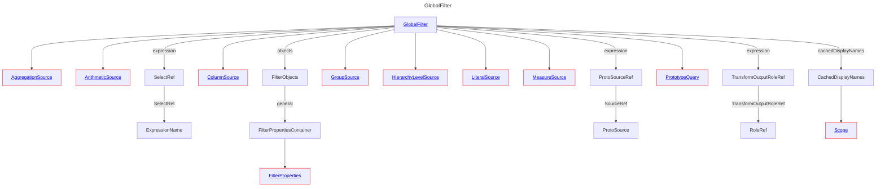

```mermaid
---
title: GlobalFilter
---
graph 
AggregationSource[<a href='/layout/erd/AggregationSource'>AggregationSource</a>]
style AggregationSource stroke:#ff0000,stroke-width:1px
ArithmeticSource[<a href='/layout/erd/ArithmeticSource'>ArithmeticSource</a>]
style ArithmeticSource stroke:#ff0000,stroke-width:1px
CachedDisplayNames[CachedDisplayNames]
ColumnSource[<a href='/layout/erd/ColumnSource'>ColumnSource</a>]
style ColumnSource stroke:#ff0000,stroke-width:1px
ExpressionName[ExpressionName]
FilterObjects[FilterObjects]
FilterProperties[<a href='/layout/erd/FilterProperties'>FilterProperties</a>]
style FilterProperties stroke:#ff0000,stroke-width:1px
FilterPropertiesContainer[FilterPropertiesContainer]
GlobalFilter[<a href='/layout/erd/GlobalFilter'>GlobalFilter</a>]
GroupSource[<a href='/layout/erd/GroupSource'>GroupSource</a>]
style GroupSource stroke:#ff0000,stroke-width:1px
HierarchyLevelSource[<a href='/layout/erd/HierarchyLevelSource'>HierarchyLevelSource</a>]
style HierarchyLevelSource stroke:#ff0000,stroke-width:1px
LiteralSource[<a href='/layout/erd/LiteralSource'>LiteralSource</a>]
style LiteralSource stroke:#ff0000,stroke-width:1px
MeasureSource[<a href='/layout/erd/MeasureSource'>MeasureSource</a>]
style MeasureSource stroke:#ff0000,stroke-width:1px
ProtoSource[ProtoSource]
ProtoSourceRef[ProtoSourceRef]
PrototypeQuery[<a href='/layout/erd/PrototypeQuery'>PrototypeQuery</a>]
style PrototypeQuery stroke:#ff0000,stroke-width:1px
RoleRef[RoleRef]
Scope[<a href='/layout/erd/Scope'>Scope</a>]
style Scope stroke:#ff0000,stroke-width:1px
SelectRef[SelectRef]
TransformOutputRoleRef[TransformOutputRoleRef]
FilterPropertiesContainer ---> FilterProperties
GlobalFilter --->|expression| TransformOutputRoleRef
ProtoSourceRef --->|SourceRef| ProtoSource
CachedDisplayNames ---> Scope
GlobalFilter ---> ArithmeticSource
GlobalFilter ---> AggregationSource
GlobalFilter --->|expression| ProtoSourceRef
GlobalFilter ---> LiteralSource
TransformOutputRoleRef --->|TransformOutputRoleRef| RoleRef
GlobalFilter --->|objects| FilterObjects
GlobalFilter ---> PrototypeQuery
SelectRef --->|SelectRef| ExpressionName
GlobalFilter --->|expression| SelectRef
GlobalFilter --->|cachedDisplayNames| CachedDisplayNames
GlobalFilter ---> HierarchyLevelSource
GlobalFilter ---> ColumnSource
GlobalFilter ---> GroupSource
FilterObjects --->|general| FilterPropertiesContainer
GlobalFilter ---> MeasureSource
```