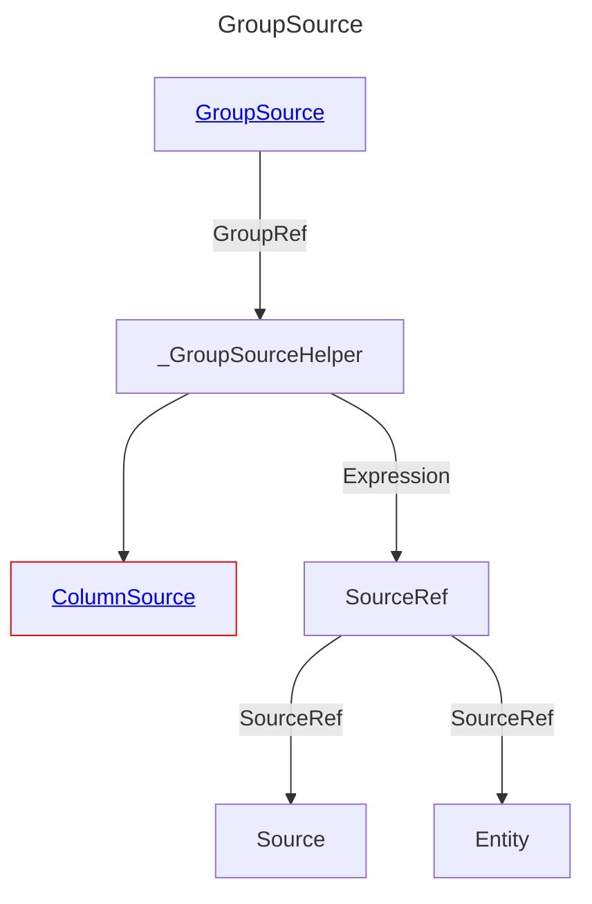

```mermaid
---
title: GroupSource
---
graph 
ColumnSource[<a href='/layout/erd/ColumnSource'>ColumnSource</a>]
style ColumnSource stroke:#ff0000,stroke-width:1px
Entity[Entity]
GroupSource[<a href='/layout/erd/GroupSource'>GroupSource</a>]
Source[Source]
SourceRef[SourceRef]
_GroupSourceHelper[_GroupSourceHelper]
SourceRef --->|SourceRef| Source
GroupSource --->|GroupRef| _GroupSourceHelper
_GroupSourceHelper ---> ColumnSource
_GroupSourceHelper --->|Expression| SourceRef
SourceRef --->|SourceRef| Entity
```