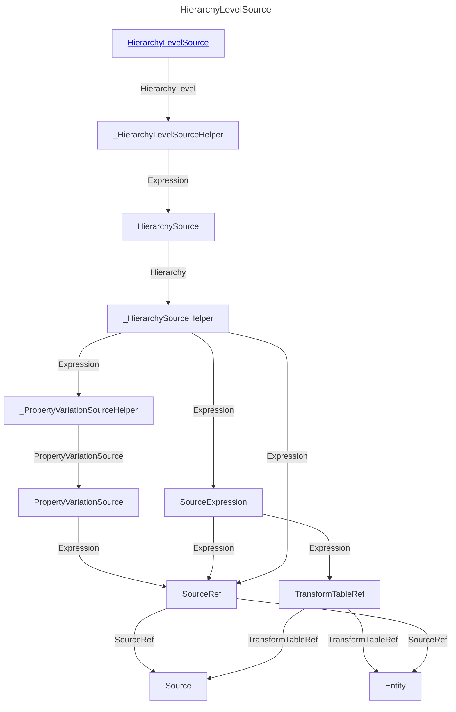

```mermaid
---
title: HierarchyLevelSource
---
graph 
Entity[Entity]
HierarchyLevelSource[<a href='/layout/erd/HierarchyLevelSource'>HierarchyLevelSource</a>]
HierarchySource[HierarchySource]
PropertyVariationSource[PropertyVariationSource]
Source[Source]
SourceExpression[SourceExpression]
SourceRef[SourceRef]
TransformTableRef[TransformTableRef]
_HierarchyLevelSourceHelper[_HierarchyLevelSourceHelper]
_HierarchySourceHelper[_HierarchySourceHelper]
_PropertyVariationSourceHelper[_PropertyVariationSourceHelper]
TransformTableRef --->|TransformTableRef| Entity
PropertyVariationSource --->|Expression| SourceRef
_HierarchyLevelSourceHelper --->|Expression| HierarchySource
_HierarchySourceHelper --->|Expression| _PropertyVariationSourceHelper
HierarchyLevelSource --->|HierarchyLevel| _HierarchyLevelSourceHelper
SourceRef --->|SourceRef| Source
SourceExpression --->|Expression| SourceRef
_HierarchySourceHelper --->|Expression| SourceExpression
_HierarchySourceHelper --->|Expression| SourceRef
SourceRef --->|SourceRef| Entity
_PropertyVariationSourceHelper --->|PropertyVariationSource| PropertyVariationSource
HierarchySource --->|Hierarchy| _HierarchySourceHelper
SourceExpression --->|Expression| TransformTableRef
TransformTableRef --->|TransformTableRef| Source
```