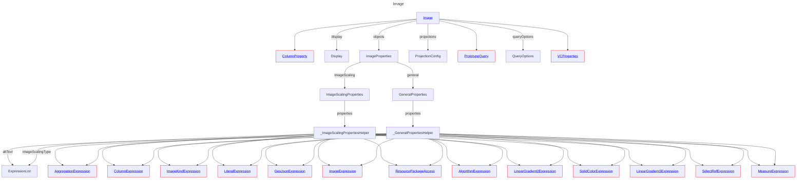

```mermaid
---
title: Image
---
graph 
AggregationExpression[<a href='/layout/erd/AggregationExpression'>AggregationExpression</a>]
style AggregationExpression stroke:#ff0000,stroke-width:1px
AlgorithmExpression[<a href='/layout/erd/AlgorithmExpression'>AlgorithmExpression</a>]
style AlgorithmExpression stroke:#ff0000,stroke-width:1px
ColumnExpression[<a href='/layout/erd/ColumnExpression'>ColumnExpression</a>]
style ColumnExpression stroke:#ff0000,stroke-width:1px
ColumnProperty[<a href='/layout/erd/ColumnProperty'>ColumnProperty</a>]
style ColumnProperty stroke:#ff0000,stroke-width:1px
Display[Display]
ExpressionList[ExpressionList]
GeneralProperties[GeneralProperties]
GeoJsonExpression[<a href='/layout/erd/GeoJsonExpression'>GeoJsonExpression</a>]
style GeoJsonExpression stroke:#ff0000,stroke-width:1px
Image[<a href='/layout/erd/Image'>Image</a>]
ImageExpression[<a href='/layout/erd/ImageExpression'>ImageExpression</a>]
style ImageExpression stroke:#ff0000,stroke-width:1px
ImageKindExpression[<a href='/layout/erd/ImageKindExpression'>ImageKindExpression</a>]
style ImageKindExpression stroke:#ff0000,stroke-width:1px
ImageProperties[ImageProperties]
ImageScalingProperties[ImageScalingProperties]
LinearGradient2Expression[<a href='/layout/erd/LinearGradient2Expression'>LinearGradient2Expression</a>]
style LinearGradient2Expression stroke:#ff0000,stroke-width:1px
LinearGradient3Expression[<a href='/layout/erd/LinearGradient3Expression'>LinearGradient3Expression</a>]
style LinearGradient3Expression stroke:#ff0000,stroke-width:1px
LiteralExpression[<a href='/layout/erd/LiteralExpression'>LiteralExpression</a>]
style LiteralExpression stroke:#ff0000,stroke-width:1px
MeasureExpression[<a href='/layout/erd/MeasureExpression'>MeasureExpression</a>]
style MeasureExpression stroke:#ff0000,stroke-width:1px
ProjectionConfig[ProjectionConfig]
PrototypeQuery[<a href='/layout/erd/PrototypeQuery'>PrototypeQuery</a>]
style PrototypeQuery stroke:#ff0000,stroke-width:1px
QueryOptions[QueryOptions]
ResourcePackageAccess[<a href='/layout/erd/ResourcePackageAccess'>ResourcePackageAccess</a>]
style ResourcePackageAccess stroke:#ff0000,stroke-width:1px
SelectRefExpression[<a href='/layout/erd/SelectRefExpression'>SelectRefExpression</a>]
style SelectRefExpression stroke:#ff0000,stroke-width:1px
SolidColorExpression[<a href='/layout/erd/SolidColorExpression'>SolidColorExpression</a>]
style SolidColorExpression stroke:#ff0000,stroke-width:1px
VCProperties[<a href='/layout/erd/VCProperties'>VCProperties</a>]
style VCProperties stroke:#ff0000,stroke-width:1px
_GeneralPropertiesHelper[_GeneralPropertiesHelper]
_ImageScalingPropertiesHelper[_ImageScalingPropertiesHelper]
ImageProperties --->|general| GeneralProperties
_ImageScalingPropertiesHelper ---> ResourcePackageAccess
Image --->|projections| ProjectionConfig
_GeneralPropertiesHelper --->|altText| ExpressionList
_ImageScalingPropertiesHelper ---> ColumnExpression
_ImageScalingPropertiesHelper ---> LinearGradient3Expression
_ImageScalingPropertiesHelper ---> LiteralExpression
_GeneralPropertiesHelper ---> AggregationExpression
_GeneralPropertiesHelper ---> ColumnExpression
_ImageScalingPropertiesHelper ---> AggregationExpression
_GeneralPropertiesHelper ---> ImageKindExpression
_ImageScalingPropertiesHelper ---> ImageExpression
_GeneralPropertiesHelper ---> LiteralExpression
_GeneralPropertiesHelper ---> GeoJsonExpression
_ImageScalingPropertiesHelper ---> MeasureExpression
_GeneralPropertiesHelper ---> ImageExpression
_GeneralPropertiesHelper ---> ResourcePackageAccess
_ImageScalingPropertiesHelper ---> LinearGradient2Expression
_ImageScalingPropertiesHelper ---> SelectRefExpression
Image --->|objects| ImageProperties
_GeneralPropertiesHelper ---> AlgorithmExpression
ImageScalingProperties --->|properties| _ImageScalingPropertiesHelper
Image ---> ColumnProperty
_ImageScalingPropertiesHelper ---> SolidColorExpression
_ImageScalingPropertiesHelper ---> GeoJsonExpression
_GeneralPropertiesHelper ---> LinearGradient2Expression
_ImageScalingPropertiesHelper ---> AlgorithmExpression
Image ---> VCProperties
GeneralProperties --->|properties| _GeneralPropertiesHelper
_GeneralPropertiesHelper ---> SolidColorExpression
Image --->|queryOptions| QueryOptions
_GeneralPropertiesHelper ---> LinearGradient3Expression
_GeneralPropertiesHelper ---> SelectRefExpression
_ImageScalingPropertiesHelper ---> ImageKindExpression
Image ---> PrototypeQuery
_GeneralPropertiesHelper ---> MeasureExpression
Image --->|display| Display
_ImageScalingPropertiesHelper --->|imageScalingType| ExpressionList
ImageProperties --->|imageScaling| ImageScalingProperties
```