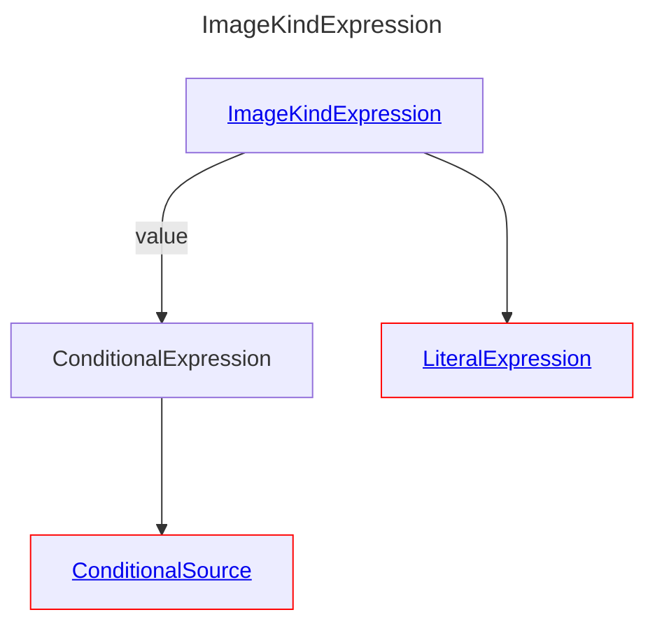

```mermaid
---
title: ImageKindExpression
---
graph 
ConditionalExpression[ConditionalExpression]
ConditionalSource[<a href='/layout/erd/ConditionalSource'>ConditionalSource</a>]
style ConditionalSource stroke:#ff0000,stroke-width:1px
ImageKindExpression[<a href='/layout/erd/ImageKindExpression'>ImageKindExpression</a>]
LiteralExpression[<a href='/layout/erd/LiteralExpression'>LiteralExpression</a>]
style LiteralExpression stroke:#ff0000,stroke-width:1px
ImageKindExpression ---> LiteralExpression
ConditionalExpression ---> ConditionalSource
ImageKindExpression --->|value| ConditionalExpression
```