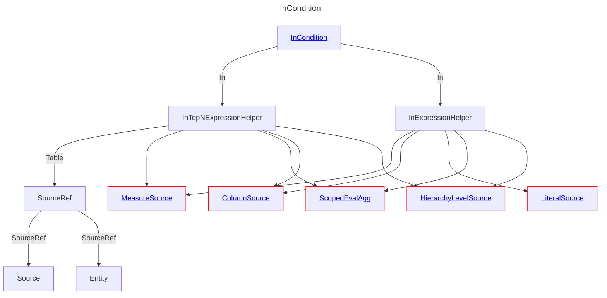

```mermaid
---
title: InCondition
---
graph 
ColumnSource[<a href='/layout/erd/ColumnSource'>ColumnSource</a>]
style ColumnSource stroke:#ff0000,stroke-width:1px
Entity[Entity]
HierarchyLevelSource[<a href='/layout/erd/HierarchyLevelSource'>HierarchyLevelSource</a>]
style HierarchyLevelSource stroke:#ff0000,stroke-width:1px
InCondition[<a href='/layout/erd/InCondition'>InCondition</a>]
InExpressionHelper[InExpressionHelper]
InTopNExpressionHelper[InTopNExpressionHelper]
LiteralSource[<a href='/layout/erd/LiteralSource'>LiteralSource</a>]
style LiteralSource stroke:#ff0000,stroke-width:1px
MeasureSource[<a href='/layout/erd/MeasureSource'>MeasureSource</a>]
style MeasureSource stroke:#ff0000,stroke-width:1px
ScopedEvalAgg[<a href='/layout/erd/ScopedEvalAgg'>ScopedEvalAgg</a>]
style ScopedEvalAgg stroke:#ff0000,stroke-width:1px
Source[Source]
SourceRef[SourceRef]
InTopNExpressionHelper --->|Table| SourceRef
InTopNExpressionHelper ---> MeasureSource
InExpressionHelper ---> MeasureSource
InTopNExpressionHelper ---> ScopedEvalAgg
InExpressionHelper ---> ColumnSource
SourceRef --->|SourceRef| Source
InCondition --->|In| InTopNExpressionHelper
InCondition --->|In| InExpressionHelper
InExpressionHelper ---> LiteralSource
InExpressionHelper ---> ScopedEvalAgg
InExpressionHelper ---> HierarchyLevelSource
SourceRef --->|SourceRef| Entity
InTopNExpressionHelper ---> ColumnSource
InTopNExpressionHelper ---> HierarchyLevelSource
```