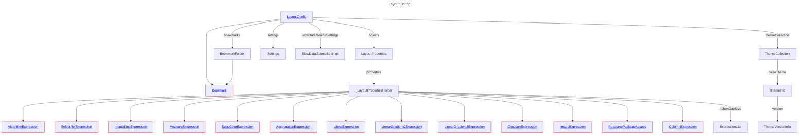

```mermaid
---
title: LayoutConfig
---
graph 
AggregationExpression[<a href='/layout/erd/AggregationExpression'>AggregationExpression</a>]
style AggregationExpression stroke:#ff0000,stroke-width:1px
AlgorithmExpression[<a href='/layout/erd/AlgorithmExpression'>AlgorithmExpression</a>]
style AlgorithmExpression stroke:#ff0000,stroke-width:1px
Bookmark[<a href='/layout/erd/Bookmark'>Bookmark</a>]
style Bookmark stroke:#ff0000,stroke-width:1px
BookmarkFolder[BookmarkFolder]
ColumnExpression[<a href='/layout/erd/ColumnExpression'>ColumnExpression</a>]
style ColumnExpression stroke:#ff0000,stroke-width:1px
ExpressionList[ExpressionList]
GeoJsonExpression[<a href='/layout/erd/GeoJsonExpression'>GeoJsonExpression</a>]
style GeoJsonExpression stroke:#ff0000,stroke-width:1px
ImageExpression[<a href='/layout/erd/ImageExpression'>ImageExpression</a>]
style ImageExpression stroke:#ff0000,stroke-width:1px
ImageKindExpression[<a href='/layout/erd/ImageKindExpression'>ImageKindExpression</a>]
style ImageKindExpression stroke:#ff0000,stroke-width:1px
LayoutConfig[<a href='/layout/erd/LayoutConfig'>LayoutConfig</a>]
LayoutProperties[LayoutProperties]
LinearGradient2Expression[<a href='/layout/erd/LinearGradient2Expression'>LinearGradient2Expression</a>]
style LinearGradient2Expression stroke:#ff0000,stroke-width:1px
LinearGradient3Expression[<a href='/layout/erd/LinearGradient3Expression'>LinearGradient3Expression</a>]
style LinearGradient3Expression stroke:#ff0000,stroke-width:1px
LiteralExpression[<a href='/layout/erd/LiteralExpression'>LiteralExpression</a>]
style LiteralExpression stroke:#ff0000,stroke-width:1px
MeasureExpression[<a href='/layout/erd/MeasureExpression'>MeasureExpression</a>]
style MeasureExpression stroke:#ff0000,stroke-width:1px
ResourcePackageAccess[<a href='/layout/erd/ResourcePackageAccess'>ResourcePackageAccess</a>]
style ResourcePackageAccess stroke:#ff0000,stroke-width:1px
SelectRefExpression[<a href='/layout/erd/SelectRefExpression'>SelectRefExpression</a>]
style SelectRefExpression stroke:#ff0000,stroke-width:1px
Settings[Settings]
SlowDataSourceSettings[SlowDataSourceSettings]
SolidColorExpression[<a href='/layout/erd/SolidColorExpression'>SolidColorExpression</a>]
style SolidColorExpression stroke:#ff0000,stroke-width:1px
ThemeCollection[ThemeCollection]
ThemeInfo[ThemeInfo]
ThemeVersionInfo[ThemeVersionInfo]
_LayoutPropertiesHelper[_LayoutPropertiesHelper]
_LayoutPropertiesHelper ---> AlgorithmExpression
_LayoutPropertiesHelper ---> SelectRefExpression
LayoutConfig ---> Bookmark
_LayoutPropertiesHelper ---> ImageKindExpression
LayoutProperties --->|properties| _LayoutPropertiesHelper
LayoutConfig --->|objects| LayoutProperties
_LayoutPropertiesHelper ---> MeasureExpression
LayoutConfig --->|themeCollection| ThemeCollection
_LayoutPropertiesHelper ---> SolidColorExpression
LayoutConfig --->|slowDataSourceSettings| SlowDataSourceSettings
_LayoutPropertiesHelper ---> AggregationExpression
ThemeCollection --->|baseTheme| ThemeInfo
_LayoutPropertiesHelper ---> LiteralExpression
_LayoutPropertiesHelper ---> LinearGradient2Expression
_LayoutPropertiesHelper ---> LinearGradient3Expression
ThemeInfo --->|version| ThemeVersionInfo
LayoutConfig --->|settings| Settings
_LayoutPropertiesHelper ---> GeoJsonExpression
BookmarkFolder ---> Bookmark
_LayoutPropertiesHelper ---> ImageExpression
_LayoutPropertiesHelper ---> ResourcePackageAccess
_LayoutPropertiesHelper ---> ColumnExpression
LayoutConfig --->|bookmarks| BookmarkFolder
_LayoutPropertiesHelper --->|ribbonGapSize| ExpressionList
```