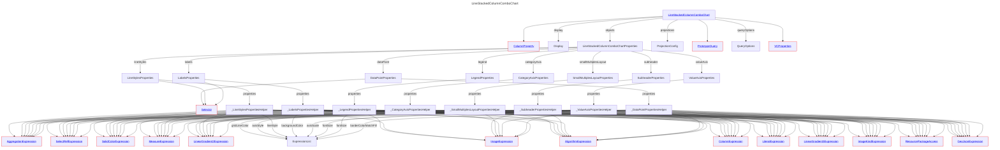

```mermaid
---
title: LineStackedColumnComboChart
---
graph 
AggregationExpression[<a href='/layout/erd/AggregationExpression'>AggregationExpression</a>]
style AggregationExpression stroke:#ff0000,stroke-width:1px
AlgorithmExpression[<a href='/layout/erd/AlgorithmExpression'>AlgorithmExpression</a>]
style AlgorithmExpression stroke:#ff0000,stroke-width:1px
CategoryAxisProperties[CategoryAxisProperties]
ColumnExpression[<a href='/layout/erd/ColumnExpression'>ColumnExpression</a>]
style ColumnExpression stroke:#ff0000,stroke-width:1px
ColumnProperty[<a href='/layout/erd/ColumnProperty'>ColumnProperty</a>]
style ColumnProperty stroke:#ff0000,stroke-width:1px
DataPointProperties[DataPointProperties]
Display[Display]
ExpressionList[ExpressionList]
GeoJsonExpression[<a href='/layout/erd/GeoJsonExpression'>GeoJsonExpression</a>]
style GeoJsonExpression stroke:#ff0000,stroke-width:1px
ImageExpression[<a href='/layout/erd/ImageExpression'>ImageExpression</a>]
style ImageExpression stroke:#ff0000,stroke-width:1px
ImageKindExpression[<a href='/layout/erd/ImageKindExpression'>ImageKindExpression</a>]
style ImageKindExpression stroke:#ff0000,stroke-width:1px
LabelsProperties[LabelsProperties]
LegendProperties[LegendProperties]
LineStackedColumnComboChart[<a href='/layout/erd/LineStackedColumnComboChart'>LineStackedColumnComboChart</a>]
LineStackedColumnComboChartProperties[LineStackedColumnComboChartProperties]
LineStylesProperties[LineStylesProperties]
LinearGradient2Expression[<a href='/layout/erd/LinearGradient2Expression'>LinearGradient2Expression</a>]
style LinearGradient2Expression stroke:#ff0000,stroke-width:1px
LinearGradient3Expression[<a href='/layout/erd/LinearGradient3Expression'>LinearGradient3Expression</a>]
style LinearGradient3Expression stroke:#ff0000,stroke-width:1px
LiteralExpression[<a href='/layout/erd/LiteralExpression'>LiteralExpression</a>]
style LiteralExpression stroke:#ff0000,stroke-width:1px
MeasureExpression[<a href='/layout/erd/MeasureExpression'>MeasureExpression</a>]
style MeasureExpression stroke:#ff0000,stroke-width:1px
ProjectionConfig[ProjectionConfig]
PrototypeQuery[<a href='/layout/erd/PrototypeQuery'>PrototypeQuery</a>]
style PrototypeQuery stroke:#ff0000,stroke-width:1px
QueryOptions[QueryOptions]
ResourcePackageAccess[<a href='/layout/erd/ResourcePackageAccess'>ResourcePackageAccess</a>]
style ResourcePackageAccess stroke:#ff0000,stroke-width:1px
SelectRefExpression[<a href='/layout/erd/SelectRefExpression'>SelectRefExpression</a>]
style SelectRefExpression stroke:#ff0000,stroke-width:1px
Selector[<a href='/layout/erd/Selector'>Selector</a>]
style Selector stroke:#ff0000,stroke-width:1px
SmallMultiplesLayoutProperties[SmallMultiplesLayoutProperties]
SolidColorExpression[<a href='/layout/erd/SolidColorExpression'>SolidColorExpression</a>]
style SolidColorExpression stroke:#ff0000,stroke-width:1px
SubheaderProperties[SubheaderProperties]
VCProperties[<a href='/layout/erd/VCProperties'>VCProperties</a>]
style VCProperties stroke:#ff0000,stroke-width:1px
ValueAxisProperties[ValueAxisProperties]
_CategoryAxisPropertiesHelper[_CategoryAxisPropertiesHelper]
_DataPointPropertiesHelper[_DataPointPropertiesHelper]
_LabelsPropertiesHelper[_LabelsPropertiesHelper]
_LegendPropertiesHelper[_LegendPropertiesHelper]
_LineStylesPropertiesHelper[_LineStylesPropertiesHelper]
_SmallMultiplesLayoutPropertiesHelper[_SmallMultiplesLayoutPropertiesHelper]
_SubheaderPropertiesHelper[_SubheaderPropertiesHelper]
_ValueAxisPropertiesHelper[_ValueAxisPropertiesHelper]
_LineStylesPropertiesHelper ---> ResourcePackageAccess
_LineStylesPropertiesHelper ---> LiteralExpression
_LineStylesPropertiesHelper ---> ImageKindExpression
SubheaderProperties --->|properties| _SubheaderPropertiesHelper
_LegendPropertiesHelper ---> ColumnExpression
_SmallMultiplesLayoutPropertiesHelper --->|gridLineColor| ExpressionList
_LabelsPropertiesHelper ---> ColumnExpression
_LineStylesPropertiesHelper ---> ColumnExpression
_LabelsPropertiesHelper ---> MeasureExpression
_DataPointPropertiesHelper ---> ImageKindExpression
LineStackedColumnComboChartProperties --->|subheader| SubheaderProperties
ValueAxisProperties --->|properties| _ValueAxisPropertiesHelper
_SubheaderPropertiesHelper ---> AggregationExpression
LegendProperties --->|properties| _LegendPropertiesHelper
LineStylesProperties --->|properties| _LineStylesPropertiesHelper
_SmallMultiplesLayoutPropertiesHelper ---> AlgorithmExpression
_SmallMultiplesLayoutPropertiesHelper ---> LinearGradient3Expression
_SubheaderPropertiesHelper ---> SelectRefExpression
_LineStylesPropertiesHelper ---> GeoJsonExpression
_ValueAxisPropertiesHelper ---> LinearGradient3Expression
_LegendPropertiesHelper ---> SolidColorExpression
_CategoryAxisPropertiesHelper ---> SolidColorExpression
_SmallMultiplesLayoutPropertiesHelper ---> MeasureExpression
_LegendPropertiesHelper ---> ResourcePackageAccess
_SmallMultiplesLayoutPropertiesHelper ---> ImageKindExpression
_CategoryAxisPropertiesHelper ---> ColumnExpression
_LineStylesPropertiesHelper ---> SolidColorExpression
_SubheaderPropertiesHelper ---> SolidColorExpression
_CategoryAxisPropertiesHelper --->|axisStyle| ExpressionList
LineStackedColumnComboChart ---> ColumnProperty
_LabelsPropertiesHelper ---> SelectRefExpression
_LineStylesPropertiesHelper --->|lineStyle| ExpressionList
_LineStylesPropertiesHelper ---> AggregationExpression
LineStackedColumnComboChartProperties --->|labels| LabelsProperties
_LabelsPropertiesHelper ---> SolidColorExpression
_CategoryAxisPropertiesHelper ---> AggregationExpression
_LineStylesPropertiesHelper ---> SelectRefExpression
_LabelsPropertiesHelper ---> AggregationExpression
_LabelsPropertiesHelper --->|backgroundColor| ExpressionList
_CategoryAxisPropertiesHelper ---> MeasureExpression
LineStackedColumnComboChart --->|display| Display
_ValueAxisPropertiesHelper ---> SelectRefExpression
LineStackedColumnComboChartProperties --->|categoryAxis| CategoryAxisProperties
LineStackedColumnComboChartProperties --->|lineStyles| LineStylesProperties
_ValueAxisPropertiesHelper ---> ImageKindExpression
LineStackedColumnComboChart --->|projections| ProjectionConfig
_CategoryAxisPropertiesHelper ---> SelectRefExpression
_SmallMultiplesLayoutPropertiesHelper ---> ColumnExpression
_SmallMultiplesLayoutPropertiesHelper ---> GeoJsonExpression
DataPointProperties ---> Selector
_CategoryAxisPropertiesHelper ---> AlgorithmExpression
_LegendPropertiesHelper ---> ImageExpression
_SubheaderPropertiesHelper ---> MeasureExpression
LineStackedColumnComboChartProperties --->|smallMultiplesLayout| SmallMultiplesLayoutProperties
_ValueAxisPropertiesHelper ---> LinearGradient2Expression
LineStackedColumnComboChartProperties --->|valueAxis| ValueAxisProperties
_DataPointPropertiesHelper ---> ColumnExpression
_SubheaderPropertiesHelper ---> LinearGradient2Expression
_LegendPropertiesHelper ---> ImageKindExpression
_LabelsPropertiesHelper ---> LinearGradient2Expression
_ValueAxisPropertiesHelper --->|axisScale| ExpressionList
_LineStylesPropertiesHelper ---> ImageExpression
_ValueAxisPropertiesHelper ---> AggregationExpression
_LegendPropertiesHelper ---> LiteralExpression
_LineStylesPropertiesHelper ---> AlgorithmExpression
_DataPointPropertiesHelper ---> LinearGradient3Expression
_SubheaderPropertiesHelper --->|fontSize| ExpressionList
LineStackedColumnComboChart ---> VCProperties
_LabelsPropertiesHelper ---> ResourcePackageAccess
_DataPointPropertiesHelper ---> ResourcePackageAccess
_LegendPropertiesHelper --->|fontSize| ExpressionList
_CategoryAxisPropertiesHelper ---> ResourcePackageAccess
_SubheaderPropertiesHelper ---> ImageExpression
_LegendPropertiesHelper ---> GeoJsonExpression
_CategoryAxisPropertiesHelper ---> ImageKindExpression
_LineStylesPropertiesHelper ---> LinearGradient2Expression
LineStackedColumnComboChart ---> PrototypeQuery
_LineStylesPropertiesHelper ---> MeasureExpression
_LabelsPropertiesHelper ---> GeoJsonExpression
LineStackedColumnComboChart --->|objects| LineStackedColumnComboChartProperties
_CategoryAxisPropertiesHelper ---> LiteralExpression
_LegendPropertiesHelper ---> MeasureExpression
_DataPointPropertiesHelper ---> LinearGradient2Expression
_DataPointPropertiesHelper ---> AggregationExpression
_ValueAxisPropertiesHelper ---> MeasureExpression
_LabelsPropertiesHelper ---> LinearGradient3Expression
_SmallMultiplesLayoutPropertiesHelper ---> LinearGradient2Expression
_SmallMultiplesLayoutPropertiesHelper ---> ImageExpression
LabelsProperties --->|properties| _LabelsPropertiesHelper
_DataPointPropertiesHelper --->|borderColorMatchFill| ExpressionList
CategoryAxisProperties --->|properties| _CategoryAxisPropertiesHelper
_LabelsPropertiesHelper ---> LiteralExpression
_CategoryAxisPropertiesHelper ---> ImageExpression
_ValueAxisPropertiesHelper ---> LiteralExpression
_SmallMultiplesLayoutPropertiesHelper ---> LiteralExpression
_DataPointPropertiesHelper ---> LiteralExpression
_SubheaderPropertiesHelper ---> AlgorithmExpression
_SmallMultiplesLayoutPropertiesHelper ---> ResourcePackageAccess
_CategoryAxisPropertiesHelper ---> LinearGradient2Expression
_ValueAxisPropertiesHelper ---> SolidColorExpression
_SubheaderPropertiesHelper ---> ColumnExpression
_DataPointPropertiesHelper ---> GeoJsonExpression
_SubheaderPropertiesHelper ---> LiteralExpression
_LegendPropertiesHelper ---> SelectRefExpression
_SubheaderPropertiesHelper ---> LinearGradient3Expression
SmallMultiplesLayoutProperties --->|properties| _SmallMultiplesLayoutPropertiesHelper
_DataPointPropertiesHelper ---> ImageExpression
_LegendPropertiesHelper ---> LinearGradient3Expression
_LegendPropertiesHelper ---> AlgorithmExpression
_DataPointPropertiesHelper ---> MeasureExpression
_LegendPropertiesHelper ---> LinearGradient2Expression
_ValueAxisPropertiesHelper ---> GeoJsonExpression
_DataPointPropertiesHelper ---> AlgorithmExpression
LineStackedColumnComboChartProperties --->|dataPoint| DataPointProperties
_CategoryAxisPropertiesHelper ---> LinearGradient3Expression
LineStackedColumnComboChart --->|queryOptions| QueryOptions
_ValueAxisPropertiesHelper ---> ColumnExpression
_SubheaderPropertiesHelper ---> ImageKindExpression
_CategoryAxisPropertiesHelper ---> GeoJsonExpression
_ValueAxisPropertiesHelper ---> AlgorithmExpression
LineStackedColumnComboChartProperties --->|legend| LegendProperties
_ValueAxisPropertiesHelper ---> ImageExpression
_LineStylesPropertiesHelper ---> LinearGradient3Expression
_LabelsPropertiesHelper ---> AlgorithmExpression
_DataPointPropertiesHelper ---> SelectRefExpression
_LegendPropertiesHelper ---> AggregationExpression
_SmallMultiplesLayoutPropertiesHelper ---> SelectRefExpression
LineStylesProperties ---> Selector
DataPointProperties --->|properties| _DataPointPropertiesHelper
_DataPointPropertiesHelper ---> SolidColorExpression
_LabelsPropertiesHelper ---> ImageKindExpression
_ValueAxisPropertiesHelper ---> ResourcePackageAccess
_SmallMultiplesLayoutPropertiesHelper ---> AggregationExpression
_SubheaderPropertiesHelper ---> ResourcePackageAccess
_SmallMultiplesLayoutPropertiesHelper ---> SolidColorExpression
LabelsProperties ---> Selector
_SubheaderPropertiesHelper ---> GeoJsonExpression
_LabelsPropertiesHelper ---> ImageExpression
```