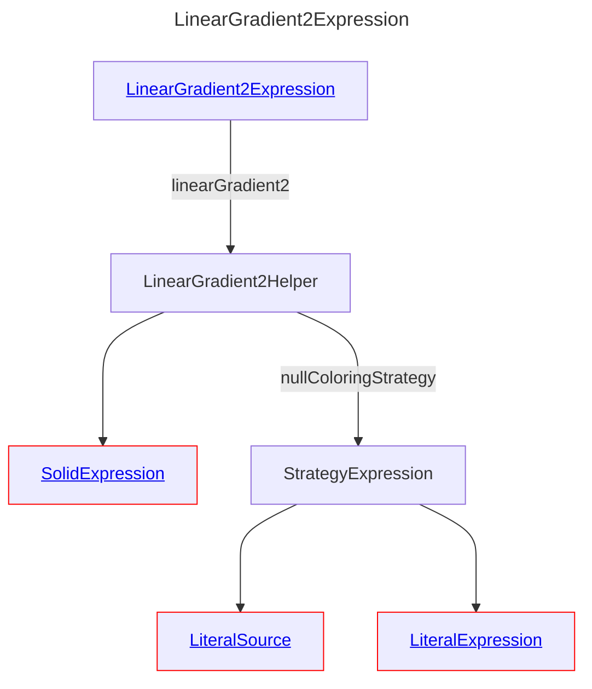

```mermaid
---
title: LinearGradient2Expression
---
graph 
LinearGradient2Expression[<a href='/layout/erd/LinearGradient2Expression'>LinearGradient2Expression</a>]
LinearGradient2Helper[LinearGradient2Helper]
LiteralExpression[<a href='/layout/erd/LiteralExpression'>LiteralExpression</a>]
style LiteralExpression stroke:#ff0000,stroke-width:1px
LiteralSource[<a href='/layout/erd/LiteralSource'>LiteralSource</a>]
style LiteralSource stroke:#ff0000,stroke-width:1px
SolidExpression[<a href='/layout/erd/SolidExpression'>SolidExpression</a>]
style SolidExpression stroke:#ff0000,stroke-width:1px
StrategyExpression[StrategyExpression]
StrategyExpression ---> LiteralSource
StrategyExpression ---> LiteralExpression
LinearGradient2Helper ---> SolidExpression
LinearGradient2Expression --->|linearGradient2| LinearGradient2Helper
LinearGradient2Helper --->|nullColoringStrategy| StrategyExpression
```