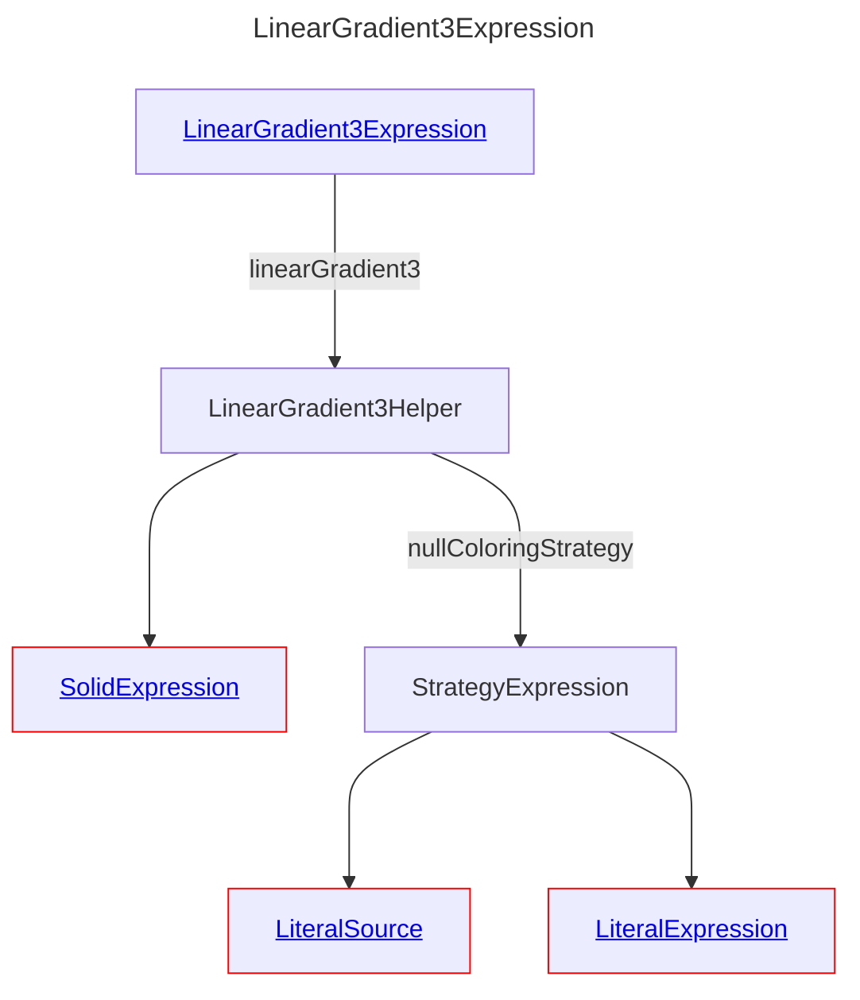

```mermaid
---
title: LinearGradient3Expression
---
graph 
LinearGradient3Expression[<a href='/layout/erd/LinearGradient3Expression'>LinearGradient3Expression</a>]
LinearGradient3Helper[LinearGradient3Helper]
LiteralExpression[<a href='/layout/erd/LiteralExpression'>LiteralExpression</a>]
style LiteralExpression stroke:#ff0000,stroke-width:1px
LiteralSource[<a href='/layout/erd/LiteralSource'>LiteralSource</a>]
style LiteralSource stroke:#ff0000,stroke-width:1px
SolidExpression[<a href='/layout/erd/SolidExpression'>SolidExpression</a>]
style SolidExpression stroke:#ff0000,stroke-width:1px
StrategyExpression[StrategyExpression]
StrategyExpression ---> LiteralSource
LinearGradient3Helper --->|nullColoringStrategy| StrategyExpression
StrategyExpression ---> LiteralExpression
LinearGradient3Helper ---> SolidExpression
LinearGradient3Expression --->|linearGradient3| LinearGradient3Helper
```