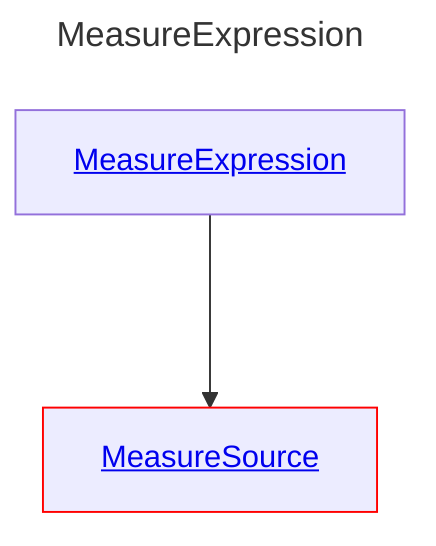

```mermaid
---
title: MeasureExpression
---
graph 
MeasureExpression[<a href='/layout/erd/MeasureExpression'>MeasureExpression</a>]
MeasureSource[<a href='/layout/erd/MeasureSource'>MeasureSource</a>]
style MeasureSource stroke:#ff0000,stroke-width:1px
MeasureExpression ---> MeasureSource
```