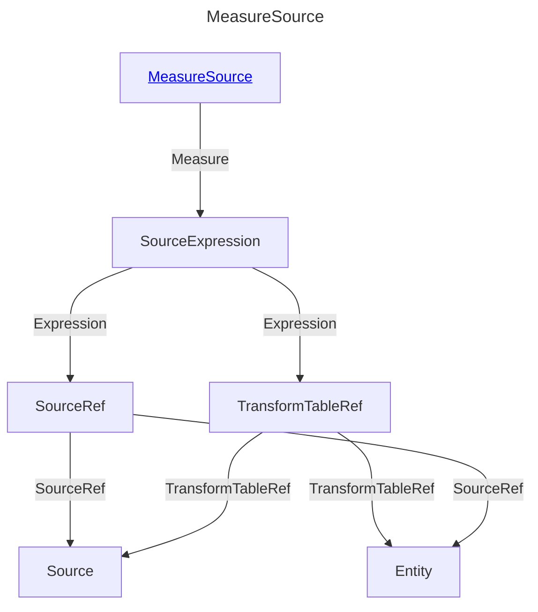

```mermaid
---
title: MeasureSource
---
graph 
Entity[Entity]
MeasureSource[<a href='/layout/erd/MeasureSource'>MeasureSource</a>]
Source[Source]
SourceExpression[SourceExpression]
SourceRef[SourceRef]
TransformTableRef[TransformTableRef]
TransformTableRef --->|TransformTableRef| Entity
SourceRef --->|SourceRef| Source
MeasureSource --->|Measure| SourceExpression
SourceExpression --->|Expression| SourceRef
SourceRef --->|SourceRef| Entity
SourceExpression --->|Expression| TransformTableRef
TransformTableRef --->|TransformTableRef| Source
```