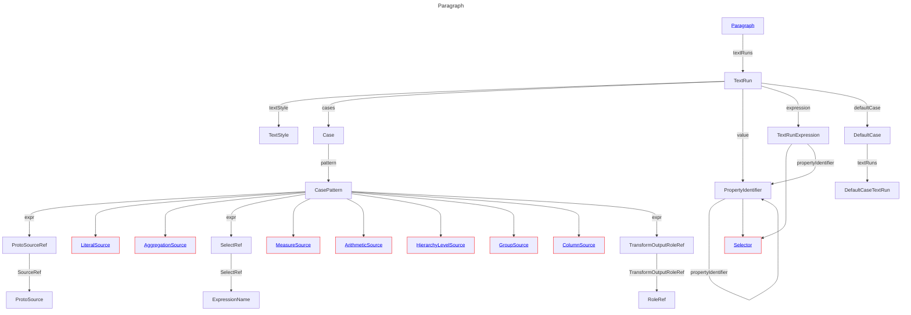

```mermaid
---
title: Paragraph
---
graph 
AggregationSource[<a href='/layout/erd/AggregationSource'>AggregationSource</a>]
style AggregationSource stroke:#ff0000,stroke-width:1px
ArithmeticSource[<a href='/layout/erd/ArithmeticSource'>ArithmeticSource</a>]
style ArithmeticSource stroke:#ff0000,stroke-width:1px
Case[Case]
CasePattern[CasePattern]
ColumnSource[<a href='/layout/erd/ColumnSource'>ColumnSource</a>]
style ColumnSource stroke:#ff0000,stroke-width:1px
DefaultCase[DefaultCase]
DefaultCaseTextRun[DefaultCaseTextRun]
ExpressionName[ExpressionName]
GroupSource[<a href='/layout/erd/GroupSource'>GroupSource</a>]
style GroupSource stroke:#ff0000,stroke-width:1px
HierarchyLevelSource[<a href='/layout/erd/HierarchyLevelSource'>HierarchyLevelSource</a>]
style HierarchyLevelSource stroke:#ff0000,stroke-width:1px
LiteralSource[<a href='/layout/erd/LiteralSource'>LiteralSource</a>]
style LiteralSource stroke:#ff0000,stroke-width:1px
MeasureSource[<a href='/layout/erd/MeasureSource'>MeasureSource</a>]
style MeasureSource stroke:#ff0000,stroke-width:1px
Paragraph[<a href='/layout/erd/Paragraph'>Paragraph</a>]
PropertyIdentifier[PropertyIdentifier]
ProtoSource[ProtoSource]
ProtoSourceRef[ProtoSourceRef]
RoleRef[RoleRef]
SelectRef[SelectRef]
Selector[<a href='/layout/erd/Selector'>Selector</a>]
style Selector stroke:#ff0000,stroke-width:1px
TextRun[TextRun]
TextRunExpression[TextRunExpression]
TextStyle[TextStyle]
TransformOutputRoleRef[TransformOutputRoleRef]
CasePattern --->|expr| ProtoSourceRef
PropertyIdentifier --->|propertyIdentifier| PropertyIdentifier
ProtoSourceRef --->|SourceRef| ProtoSource
Paragraph --->|textRuns| TextRun
CasePattern ---> LiteralSource
CasePattern ---> AggregationSource
TextRun --->|textStyle| TextStyle
CasePattern --->|expr| SelectRef
CasePattern ---> MeasureSource
CasePattern ---> ArithmeticSource
TextRun --->|cases| Case
TransformOutputRoleRef --->|TransformOutputRoleRef| RoleRef
TextRunExpression ---> Selector
PropertyIdentifier ---> Selector
TextRun --->|value| PropertyIdentifier
CasePattern ---> HierarchyLevelSource
CasePattern ---> GroupSource
TextRun --->|expression| TextRunExpression
SelectRef --->|SelectRef| ExpressionName
DefaultCase --->|textRuns| DefaultCaseTextRun
CasePattern ---> ColumnSource
TextRunExpression --->|propertyIdentifier| PropertyIdentifier
CasePattern --->|expr| TransformOutputRoleRef
TextRun --->|defaultCase| DefaultCase
Case --->|pattern| CasePattern
```