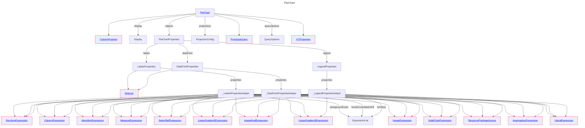

```mermaid
---
title: PieChart
---
graph 
AggregationExpression[<a href='/layout/erd/AggregationExpression'>AggregationExpression</a>]
style AggregationExpression stroke:#ff0000,stroke-width:1px
AlgorithmExpression[<a href='/layout/erd/AlgorithmExpression'>AlgorithmExpression</a>]
style AlgorithmExpression stroke:#ff0000,stroke-width:1px
ColumnExpression[<a href='/layout/erd/ColumnExpression'>ColumnExpression</a>]
style ColumnExpression stroke:#ff0000,stroke-width:1px
ColumnProperty[<a href='/layout/erd/ColumnProperty'>ColumnProperty</a>]
style ColumnProperty stroke:#ff0000,stroke-width:1px
DataPointProperties[DataPointProperties]
Display[Display]
ExpressionList[ExpressionList]
GeoJsonExpression[<a href='/layout/erd/GeoJsonExpression'>GeoJsonExpression</a>]
style GeoJsonExpression stroke:#ff0000,stroke-width:1px
ImageExpression[<a href='/layout/erd/ImageExpression'>ImageExpression</a>]
style ImageExpression stroke:#ff0000,stroke-width:1px
ImageKindExpression[<a href='/layout/erd/ImageKindExpression'>ImageKindExpression</a>]
style ImageKindExpression stroke:#ff0000,stroke-width:1px
LabelsProperties[LabelsProperties]
LegendProperties[LegendProperties]
LinearGradient2Expression[<a href='/layout/erd/LinearGradient2Expression'>LinearGradient2Expression</a>]
style LinearGradient2Expression stroke:#ff0000,stroke-width:1px
LinearGradient3Expression[<a href='/layout/erd/LinearGradient3Expression'>LinearGradient3Expression</a>]
style LinearGradient3Expression stroke:#ff0000,stroke-width:1px
LiteralExpression[<a href='/layout/erd/LiteralExpression'>LiteralExpression</a>]
style LiteralExpression stroke:#ff0000,stroke-width:1px
MeasureExpression[<a href='/layout/erd/MeasureExpression'>MeasureExpression</a>]
style MeasureExpression stroke:#ff0000,stroke-width:1px
PieChart[<a href='/layout/erd/PieChart'>PieChart</a>]
PieChartProperties[PieChartProperties]
ProjectionConfig[ProjectionConfig]
PrototypeQuery[<a href='/layout/erd/PrototypeQuery'>PrototypeQuery</a>]
style PrototypeQuery stroke:#ff0000,stroke-width:1px
QueryOptions[QueryOptions]
ResourcePackageAccess[<a href='/layout/erd/ResourcePackageAccess'>ResourcePackageAccess</a>]
style ResourcePackageAccess stroke:#ff0000,stroke-width:1px
SelectRefExpression[<a href='/layout/erd/SelectRefExpression'>SelectRefExpression</a>]
style SelectRefExpression stroke:#ff0000,stroke-width:1px
Selector[<a href='/layout/erd/Selector'>Selector</a>]
style Selector stroke:#ff0000,stroke-width:1px
SolidColorExpression[<a href='/layout/erd/SolidColorExpression'>SolidColorExpression</a>]
style SolidColorExpression stroke:#ff0000,stroke-width:1px
VCProperties[<a href='/layout/erd/VCProperties'>VCProperties</a>]
style VCProperties stroke:#ff0000,stroke-width:1px
_DataPointPropertiesHelper[_DataPointPropertiesHelper]
_LabelsPropertiesHelper[_LabelsPropertiesHelper]
_LegendPropertiesHelper[_LegendPropertiesHelper]
_LegendPropertiesHelper --->|fontSize| ExpressionList
_DataPointPropertiesHelper ---> GeoJsonExpression
_LegendPropertiesHelper ---> ColumnExpression
_LabelsPropertiesHelper ---> ColumnExpression
_LegendPropertiesHelper ---> GeoJsonExpression
_LabelsPropertiesHelper ---> MeasureExpression
_LegendPropertiesHelper ---> SelectRefExpression
_DataPointPropertiesHelper ---> ImageKindExpression
_DataPointPropertiesHelper ---> ImageExpression
_LegendPropertiesHelper ---> LinearGradient3Expression
_LegendPropertiesHelper ---> AlgorithmExpression
PieChart ---> VCProperties
_LegendPropertiesHelper ---> LinearGradient2Expression
_DataPointPropertiesHelper ---> MeasureExpression
PieChart --->|objects| PieChartProperties
LegendProperties --->|properties| _LegendPropertiesHelper
_DataPointPropertiesHelper ---> AlgorithmExpression
PieChart ---> PrototypeQuery
DataPointProperties ---> Selector
_LegendPropertiesHelper ---> ImageExpression
_LabelsPropertiesHelper ---> GeoJsonExpression
PieChartProperties --->|labels| LabelsProperties
_DataPointPropertiesHelper ---> ResourcePackageAccess
_LegendPropertiesHelper ---> SolidColorExpression
PieChartProperties --->|legend| LegendProperties
_LegendPropertiesHelper ---> MeasureExpression
PieChart --->|display| Display
PieChart ---> ColumnProperty
_DataPointPropertiesHelper ---> ColumnExpression
_DataPointPropertiesHelper ---> LinearGradient2Expression
_DataPointPropertiesHelper ---> AggregationExpression
_LegendPropertiesHelper ---> ResourcePackageAccess
_LabelsPropertiesHelper ---> LinearGradient3Expression
PieChartProperties --->|dataPoint| DataPointProperties
_LabelsPropertiesHelper ---> AlgorithmExpression
_LegendPropertiesHelper ---> ImageKindExpression
_DataPointPropertiesHelper ---> SelectRefExpression
PieChart --->|projections| ProjectionConfig
_LegendPropertiesHelper ---> AggregationExpression
_LabelsPropertiesHelper ---> SelectRefExpression
_LabelsPropertiesHelper ---> LinearGradient2Expression
LabelsProperties --->|properties| _LabelsPropertiesHelper
DataPointProperties --->|properties| _DataPointPropertiesHelper
_LabelsPropertiesHelper ---> SolidColorExpression
_DataPointPropertiesHelper ---> SolidColorExpression
_DataPointPropertiesHelper --->|borderColorMatchFill| ExpressionList
_LabelsPropertiesHelper ---> ImageKindExpression
_LabelsPropertiesHelper ---> LiteralExpression
_LabelsPropertiesHelper ---> AggregationExpression
_DataPointPropertiesHelper ---> LiteralExpression
_LegendPropertiesHelper ---> LiteralExpression
_LabelsPropertiesHelper --->|backgroundColor| ExpressionList
_DataPointPropertiesHelper ---> LinearGradient3Expression
PieChart --->|queryOptions| QueryOptions
LabelsProperties ---> Selector
_LabelsPropertiesHelper ---> ResourcePackageAccess
_LabelsPropertiesHelper ---> ImageExpression
```