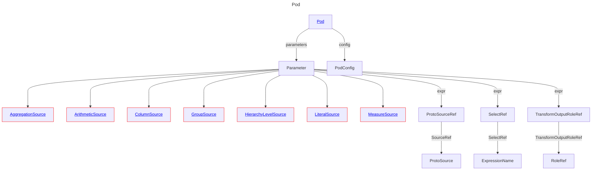

```mermaid
---
title: Pod
---
graph 
AggregationSource[<a href='/layout/erd/AggregationSource'>AggregationSource</a>]
style AggregationSource stroke:#ff0000,stroke-width:1px
ArithmeticSource[<a href='/layout/erd/ArithmeticSource'>ArithmeticSource</a>]
style ArithmeticSource stroke:#ff0000,stroke-width:1px
ColumnSource[<a href='/layout/erd/ColumnSource'>ColumnSource</a>]
style ColumnSource stroke:#ff0000,stroke-width:1px
ExpressionName[ExpressionName]
GroupSource[<a href='/layout/erd/GroupSource'>GroupSource</a>]
style GroupSource stroke:#ff0000,stroke-width:1px
HierarchyLevelSource[<a href='/layout/erd/HierarchyLevelSource'>HierarchyLevelSource</a>]
style HierarchyLevelSource stroke:#ff0000,stroke-width:1px
LiteralSource[<a href='/layout/erd/LiteralSource'>LiteralSource</a>]
style LiteralSource stroke:#ff0000,stroke-width:1px
MeasureSource[<a href='/layout/erd/MeasureSource'>MeasureSource</a>]
style MeasureSource stroke:#ff0000,stroke-width:1px
Parameter[Parameter]
Pod[<a href='/layout/erd/Pod'>Pod</a>]
PodConfig[PodConfig]
ProtoSource[ProtoSource]
ProtoSourceRef[ProtoSourceRef]
RoleRef[RoleRef]
SelectRef[SelectRef]
TransformOutputRoleRef[TransformOutputRoleRef]
SelectRef --->|SelectRef| ExpressionName
Parameter ---> ArithmeticSource
ProtoSourceRef --->|SourceRef| ProtoSource
Pod --->|config| PodConfig
Parameter ---> LiteralSource
Pod --->|parameters| Parameter
Parameter --->|expr| ProtoSourceRef
Parameter --->|expr| SelectRef
Parameter ---> AggregationSource
Parameter ---> GroupSource
Parameter ---> HierarchyLevelSource
Parameter ---> MeasureSource
Parameter --->|expr| TransformOutputRoleRef
TransformOutputRoleRef --->|TransformOutputRoleRef| RoleRef
Parameter ---> ColumnSource
```