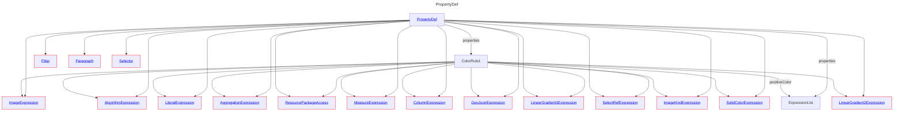

```mermaid
---
title: PropertyDef
---
graph 
AggregationExpression[<a href='/layout/erd/AggregationExpression'>AggregationExpression</a>]
style AggregationExpression stroke:#ff0000,stroke-width:1px
AlgorithmExpression[<a href='/layout/erd/AlgorithmExpression'>AlgorithmExpression</a>]
style AlgorithmExpression stroke:#ff0000,stroke-width:1px
ColorRule1[ColorRule1]
ColumnExpression[<a href='/layout/erd/ColumnExpression'>ColumnExpression</a>]
style ColumnExpression stroke:#ff0000,stroke-width:1px
ExpressionList[ExpressionList]
Filter[<a href='/layout/erd/Filter'>Filter</a>]
style Filter stroke:#ff0000,stroke-width:1px
GeoJsonExpression[<a href='/layout/erd/GeoJsonExpression'>GeoJsonExpression</a>]
style GeoJsonExpression stroke:#ff0000,stroke-width:1px
ImageExpression[<a href='/layout/erd/ImageExpression'>ImageExpression</a>]
style ImageExpression stroke:#ff0000,stroke-width:1px
ImageKindExpression[<a href='/layout/erd/ImageKindExpression'>ImageKindExpression</a>]
style ImageKindExpression stroke:#ff0000,stroke-width:1px
LinearGradient2Expression[<a href='/layout/erd/LinearGradient2Expression'>LinearGradient2Expression</a>]
style LinearGradient2Expression stroke:#ff0000,stroke-width:1px
LinearGradient3Expression[<a href='/layout/erd/LinearGradient3Expression'>LinearGradient3Expression</a>]
style LinearGradient3Expression stroke:#ff0000,stroke-width:1px
LiteralExpression[<a href='/layout/erd/LiteralExpression'>LiteralExpression</a>]
style LiteralExpression stroke:#ff0000,stroke-width:1px
MeasureExpression[<a href='/layout/erd/MeasureExpression'>MeasureExpression</a>]
style MeasureExpression stroke:#ff0000,stroke-width:1px
Paragraph[<a href='/layout/erd/Paragraph'>Paragraph</a>]
style Paragraph stroke:#ff0000,stroke-width:1px
PropertyDef[<a href='/layout/erd/PropertyDef'>PropertyDef</a>]
ResourcePackageAccess[<a href='/layout/erd/ResourcePackageAccess'>ResourcePackageAccess</a>]
style ResourcePackageAccess stroke:#ff0000,stroke-width:1px
SelectRefExpression[<a href='/layout/erd/SelectRefExpression'>SelectRefExpression</a>]
style SelectRefExpression stroke:#ff0000,stroke-width:1px
Selector[<a href='/layout/erd/Selector'>Selector</a>]
style Selector stroke:#ff0000,stroke-width:1px
SolidColorExpression[<a href='/layout/erd/SolidColorExpression'>SolidColorExpression</a>]
style SolidColorExpression stroke:#ff0000,stroke-width:1px
PropertyDef ---> ImageExpression
PropertyDef --->|properties| ColorRule1
PropertyDef ---> LiteralExpression
PropertyDef ---> ColumnExpression
PropertyDef ---> MeasureExpression
PropertyDef ---> AlgorithmExpression
ColorRule1 ---> LinearGradient3Expression
PropertyDef ---> AggregationExpression
ColorRule1 ---> ResourcePackageAccess
PropertyDef ---> ImageKindExpression
PropertyDef ---> GeoJsonExpression
PropertyDef ---> Filter
ColorRule1 ---> SelectRefExpression
ColorRule1 ---> AlgorithmExpression
ColorRule1 ---> AggregationExpression
ColorRule1 ---> GeoJsonExpression
PropertyDef ---> ResourcePackageAccess
ColorRule1 ---> LiteralExpression
PropertyDef ---> SolidColorExpression
ColorRule1 ---> MeasureExpression
PropertyDef ---> SelectRefExpression
PropertyDef --->|properties| ExpressionList
ColorRule1 ---> SolidColorExpression
PropertyDef ---> LinearGradient3Expression
ColorRule1 ---> ImageKindExpression
PropertyDef ---> Selector
ColorRule1 ---> ColumnExpression
PropertyDef ---> LinearGradient2Expression
PropertyDef ---> Paragraph
ColorRule1 --->|positiveColor| ExpressionList
ColorRule1 ---> LinearGradient2Expression
ColorRule1 ---> ImageExpression
```