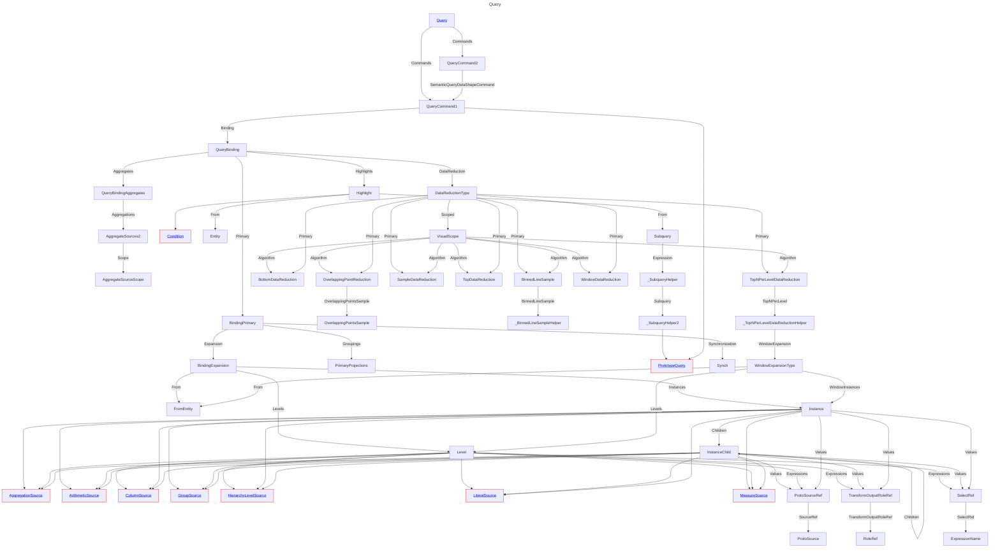

```mermaid
---
title: Query
---
graph 
AggregateSourceScope[AggregateSourceScope]
AggregateSources2[AggregateSources2]
AggregationSource[<a href='/layout/erd/AggregationSource'>AggregationSource</a>]
style AggregationSource stroke:#ff0000,stroke-width:1px
ArithmeticSource[<a href='/layout/erd/ArithmeticSource'>ArithmeticSource</a>]
style ArithmeticSource stroke:#ff0000,stroke-width:1px
BindingExpansion[BindingExpansion]
BindingPrimary[BindingPrimary]
BinnedLineSample[BinnedLineSample]
BottomDataReduction[BottomDataReduction]
ColumnSource[<a href='/layout/erd/ColumnSource'>ColumnSource</a>]
style ColumnSource stroke:#ff0000,stroke-width:1px
Condition[<a href='/layout/erd/Condition'>Condition</a>]
style Condition stroke:#ff0000,stroke-width:1px
DataReductionType[DataReductionType]
Entity[Entity]
ExpressionName[ExpressionName]
FromEntity[FromEntity]
GroupSource[<a href='/layout/erd/GroupSource'>GroupSource</a>]
style GroupSource stroke:#ff0000,stroke-width:1px
HierarchyLevelSource[<a href='/layout/erd/HierarchyLevelSource'>HierarchyLevelSource</a>]
style HierarchyLevelSource stroke:#ff0000,stroke-width:1px
Highlight[Highlight]
Instance[Instance]
InstanceChild[InstanceChild]
Level[Level]
LiteralSource[<a href='/layout/erd/LiteralSource'>LiteralSource</a>]
style LiteralSource stroke:#ff0000,stroke-width:1px
MeasureSource[<a href='/layout/erd/MeasureSource'>MeasureSource</a>]
style MeasureSource stroke:#ff0000,stroke-width:1px
OverlappingPointReduction[OverlappingPointReduction]
OverlappingPointsSample[OverlappingPointsSample]
PrimaryProjections[PrimaryProjections]
ProtoSource[ProtoSource]
ProtoSourceRef[ProtoSourceRef]
PrototypeQuery[<a href='/layout/erd/PrototypeQuery'>PrototypeQuery</a>]
style PrototypeQuery stroke:#ff0000,stroke-width:1px
Query[<a href='/layout/erd/Query'>Query</a>]
QueryBinding[QueryBinding]
QueryBindingAggregates[QueryBindingAggregates]
QueryCommand1[QueryCommand1]
QueryCommand2[QueryCommand2]
RoleRef[RoleRef]
SampleDataReduction[SampleDataReduction]
SelectRef[SelectRef]
Subquery[Subquery]
Synch[Synch]
TopDataReduction[TopDataReduction]
TopNPerLevelDataReduction[TopNPerLevelDataReduction]
TransformOutputRoleRef[TransformOutputRoleRef]
VisualScope[VisualScope]
WindowDataReduction[WindowDataReduction]
WindowExpansionType[WindowExpansionType]
_BinnedLineSampleHelper[_BinnedLineSampleHelper]
_SubqueryHelper[_SubqueryHelper]
_SubqueryHelper2[_SubqueryHelper2]
_TopNPerLevelDataReductionHelper[_TopNPerLevelDataReductionHelper]
Instance ---> ArithmeticSource
Instance ---> AggregationSource
TopNPerLevelDataReduction --->|TopNPerLevel| _TopNPerLevelDataReductionHelper
DataReductionType --->|Primary| SampleDataReduction
Highlight --->|From| Entity
ProtoSourceRef --->|SourceRef| ProtoSource
Instance ---> GroupSource
BindingPrimary --->|Synchronization| Synch
BindingExpansion --->|From| FromEntity
Query --->|Commands| QueryCommand1
Level ---> AggregationSource
BindingPrimary --->|Groupings| PrimaryProjections
DataReductionType --->|Primary| BinnedLineSample
QueryBinding --->|Aggregates| QueryBindingAggregates
QueryBindingAggregates --->|Aggregations| AggregateSources2
VisualScope --->|Algorithm| WindowDataReduction
VisualScope --->|Algorithm| BottomDataReduction
InstanceChild ---> AggregationSource
Subquery --->|Expression| _SubqueryHelper
VisualScope --->|Algorithm| TopDataReduction
QueryCommand2 --->|SemanticQueryDataShapeCommand| QueryCommand1
Instance ---> MeasureSource
DataReductionType --->|Primary| TopNPerLevelDataReduction
Level ---> LiteralSource
VisualScope --->|Algorithm| OverlappingPointReduction
Level --->|Expressions| SelectRef
BindingExpansion --->|Instances| Instance
WindowExpansionType --->|WindowInstances| Instance
VisualScope --->|Algorithm| TopNPerLevelDataReduction
InstanceChild --->|Values| ProtoSourceRef
Level ---> MeasureSource
Highlight ---> Condition
Level ---> ArithmeticSource
Level ---> GroupSource
WindowExpansionType --->|From| FromEntity
BindingPrimary --->|Expansion| BindingExpansion
_SubqueryHelper2 ---> PrototypeQuery
InstanceChild ---> MeasureSource
QueryBinding --->|Primary| BindingPrimary
Level --->|Expressions| TransformOutputRoleRef
InstanceChild --->|Values| TransformOutputRoleRef
Level ---> HierarchyLevelSource
InstanceChild --->|Children| InstanceChild
Level --->|Expressions| ProtoSourceRef
DataReductionType --->|Primary| WindowDataReduction
QueryCommand1 ---> PrototypeQuery
TransformOutputRoleRef --->|TransformOutputRoleRef| RoleRef
_TopNPerLevelDataReductionHelper --->|WindowExpansion| WindowExpansionType
BindingExpansion --->|Levels| Level
Level ---> ColumnSource
_SubqueryHelper --->|Subquery| _SubqueryHelper2
InstanceChild ---> GroupSource
Highlight --->|From| Subquery
SelectRef --->|SelectRef| ExpressionName
DataReductionType --->|Primary| BottomDataReduction
Instance ---> HierarchyLevelSource
DataReductionType --->|Primary| OverlappingPointReduction
OverlappingPointReduction --->|OverlappingPointsSample| OverlappingPointsSample
AggregateSources2 --->|Scope| AggregateSourceScope
InstanceChild ---> LiteralSource
Instance --->|Children| InstanceChild
Instance ---> ColumnSource
InstanceChild ---> HierarchyLevelSource
QueryBinding --->|DataReduction| DataReductionType
InstanceChild ---> ArithmeticSource
Instance --->|Values| ProtoSourceRef
VisualScope --->|Algorithm| SampleDataReduction
BinnedLineSample --->|BinnedLineSample| _BinnedLineSampleHelper
VisualScope --->|Algorithm| BinnedLineSample
DataReductionType --->|Scoped| VisualScope
Query --->|Commands| QueryCommand2
Instance ---> LiteralSource
QueryCommand1 --->|Binding| QueryBinding
Instance --->|Values| TransformOutputRoleRef
InstanceChild ---> ColumnSource
QueryBinding --->|Highlights| Highlight
DataReductionType --->|Primary| TopDataReduction
InstanceChild --->|Values| SelectRef
Instance --->|Values| SelectRef
WindowExpansionType --->|Levels| Level
```