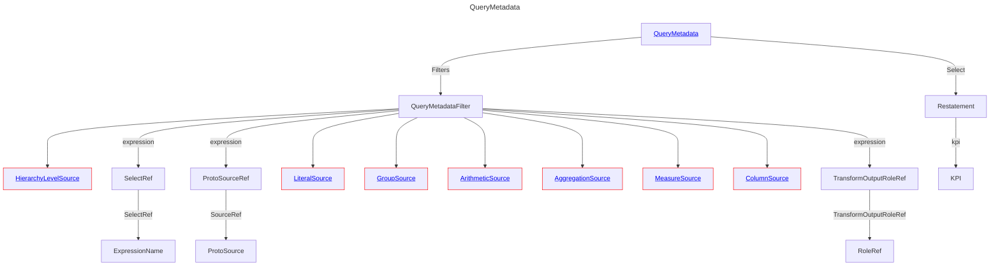

```mermaid
---
title: QueryMetadata
---
graph 
AggregationSource[<a href='/layout/erd/AggregationSource'>AggregationSource</a>]
style AggregationSource stroke:#ff0000,stroke-width:1px
ArithmeticSource[<a href='/layout/erd/ArithmeticSource'>ArithmeticSource</a>]
style ArithmeticSource stroke:#ff0000,stroke-width:1px
ColumnSource[<a href='/layout/erd/ColumnSource'>ColumnSource</a>]
style ColumnSource stroke:#ff0000,stroke-width:1px
ExpressionName[ExpressionName]
GroupSource[<a href='/layout/erd/GroupSource'>GroupSource</a>]
style GroupSource stroke:#ff0000,stroke-width:1px
HierarchyLevelSource[<a href='/layout/erd/HierarchyLevelSource'>HierarchyLevelSource</a>]
style HierarchyLevelSource stroke:#ff0000,stroke-width:1px
KPI[KPI]
LiteralSource[<a href='/layout/erd/LiteralSource'>LiteralSource</a>]
style LiteralSource stroke:#ff0000,stroke-width:1px
MeasureSource[<a href='/layout/erd/MeasureSource'>MeasureSource</a>]
style MeasureSource stroke:#ff0000,stroke-width:1px
ProtoSource[ProtoSource]
ProtoSourceRef[ProtoSourceRef]
QueryMetadata[<a href='/layout/erd/QueryMetadata'>QueryMetadata</a>]
QueryMetadataFilter[QueryMetadataFilter]
Restatement[Restatement]
RoleRef[RoleRef]
SelectRef[SelectRef]
TransformOutputRoleRef[TransformOutputRoleRef]
QueryMetadataFilter ---> HierarchyLevelSource
SelectRef --->|SelectRef| ExpressionName
ProtoSourceRef --->|SourceRef| ProtoSource
Restatement --->|kpi| KPI
QueryMetadataFilter --->|expression| SelectRef
QueryMetadataFilter --->|expression| ProtoSourceRef
QueryMetadataFilter ---> LiteralSource
QueryMetadata --->|Filters| QueryMetadataFilter
QueryMetadata --->|Select| Restatement
QueryMetadataFilter ---> GroupSource
QueryMetadataFilter ---> ArithmeticSource
QueryMetadataFilter ---> AggregationSource
TransformOutputRoleRef --->|TransformOutputRoleRef| RoleRef
QueryMetadataFilter ---> MeasureSource
QueryMetadataFilter ---> ColumnSource
QueryMetadataFilter --->|expression| TransformOutputRoleRef
```