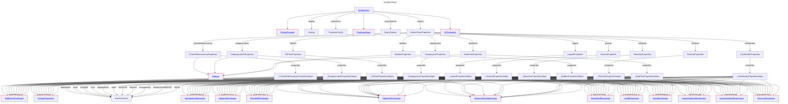

```mermaid
---
title: ScatterChart
---
graph 
AggregationExpression[<a href='/layout/erd/AggregationExpression'>AggregationExpression</a>]
style AggregationExpression stroke:#ff0000,stroke-width:1px
AlgorithmExpression[<a href='/layout/erd/AlgorithmExpression'>AlgorithmExpression</a>]
style AlgorithmExpression stroke:#ff0000,stroke-width:1px
BubblesProperties[BubblesProperties]
CategoryAxisProperties[CategoryAxisProperties]
CategoryLabelsProperties[CategoryLabelsProperties]
ColorBorderProperties[ColorBorderProperties]
ColumnExpression[<a href='/layout/erd/ColumnExpression'>ColumnExpression</a>]
style ColumnExpression stroke:#ff0000,stroke-width:1px
ColumnProperty[<a href='/layout/erd/ColumnProperty'>ColumnProperty</a>]
style ColumnProperty stroke:#ff0000,stroke-width:1px
DataPointProperties[DataPointProperties]
Display[Display]
ExpressionList[ExpressionList]
FillPointProperties[FillPointProperties]
GeneralProperties[GeneralProperties]
GeoJsonExpression[<a href='/layout/erd/GeoJsonExpression'>GeoJsonExpression</a>]
style GeoJsonExpression stroke:#ff0000,stroke-width:1px
ImageExpression[<a href='/layout/erd/ImageExpression'>ImageExpression</a>]
style ImageExpression stroke:#ff0000,stroke-width:1px
ImageKindExpression[<a href='/layout/erd/ImageKindExpression'>ImageKindExpression</a>]
style ImageKindExpression stroke:#ff0000,stroke-width:1px
LegendProperties[LegendProperties]
LinearGradient2Expression[<a href='/layout/erd/LinearGradient2Expression'>LinearGradient2Expression</a>]
style LinearGradient2Expression stroke:#ff0000,stroke-width:1px
LinearGradient3Expression[<a href='/layout/erd/LinearGradient3Expression'>LinearGradient3Expression</a>]
style LinearGradient3Expression stroke:#ff0000,stroke-width:1px
LiteralExpression[<a href='/layout/erd/LiteralExpression'>LiteralExpression</a>]
style LiteralExpression stroke:#ff0000,stroke-width:1px
MeasureExpression[<a href='/layout/erd/MeasureExpression'>MeasureExpression</a>]
style MeasureExpression stroke:#ff0000,stroke-width:1px
PlotAreaProperties[PlotAreaProperties]
ProjectionConfig[ProjectionConfig]
PrototypeQuery[<a href='/layout/erd/PrototypeQuery'>PrototypeQuery</a>]
style PrototypeQuery stroke:#ff0000,stroke-width:1px
QueryOptions[QueryOptions]
ResourcePackageAccess[<a href='/layout/erd/ResourcePackageAccess'>ResourcePackageAccess</a>]
style ResourcePackageAccess stroke:#ff0000,stroke-width:1px
ScatterChart[<a href='/layout/erd/ScatterChart'>ScatterChart</a>]
ScatterChartProperties[ScatterChartProperties]
SelectRefExpression[<a href='/layout/erd/SelectRefExpression'>SelectRefExpression</a>]
style SelectRefExpression stroke:#ff0000,stroke-width:1px
Selector[<a href='/layout/erd/Selector'>Selector</a>]
style Selector stroke:#ff0000,stroke-width:1px
SolidColorExpression[<a href='/layout/erd/SolidColorExpression'>SolidColorExpression</a>]
style SolidColorExpression stroke:#ff0000,stroke-width:1px
VCProperties[<a href='/layout/erd/VCProperties'>VCProperties</a>]
style VCProperties stroke:#ff0000,stroke-width:1px
ValueAxisProperties[ValueAxisProperties]
Y1AxisReferenceLineProperties[Y1AxisReferenceLineProperties]
_BubblesPropertiesHelper[_BubblesPropertiesHelper]
_CategoryAxisPropertiesHelper[_CategoryAxisPropertiesHelper]
_CategoryLabelsPropertiesHelper[_CategoryLabelsPropertiesHelper]
_ColorBorderPropertiesHelper[_ColorBorderPropertiesHelper]
_DataPointPropertiesHelper[_DataPointPropertiesHelper]
_FillPointPropertiesHelper[_FillPointPropertiesHelper]
_GeneralPropertiesHelper[_GeneralPropertiesHelper]
_LegendPropertiesHelper[_LegendPropertiesHelper]
_PlotAreaPropertiesHelper[_PlotAreaPropertiesHelper]
_ValueAxisPropertiesHelper[_ValueAxisPropertiesHelper]
_Y1AxisReferenceLinePropertiesHelper[_Y1AxisReferenceLinePropertiesHelper]
_CategoryLabelsPropertiesHelper ---> ResourcePackageAccess
ScatterChartProperties --->|categoryAxis| CategoryAxisProperties
_ColorBorderPropertiesHelper ---> LiteralExpression
_Y1AxisReferenceLinePropertiesHelper ---> ColumnExpression
_LegendPropertiesHelper ---> ColumnExpression
_DataPointPropertiesHelper ---> ImageKindExpression
ScatterChartProperties --->|dataPoint| DataPointProperties
_Y1AxisReferenceLinePropertiesHelper ---> ImageExpression
ValueAxisProperties --->|properties| _ValueAxisPropertiesHelper
Y1AxisReferenceLineProperties --->|properties| _Y1AxisReferenceLinePropertiesHelper
ScatterChartProperties --->|legend| LegendProperties
LegendProperties --->|properties| _LegendPropertiesHelper
_CategoryLabelsPropertiesHelper ---> AlgorithmExpression
_ValueAxisPropertiesHelper ---> LinearGradient3Expression
_LegendPropertiesHelper ---> SolidColorExpression
_Y1AxisReferenceLinePropertiesHelper ---> AggregationExpression
_FillPointPropertiesHelper ---> SelectRefExpression
_BubblesPropertiesHelper --->|bubbleSize| ExpressionList
_FillPointPropertiesHelper --->|show| ExpressionList
_CategoryAxisPropertiesHelper ---> SolidColorExpression
ScatterChart --->|queryOptions| QueryOptions
_LegendPropertiesHelper ---> ResourcePackageAccess
_CategoryAxisPropertiesHelper ---> ColumnExpression
ScatterChart ---> PrototypeQuery
_CategoryAxisPropertiesHelper --->|axisStyle| ExpressionList
_FillPointPropertiesHelper ---> AlgorithmExpression
_GeneralPropertiesHelper ---> SolidColorExpression
_CategoryAxisPropertiesHelper ---> AggregationExpression
_GeneralPropertiesHelper ---> LinearGradient3Expression
_Y1AxisReferenceLinePropertiesHelper ---> ImageKindExpression
_CategoryLabelsPropertiesHelper ---> LiteralExpression
_GeneralPropertiesHelper ---> MeasureExpression
_CategoryAxisPropertiesHelper ---> MeasureExpression
_PlotAreaPropertiesHelper ---> AlgorithmExpression
_FillPointPropertiesHelper ---> LinearGradient3Expression
_Y1AxisReferenceLinePropertiesHelper ---> LinearGradient2Expression
Y1AxisReferenceLineProperties ---> Selector
_ValueAxisPropertiesHelper ---> SelectRefExpression
ColorBorderProperties --->|properties| _ColorBorderPropertiesHelper
_ValueAxisPropertiesHelper ---> ImageKindExpression
_CategoryLabelsPropertiesHelper ---> GeoJsonExpression
_PlotAreaPropertiesHelper ---> ResourcePackageAccess
_BubblesPropertiesHelper ---> ColumnExpression
_CategoryLabelsPropertiesHelper --->|color| ExpressionList
_BubblesPropertiesHelper ---> LiteralExpression
_PlotAreaPropertiesHelper ---> ColumnExpression
_FillPointPropertiesHelper ---> GeoJsonExpression
_FillPointPropertiesHelper ---> ResourcePackageAccess
_Y1AxisReferenceLinePropertiesHelper --->|displayName| ExpressionList
CategoryLabelsProperties ---> Selector
_ColorBorderPropertiesHelper --->|show| ExpressionList
_CategoryAxisPropertiesHelper ---> SelectRefExpression
_FillPointPropertiesHelper ---> ImageExpression
ScatterChartProperties --->|fillPoint| FillPointProperties
DataPointProperties ---> Selector
_CategoryAxisPropertiesHelper ---> AlgorithmExpression
_GeneralPropertiesHelper ---> LiteralExpression
_LegendPropertiesHelper ---> ImageExpression
ScatterChartProperties --->|plotArea| PlotAreaProperties
ScatterChart --->|projections| ProjectionConfig
FillPointProperties --->|properties| _FillPointPropertiesHelper
_GeneralPropertiesHelper ---> ImageExpression
_Y1AxisReferenceLinePropertiesHelper ---> LinearGradient3Expression
_ValueAxisPropertiesHelper ---> LinearGradient2Expression
BubblesProperties --->|properties| _BubblesPropertiesHelper
_GeneralPropertiesHelper ---> AlgorithmExpression
_CategoryLabelsPropertiesHelper ---> AggregationExpression
_Y1AxisReferenceLinePropertiesHelper ---> SelectRefExpression
_DataPointPropertiesHelper ---> ColumnExpression
_BubblesPropertiesHelper ---> LinearGradient2Expression
_CategoryLabelsPropertiesHelper ---> ImageExpression
_LegendPropertiesHelper ---> ImageKindExpression
_CategoryLabelsPropertiesHelper ---> ImageKindExpression
_BubblesPropertiesHelper ---> SelectRefExpression
_Y1AxisReferenceLinePropertiesHelper ---> ResourcePackageAccess
_ValueAxisPropertiesHelper --->|axisScale| ExpressionList
_ValueAxisPropertiesHelper ---> AggregationExpression
_CategoryLabelsPropertiesHelper ---> LinearGradient2Expression
_GeneralPropertiesHelper ---> SelectRefExpression
ScatterChartProperties --->|bubbles| BubblesProperties
_PlotAreaPropertiesHelper ---> LinearGradient2Expression
_LegendPropertiesHelper ---> LiteralExpression
_DataPointPropertiesHelper ---> LinearGradient3Expression
ScatterChartProperties --->|colorBorder| ColorBorderProperties
_DataPointPropertiesHelper ---> ResourcePackageAccess
_CategoryLabelsPropertiesHelper ---> SolidColorExpression
_Y1AxisReferenceLinePropertiesHelper ---> GeoJsonExpression
_LegendPropertiesHelper --->|fontSize| ExpressionList
_CategoryAxisPropertiesHelper ---> ResourcePackageAccess
_LegendPropertiesHelper ---> GeoJsonExpression
_CategoryAxisPropertiesHelper ---> ImageKindExpression
_GeneralPropertiesHelper ---> AggregationExpression
_GeneralPropertiesHelper ---> ImageKindExpression
_PlotAreaPropertiesHelper ---> ImageKindExpression
_ColorBorderPropertiesHelper ---> ResourcePackageAccess
_GeneralPropertiesHelper ---> GeoJsonExpression
_PlotAreaPropertiesHelper ---> SelectRefExpression
_PlotAreaPropertiesHelper --->|transparency| ExpressionList
_FillPointPropertiesHelper ---> ImageKindExpression
_PlotAreaPropertiesHelper ---> LinearGradient3Expression
_ColorBorderPropertiesHelper ---> AggregationExpression
_CategoryAxisPropertiesHelper ---> LiteralExpression
ScatterChart --->|objects| ScatterChartProperties
_FillPointPropertiesHelper ---> MeasureExpression
_LegendPropertiesHelper ---> MeasureExpression
_DataPointPropertiesHelper ---> LinearGradient2Expression
_DataPointPropertiesHelper ---> AggregationExpression
_BubblesPropertiesHelper ---> LinearGradient3Expression
_FillPointPropertiesHelper ---> ColumnExpression
_ColorBorderPropertiesHelper ---> LinearGradient2Expression
_ColorBorderPropertiesHelper ---> ColumnExpression
_ValueAxisPropertiesHelper ---> MeasureExpression
_BubblesPropertiesHelper ---> GeoJsonExpression
_BubblesPropertiesHelper ---> ImageExpression
_GeneralPropertiesHelper ---> LinearGradient2Expression
_FillPointPropertiesHelper ---> LinearGradient2Expression
_PlotAreaPropertiesHelper ---> SolidColorExpression
_DataPointPropertiesHelper --->|borderColorMatchFill| ExpressionList
CategoryAxisProperties --->|properties| _CategoryAxisPropertiesHelper
_BubblesPropertiesHelper ---> ResourcePackageAccess
_CategoryAxisPropertiesHelper ---> ImageExpression
_ValueAxisPropertiesHelper ---> LiteralExpression
_BubblesPropertiesHelper ---> MeasureExpression
_PlotAreaPropertiesHelper ---> ImageExpression
_DataPointPropertiesHelper ---> LiteralExpression
_ColorBorderPropertiesHelper ---> AlgorithmExpression
_FillPointPropertiesHelper ---> AggregationExpression
_CategoryAxisPropertiesHelper ---> LinearGradient2Expression
_ValueAxisPropertiesHelper ---> SolidColorExpression
_ColorBorderPropertiesHelper ---> ImageExpression
_GeneralPropertiesHelper --->|altText| ExpressionList
_DataPointPropertiesHelper ---> GeoJsonExpression
_Y1AxisReferenceLinePropertiesHelper ---> LiteralExpression
ScatterChart ---> VCProperties
PlotAreaProperties --->|properties| _PlotAreaPropertiesHelper
_CategoryLabelsPropertiesHelper ---> MeasureExpression
_LegendPropertiesHelper ---> SelectRefExpression
_FillPointPropertiesHelper ---> LiteralExpression
_FillPointPropertiesHelper ---> SolidColorExpression
_PlotAreaPropertiesHelper ---> MeasureExpression
_DataPointPropertiesHelper ---> ImageExpression
_LegendPropertiesHelper ---> LinearGradient3Expression
_PlotAreaPropertiesHelper ---> LiteralExpression
_LegendPropertiesHelper ---> AlgorithmExpression
_DataPointPropertiesHelper ---> MeasureExpression
_LegendPropertiesHelper ---> LinearGradient2Expression
_GeneralPropertiesHelper ---> ColumnExpression
_ValueAxisPropertiesHelper ---> GeoJsonExpression
_DataPointPropertiesHelper ---> AlgorithmExpression
_ColorBorderPropertiesHelper ---> ImageKindExpression
ScatterChart --->|display| Display
_Y1AxisReferenceLinePropertiesHelper ---> AlgorithmExpression
ScatterChartProperties --->|valueAxis| ValueAxisProperties
_ColorBorderPropertiesHelper ---> SolidColorExpression
_BubblesPropertiesHelper ---> SolidColorExpression
_ColorBorderPropertiesHelper ---> GeoJsonExpression
ScatterChart ---> ColumnProperty
ScatterChartProperties --->|categoryLabels| CategoryLabelsProperties
_CategoryAxisPropertiesHelper ---> LinearGradient3Expression
_ValueAxisPropertiesHelper ---> ColumnExpression
_CategoryLabelsPropertiesHelper ---> SelectRefExpression
ScatterChartProperties --->|y1AxisReferenceLine| Y1AxisReferenceLineProperties
_GeneralPropertiesHelper ---> ResourcePackageAccess
_CategoryAxisPropertiesHelper ---> GeoJsonExpression
_CategoryLabelsPropertiesHelper ---> ColumnExpression
_ColorBorderPropertiesHelper ---> MeasureExpression
_ValueAxisPropertiesHelper ---> AlgorithmExpression
_ValueAxisPropertiesHelper ---> ImageExpression
_ColorBorderPropertiesHelper ---> LinearGradient3Expression
_DataPointPropertiesHelper ---> SelectRefExpression
CategoryLabelsProperties --->|properties| _CategoryLabelsPropertiesHelper
_LegendPropertiesHelper ---> AggregationExpression
_BubblesPropertiesHelper ---> AlgorithmExpression
DataPointProperties --->|properties| _DataPointPropertiesHelper
GeneralProperties --->|properties| _GeneralPropertiesHelper
_PlotAreaPropertiesHelper ---> GeoJsonExpression
_DataPointPropertiesHelper ---> SolidColorExpression
BubblesProperties ---> Selector
_Y1AxisReferenceLinePropertiesHelper ---> MeasureExpression
_Y1AxisReferenceLinePropertiesHelper ---> SolidColorExpression
_BubblesPropertiesHelper ---> AggregationExpression
_PlotAreaPropertiesHelper ---> AggregationExpression
_ValueAxisPropertiesHelper ---> ResourcePackageAccess
_CategoryLabelsPropertiesHelper ---> LinearGradient3Expression
_ColorBorderPropertiesHelper ---> SelectRefExpression
ScatterChartProperties --->|general| GeneralProperties
_BubblesPropertiesHelper ---> ImageKindExpression
```