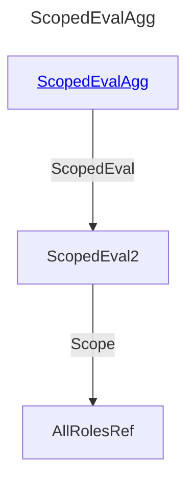

```mermaid
---
title: ScopedEvalAgg
---
graph 
AllRolesRef[AllRolesRef]
ScopedEval2[ScopedEval2]
ScopedEvalAgg[<a href='/layout/erd/ScopedEvalAgg'>ScopedEvalAgg</a>]
ScopedEval2 --->|Scope| AllRolesRef
ScopedEvalAgg --->|ScopedEval| ScopedEval2
```