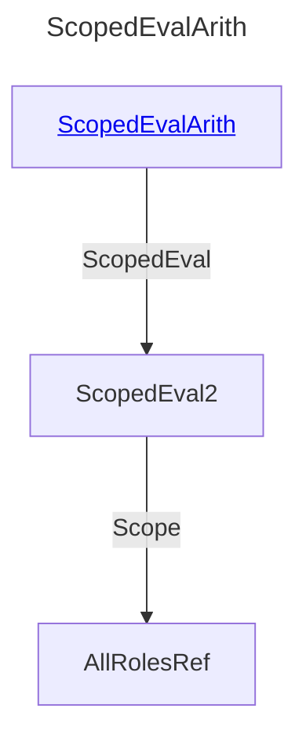

```mermaid
---
title: ScopedEvalArith
---
graph 
AllRolesRef[AllRolesRef]
ScopedEval2[ScopedEval2]
ScopedEvalArith[<a href='/layout/erd/ScopedEvalArith'>ScopedEvalArith</a>]
ScopedEval2 --->|Scope| AllRolesRef
ScopedEvalArith --->|ScopedEval| ScopedEval2
```