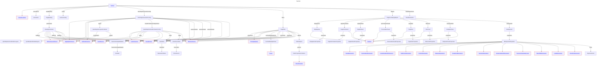

```mermaid
---
title: Section
---
graph 
AggregationExpression[<a href='/layout/erd/AggregationExpression'>AggregationExpression</a>]
style AggregationExpression stroke:#ff0000,stroke-width:1px
AggregationSource[<a href='/layout/erd/AggregationSource'>AggregationSource</a>]
style AggregationSource stroke:#ff0000,stroke-width:1px
AlgorithmExpression[<a href='/layout/erd/AlgorithmExpression'>AlgorithmExpression</a>]
style AlgorithmExpression stroke:#ff0000,stroke-width:1px
Annotation[Annotation]
ArithmeticSource[<a href='/layout/erd/ArithmeticSource'>ArithmeticSource</a>]
style ArithmeticSource stroke:#ff0000,stroke-width:1px
AutoPageGenerationConfig[AutoPageGenerationConfig]
Background[Background]
BackgroundProperties[BackgroundProperties]
BindingParameter[BindingParameter]
CachedDisplayNames[CachedDisplayNames]
ColumnExpression[<a href='/layout/erd/ColumnExpression'>ColumnExpression</a>]
style ColumnExpression stroke:#ff0000,stroke-width:1px
ColumnSource[<a href='/layout/erd/ColumnSource'>ColumnSource</a>]
style ColumnSource stroke:#ff0000,stroke-width:1px
DisplayArea[DisplayArea]
DisplayAreaProperties[DisplayAreaProperties]
ExpressionList[ExpressionList]
ExpressionName[ExpressionName]
FilterCard[FilterCard]
FilterCardProperties[FilterCardProperties]
FilterObjects[FilterObjects]
FilterProperties[<a href='/layout/erd/FilterProperties'>FilterProperties</a>]
style FilterProperties stroke:#ff0000,stroke-width:1px
FilterPropertiesContainer[FilterPropertiesContainer]
GeoJsonExpression[<a href='/layout/erd/GeoJsonExpression'>GeoJsonExpression</a>]
style GeoJsonExpression stroke:#ff0000,stroke-width:1px
GroupSource[<a href='/layout/erd/GroupSource'>GroupSource</a>]
style GroupSource stroke:#ff0000,stroke-width:1px
HierarchyLevelSource[<a href='/layout/erd/HierarchyLevelSource'>HierarchyLevelSource</a>]
style HierarchyLevelSource stroke:#ff0000,stroke-width:1px
ImageExpression[<a href='/layout/erd/ImageExpression'>ImageExpression</a>]
style ImageExpression stroke:#ff0000,stroke-width:1px
ImageKindExpression[<a href='/layout/erd/ImageKindExpression'>ImageKindExpression</a>]
style ImageKindExpression stroke:#ff0000,stroke-width:1px
LinearGradient2Expression[<a href='/layout/erd/LinearGradient2Expression'>LinearGradient2Expression</a>]
style LinearGradient2Expression stroke:#ff0000,stroke-width:1px
LinearGradient3Expression[<a href='/layout/erd/LinearGradient3Expression'>LinearGradient3Expression</a>]
style LinearGradient3Expression stroke:#ff0000,stroke-width:1px
LiteralExpression[<a href='/layout/erd/LiteralExpression'>LiteralExpression</a>]
style LiteralExpression stroke:#ff0000,stroke-width:1px
LiteralSource[<a href='/layout/erd/LiteralSource'>LiteralSource</a>]
style LiteralSource stroke:#ff0000,stroke-width:1px
MeasureExpression[<a href='/layout/erd/MeasureExpression'>MeasureExpression</a>]
style MeasureExpression stroke:#ff0000,stroke-width:1px
MeasureSource[<a href='/layout/erd/MeasureSource'>MeasureSource</a>]
style MeasureSource stroke:#ff0000,stroke-width:1px
OutspacePane[OutspacePane]
OutspacePaneProperties[OutspacePaneProperties]
PageBinding[PageBinding]
PageFilter[PageFilter]
PageFormattingObjects[PageFormattingObjects]
PageInformation[PageInformation]
PageInformationProperties[PageInformationProperties]
PageRefresh[PageRefresh]
PageRefreshProperties[PageRefreshProperties]
PageSize[PageSize]
PageSizeProperties[PageSizeProperties]
PersonalizeVisual[PersonalizeVisual]
PersonalizeVisualProperties[PersonalizeVisualProperties]
ProtoSource[ProtoSource]
ProtoSourceRef[ProtoSourceRef]
PrototypeQuery[<a href='/layout/erd/PrototypeQuery'>PrototypeQuery</a>]
style PrototypeQuery stroke:#ff0000,stroke-width:1px
QuickExploreCombinationLayout[QuickExploreCombinationLayout]
QuickExploreLayoutContainer[QuickExploreLayoutContainer]
QuickExploreRelatedLayout[QuickExploreRelatedLayout]
QuickExploreVisualContainerConfig[QuickExploreVisualContainerConfig]
ResourcePackageAccess[<a href='/layout/erd/ResourcePackageAccess'>ResourcePackageAccess</a>]
style ResourcePackageAccess stroke:#ff0000,stroke-width:1px
RoleRef[RoleRef]
Scope[<a href='/layout/erd/Scope'>Scope</a>]
style Scope stroke:#ff0000,stroke-width:1px
Section[<a href='/layout/erd/Section'>Section</a>]
SectionConfig[SectionConfig]
SelectRef[SelectRef]
SelectRefExpression[<a href='/layout/erd/SelectRefExpression'>SelectRefExpression</a>]
style SelectRefExpression stroke:#ff0000,stroke-width:1px
Selector[<a href='/layout/erd/Selector'>Selector</a>]
style Selector stroke:#ff0000,stroke-width:1px
SolidColorExpression[<a href='/layout/erd/SolidColorExpression'>SolidColorExpression</a>]
style SolidColorExpression stroke:#ff0000,stroke-width:1px
TransformOutputRoleRef[TransformOutputRoleRef]
VisualContainer[<a href='/layout/erd/VisualContainer'>VisualContainer</a>]
style VisualContainer stroke:#ff0000,stroke-width:1px
VisualInteraction[VisualInteraction]
QuickExploreVisualContainerConfig ---> ColumnSource
BindingParameter --->|fieldExpr| TransformOutputRoleRef
AutoPageGenerationConfig ---> AggregationSource
BindingParameter ---> GroupSource
BackgroundProperties ---> ImageExpression
BindingParameter ---> ColumnSource
BackgroundProperties ---> AggregationExpression
PageFormattingObjects --->|displayArea| DisplayArea
Section ---> VisualContainer
ProtoSourceRef --->|SourceRef| ProtoSource
BackgroundProperties ---> LinearGradient2Expression
AutoPageGenerationConfig ---> LiteralSource
BackgroundProperties ---> SolidColorExpression
BackgroundProperties ---> ColumnExpression
QuickExploreLayoutContainer --->|combination| QuickExploreCombinationLayout
Section --->|annotations| Annotation
PageFormattingObjects --->|pageInformation| PageInformation
BindingParameter ---> ArithmeticSource
PageRefresh ---> Selector
PageFilter --->|expression| TransformOutputRoleRef
PageFilter ---> PrototypeQuery
PersonalizeVisual ---> Selector
PageFilter ---> ColumnSource
AutoPageGenerationConfig ---> HierarchyLevelSource
FilterObjects --->|general| FilterPropertiesContainer
BindingParameter ---> HierarchyLevelSource
BackgroundProperties ---> MeasureExpression
BindingParameter ---> LiteralSource
PersonalizeVisual --->|properties| PersonalizeVisualProperties
QuickExploreVisualContainerConfig ---> HierarchyLevelSource
AutoPageGenerationConfig ---> ArithmeticSource
BackgroundProperties ---> ImageKindExpression
PageSize ---> Selector
AutoPageGenerationConfig --->|layout| QuickExploreLayoutContainer
QuickExploreVisualContainerConfig ---> ArithmeticSource
BindingParameter --->|fieldExpr| SelectRef
PageFilter ---> HierarchyLevelSource
BindingParameter --->|fieldExpr| ProtoSourceRef
PageFilter --->|cachedDisplayNames| CachedDisplayNames
DisplayArea ---> Selector
PageRefresh --->|properties| PageRefreshProperties
AutoPageGenerationConfig --->|visualContainerConfigurations| QuickExploreVisualContainerConfig
PageFormattingObjects --->|pageRefresh| PageRefresh
PageFilter ---> AggregationSource
PageBinding --->|parameters| BindingParameter
FilterPropertiesContainer ---> FilterProperties
AutoPageGenerationConfig ---> MeasureSource
BackgroundProperties ---> GeoJsonExpression
Section --->|pageBinding| PageBinding
BackgroundProperties ---> LinearGradient3Expression
PageInformation --->|propeties| PageInformationProperties
PageFormattingObjects --->|personalizeVisuals| PersonalizeVisual
PageFilter ---> LiteralSource
TransformOutputRoleRef --->|TransformOutputRoleRef| RoleRef
QuickExploreVisualContainerConfig --->|fields| TransformOutputRoleRef
QuickExploreVisualContainerConfig ---> AggregationSource
PageFilter --->|expression| ProtoSourceRef
PageFilter --->|expression| SelectRef
FilterCard ---> Selector
BindingParameter ---> AggregationSource
PageInformation ---> Selector
SelectRef --->|SelectRef| ExpressionName
BackgroundProperties ---> ResourcePackageAccess
OutspacePane --->|properties| OutspacePaneProperties
PageFormattingObjects --->|pageSize| PageSize
FilterCard --->|properties| FilterCardProperties
Section --->|config| SectionConfig
PageFormattingObjects --->|filterCard| FilterCard
Section --->|autoPageGenerationConfig| AutoPageGenerationConfig
QuickExploreVisualContainerConfig ---> LiteralSource
AutoPageGenerationConfig --->|selectedFields| SelectRef
DisplayArea --->|properties| DisplayAreaProperties
Section --->|filters| PageFilter
QuickExploreVisualContainerConfig ---> GroupSource
AutoPageGenerationConfig --->|selectedFields| ProtoSourceRef
AutoPageGenerationConfig --->|selectedFields| TransformOutputRoleRef
BindingParameter ---> MeasureSource
PageFilter ---> ArithmeticSource
QuickExploreVisualContainerConfig --->|fields| SelectRef
Section --->|objects| PageFormattingObjects
AutoPageGenerationConfig ---> ColumnSource
PageFilter ---> GroupSource
CachedDisplayNames ---> Scope
QuickExploreVisualContainerConfig --->|fields| ProtoSourceRef
BackgroundProperties ---> SelectRefExpression
PageFilter ---> MeasureSource
PageSize --->|properties| PageSizeProperties
BackgroundProperties ---> LiteralExpression
QuickExploreVisualContainerConfig ---> MeasureSource
AutoPageGenerationConfig ---> GroupSource
PageFilter --->|objects| FilterObjects
Section --->|visualInteractions| VisualInteraction
PageFormattingObjects --->|outspacePane| OutspacePane
BackgroundProperties ---> AlgorithmExpression
PageFormattingObjects --->|background| Background
Background --->|properties| BackgroundProperties
OutspacePane ---> Selector
QuickExploreLayoutContainer --->|related| QuickExploreRelatedLayout
BackgroundProperties --->|show| ExpressionList
```