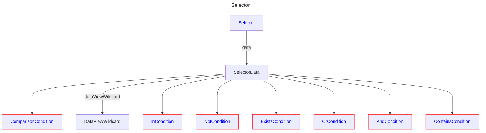

```mermaid
---
title: Selector
---
graph 
AndCondition[<a href='/layout/erd/AndCondition'>AndCondition</a>]
style AndCondition stroke:#ff0000,stroke-width:1px
ComparisonCondition[<a href='/layout/erd/ComparisonCondition'>ComparisonCondition</a>]
style ComparisonCondition stroke:#ff0000,stroke-width:1px
ContainsCondition[<a href='/layout/erd/ContainsCondition'>ContainsCondition</a>]
style ContainsCondition stroke:#ff0000,stroke-width:1px
DataViewWildcard[DataViewWildcard]
ExistsCondition[<a href='/layout/erd/ExistsCondition'>ExistsCondition</a>]
style ExistsCondition stroke:#ff0000,stroke-width:1px
InCondition[<a href='/layout/erd/InCondition'>InCondition</a>]
style InCondition stroke:#ff0000,stroke-width:1px
NotCondition[<a href='/layout/erd/NotCondition'>NotCondition</a>]
style NotCondition stroke:#ff0000,stroke-width:1px
OrCondition[<a href='/layout/erd/OrCondition'>OrCondition</a>]
style OrCondition stroke:#ff0000,stroke-width:1px
Selector[<a href='/layout/erd/Selector'>Selector</a>]
SelectorData[SelectorData]
SelectorData ---> ComparisonCondition
SelectorData --->|dataViewWildcard| DataViewWildcard
SelectorData ---> InCondition
SelectorData ---> NotCondition
SelectorData ---> ExistsCondition
SelectorData ---> OrCondition
SelectorData ---> AndCondition
Selector --->|data| SelectorData
SelectorData ---> ContainsCondition
```