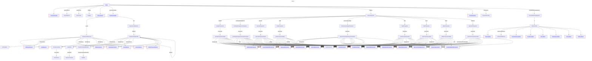

```mermaid
---
title: Slicer
---
graph 
AggregationExpression[<a href='/layout/erd/AggregationExpression'>AggregationExpression</a>]
style AggregationExpression stroke:#ff0000,stroke-width:1px
AggregationSource[<a href='/layout/erd/AggregationSource'>AggregationSource</a>]
style AggregationSource stroke:#ff0000,stroke-width:1px
AlgorithmExpression[<a href='/layout/erd/AlgorithmExpression'>AlgorithmExpression</a>]
style AlgorithmExpression stroke:#ff0000,stroke-width:1px
AndCondition[<a href='/layout/erd/AndCondition'>AndCondition</a>]
style AndCondition stroke:#ff0000,stroke-width:1px
ArithmeticSource[<a href='/layout/erd/ArithmeticSource'>ArithmeticSource</a>]
style ArithmeticSource stroke:#ff0000,stroke-width:1px
CachedFilterDisplayItems[CachedFilterDisplayItems]
ColumnExpression[<a href='/layout/erd/ColumnExpression'>ColumnExpression</a>]
style ColumnExpression stroke:#ff0000,stroke-width:1px
ColumnProperty[<a href='/layout/erd/ColumnProperty'>ColumnProperty</a>]
style ColumnProperty stroke:#ff0000,stroke-width:1px
ColumnSource[<a href='/layout/erd/ColumnSource'>ColumnSource</a>]
style ColumnSource stroke:#ff0000,stroke-width:1px
ComparisonCondition[<a href='/layout/erd/ComparisonCondition'>ComparisonCondition</a>]
style ComparisonCondition stroke:#ff0000,stroke-width:1px
ContainsCondition[<a href='/layout/erd/ContainsCondition'>ContainsCondition</a>]
style ContainsCondition stroke:#ff0000,stroke-width:1px
DataProperties[DataProperties]
DataViewWildcard[DataViewWildcard]
DateProperties[DateProperties]
Display[Display]
ExistsCondition[<a href='/layout/erd/ExistsCondition'>ExistsCondition</a>]
style ExistsCondition stroke:#ff0000,stroke-width:1px
ExpansionState[<a href='/layout/erd/ExpansionState'>ExpansionState</a>]
ExpansionStateChild[ExpansionStateChild]
ExpansionStateLevel[ExpansionStateLevel]
ExpansionStateRoot[ExpansionStateRoot]
ExpressionList[ExpressionList]
ExpressionName[ExpressionName]
GeneralProperties[GeneralProperties]
GeoJsonExpression[<a href='/layout/erd/GeoJsonExpression'>GeoJsonExpression</a>]
style GeoJsonExpression stroke:#ff0000,stroke-width:1px
GroupSource[<a href='/layout/erd/GroupSource'>GroupSource</a>]
style GroupSource stroke:#ff0000,stroke-width:1px
HeaderProperties[HeaderProperties]
HierarchyLevelSource[<a href='/layout/erd/HierarchyLevelSource'>HierarchyLevelSource</a>]
style HierarchyLevelSource stroke:#ff0000,stroke-width:1px
ImageExpression[<a href='/layout/erd/ImageExpression'>ImageExpression</a>]
style ImageExpression stroke:#ff0000,stroke-width:1px
ImageKindExpression[<a href='/layout/erd/ImageKindExpression'>ImageKindExpression</a>]
style ImageKindExpression stroke:#ff0000,stroke-width:1px
InCondition[<a href='/layout/erd/InCondition'>InCondition</a>]
style InCondition stroke:#ff0000,stroke-width:1px
Information[Information]
ItemProperties[ItemProperties]
LinearGradient2Expression[<a href='/layout/erd/LinearGradient2Expression'>LinearGradient2Expression</a>]
style LinearGradient2Expression stroke:#ff0000,stroke-width:1px
LinearGradient3Expression[<a href='/layout/erd/LinearGradient3Expression'>LinearGradient3Expression</a>]
style LinearGradient3Expression stroke:#ff0000,stroke-width:1px
LiteralExpression[<a href='/layout/erd/LiteralExpression'>LiteralExpression</a>]
style LiteralExpression stroke:#ff0000,stroke-width:1px
LiteralSource[<a href='/layout/erd/LiteralSource'>LiteralSource</a>]
style LiteralSource stroke:#ff0000,stroke-width:1px
MeasureExpression[<a href='/layout/erd/MeasureExpression'>MeasureExpression</a>]
style MeasureExpression stroke:#ff0000,stroke-width:1px
MeasureSource[<a href='/layout/erd/MeasureSource'>MeasureSource</a>]
style MeasureSource stroke:#ff0000,stroke-width:1px
NotCondition[<a href='/layout/erd/NotCondition'>NotCondition</a>]
style NotCondition stroke:#ff0000,stroke-width:1px
NumericInputStyleProperties[NumericInputStyleProperties]
OrCondition[<a href='/layout/erd/OrCondition'>OrCondition</a>]
style OrCondition stroke:#ff0000,stroke-width:1px
PendingChangeIconProperties[PendingChangeIconProperties]
ProjectionConfig[ProjectionConfig]
ProtoSource[ProtoSource]
ProtoSourceRef[ProtoSourceRef]
PrototypeQuery[<a href='/layout/erd/PrototypeQuery'>PrototypeQuery</a>]
style PrototypeQuery stroke:#ff0000,stroke-width:1px
QueryOptions[QueryOptions]
ResourcePackageAccess[<a href='/layout/erd/ResourcePackageAccess'>ResourcePackageAccess</a>]
style ResourcePackageAccess stroke:#ff0000,stroke-width:1px
RoleRef[RoleRef]
SelectRef[SelectRef]
SelectRefExpression[<a href='/layout/erd/SelectRefExpression'>SelectRefExpression</a>]
style SelectRefExpression stroke:#ff0000,stroke-width:1px
SelectionProperties[SelectionProperties]
SelectorData[SelectorData]
Slicer[<a href='/layout/erd/Slicer'>Slicer</a>]
SlicerProperties[SlicerProperties]
SliderProperties[SliderProperties]
SolidColorExpression[<a href='/layout/erd/SolidColorExpression'>SolidColorExpression</a>]
style SolidColorExpression stroke:#ff0000,stroke-width:1px
SyncGroup[SyncGroup]
TransformOutputRoleRef[TransformOutputRoleRef]
VCProperties[<a href='/layout/erd/VCProperties'>VCProperties</a>]
style VCProperties stroke:#ff0000,stroke-width:1px
_DataPropertiesHelper[_DataPropertiesHelper]
_DatePropertiesHelper[_DatePropertiesHelper]
_GeneralPropertiesHelper[_GeneralPropertiesHelper]
_HeaderPropertiesHelper[_HeaderPropertiesHelper]
_ItemPropertiesHelper[_ItemPropertiesHelper]
_NumericInputStylePropertiesHelper[_NumericInputStylePropertiesHelper]
_PendingChangeIconPropertiesHelper[_PendingChangeIconPropertiesHelper]
_SelectionPropertiesHelper[_SelectionPropertiesHelper]
_SliderPropertiesHelper[_SliderPropertiesHelper]
_SelectionPropertiesHelper --->|selectAllCheckboxEnabled| ExpressionList
SlicerProperties --->|header| HeaderProperties
_ItemPropertiesHelper ---> LiteralExpression
ExpansionStateChild --->|identityValues| ProtoSourceRef
SelectorData ---> NotCondition
_ItemPropertiesHelper ---> ColumnExpression
_SelectionPropertiesHelper ---> ColumnExpression
SlicerProperties --->|pendingChangesIcon| PendingChangeIconProperties
_DatePropertiesHelper ---> ImageKindExpression
ProtoSourceRef --->|SourceRef| ProtoSource
Slicer ---> ColumnProperty
Slicer --->|queryOptions| QueryOptions
_DataPropertiesHelper ---> AlgorithmExpression
_SliderPropertiesHelper ---> AlgorithmExpression
_NumericInputStylePropertiesHelper ---> ImageExpression
SelectorData --->|dataViewWildcard| DataViewWildcard
ExpansionStateLevel ---> LiteralSource
SliderProperties --->|properties| _SliderPropertiesHelper
_HeaderPropertiesHelper --->|background| ExpressionList
_DataPropertiesHelper ---> LinearGradient3Expression
_SelectionPropertiesHelper ---> SolidColorExpression
_SliderPropertiesHelper ---> ImageExpression
_HeaderPropertiesHelper ---> LinearGradient2Expression
_SelectionPropertiesHelper ---> ImageKindExpression
_DatePropertiesHelper ---> SelectRefExpression
ExpansionStateChild ---> ArithmeticSource
_DataPropertiesHelper ---> LinearGradient2Expression
_GeneralPropertiesHelper ---> SolidColorExpression
SlicerProperties --->|general| GeneralProperties
SelectorData ---> ComparisonCondition
_PendingChangeIconPropertiesHelper ---> ColumnExpression
_SliderPropertiesHelper ---> LinearGradient3Expression
_ItemPropertiesHelper ---> GeoJsonExpression
_NumericInputStylePropertiesHelper ---> SolidColorExpression
_GeneralPropertiesHelper ---> LinearGradient3Expression
_DatePropertiesHelper ---> LiteralExpression
_SelectionPropertiesHelper ---> AggregationExpression
_GeneralPropertiesHelper ---> MeasureExpression
_DatePropertiesHelper ---> MeasureExpression
ExpansionStateLevel ---> ArithmeticSource
_DatePropertiesHelper ---> LinearGradient3Expression
_DataPropertiesHelper ---> SelectRefExpression
_NumericInputStylePropertiesHelper --->|background| ExpressionList
_SelectionPropertiesHelper ---> LinearGradient3Expression
_HeaderPropertiesHelper ---> MeasureExpression
Slicer --->|syncGroup| SyncGroup
_PendingChangeIconPropertiesHelper ---> MeasureExpression
SelectorData ---> ExistsCondition
_SliderPropertiesHelper ---> ResourcePackageAccess
_DatePropertiesHelper ---> ResourcePackageAccess
_SliderPropertiesHelper ---> LiteralExpression
_SliderPropertiesHelper ---> SelectRefExpression
_DatePropertiesHelper ---> ColumnExpression
HeaderProperties --->|properties| _HeaderPropertiesHelper
_GeneralPropertiesHelper ---> LiteralExpression
SelectorData ---> InCondition
_SelectionPropertiesHelper ---> ImageExpression
_SelectionPropertiesHelper ---> SelectRefExpression
_NumericInputStylePropertiesHelper ---> GeoJsonExpression
_HeaderPropertiesHelper ---> LinearGradient3Expression
_PendingChangeIconPropertiesHelper ---> SolidColorExpression
SelectorData ---> ContainsCondition
_DataPropertiesHelper ---> SolidColorExpression
_GeneralPropertiesHelper ---> ImageExpression
_DatePropertiesHelper ---> SolidColorExpression
_NumericInputStylePropertiesHelper ---> ImageKindExpression
_PendingChangeIconPropertiesHelper --->|color| ExpressionList
SlicerProperties --->|data| DataProperties
ExpansionState --->|levels| ExpansionStateLevel
_GeneralPropertiesHelper ---> AlgorithmExpression
_SelectionPropertiesHelper ---> LiteralExpression
_PendingChangeIconPropertiesHelper ---> AlgorithmExpression
ItemProperties --->|properties| _ItemPropertiesHelper
_HeaderPropertiesHelper ---> GeoJsonExpression
_HeaderPropertiesHelper ---> SolidColorExpression
DateProperties --->|properties| _DatePropertiesHelper
Slicer --->|display| Display
_SelectionPropertiesHelper ---> MeasureExpression
SelectorData ---> OrCondition
_PendingChangeIconPropertiesHelper ---> SelectRefExpression
_HeaderPropertiesHelper ---> SelectRefExpression
Slicer ---> VCProperties
_DatePropertiesHelper --->|background| ExpressionList
_NumericInputStylePropertiesHelper ---> ResourcePackageAccess
_DataPropertiesHelper ---> AggregationExpression
ExpansionStateRoot --->|children| ExpansionStateChild
_SliderPropertiesHelper ---> AggregationExpression
_GeneralPropertiesHelper ---> SelectRefExpression
_ItemPropertiesHelper ---> ImageExpression
_ItemPropertiesHelper ---> SolidColorExpression
SlicerProperties --->|numericInputStyle| NumericInputStyleProperties
_ItemPropertiesHelper ---> LinearGradient3Expression
Slicer --->|expansionStates| ExpansionState
_SelectionPropertiesHelper ---> ResourcePackageAccess
_SelectionPropertiesHelper ---> GeoJsonExpression
_NumericInputStylePropertiesHelper ---> AggregationExpression
_PendingChangeIconPropertiesHelper ---> LinearGradient2Expression
SelectionProperties --->|properties| _SelectionPropertiesHelper
ExpansionStateChild --->|identityValues| SelectRef
_SliderPropertiesHelper ---> MeasureExpression
_ItemPropertiesHelper ---> MeasureExpression
SlicerProperties --->|date| DateProperties
_SliderPropertiesHelper ---> ColumnExpression
ExpansionStateChild ---> GroupSource
ExpansionStateChild --->|identityValues| TransformOutputRoleRef
SlicerProperties --->|items| ItemProperties
_SelectionPropertiesHelper ---> LinearGradient2Expression
ExpansionStateLevel --->|AIInformation| Information
_GeneralPropertiesHelper ---> AggregationExpression
SlicerProperties --->|slider| SliderProperties
_DataPropertiesHelper ---> ColumnExpression
ExpansionStateLevel ---> AggregationSource
_GeneralPropertiesHelper ---> ImageKindExpression
_HeaderPropertiesHelper ---> ResourcePackageAccess
_PendingChangeIconPropertiesHelper ---> AggregationExpression
_DatePropertiesHelper ---> LinearGradient2Expression
_GeneralPropertiesHelper ---> GeoJsonExpression
_DataPropertiesHelper ---> ResourcePackageAccess
_HeaderPropertiesHelper ---> LiteralExpression
TransformOutputRoleRef --->|TransformOutputRoleRef| RoleRef
_NumericInputStylePropertiesHelper ---> LinearGradient2Expression
_SliderPropertiesHelper ---> GeoJsonExpression
ExpansionStateChild ---> LiteralSource
_ItemPropertiesHelper ---> ImageKindExpression
_PendingChangeIconPropertiesHelper ---> ImageKindExpression
_ItemPropertiesHelper ---> ResourcePackageAccess
_HeaderPropertiesHelper ---> ImageKindExpression
_GeneralPropertiesHelper ---> LinearGradient2Expression
_PendingChangeIconPropertiesHelper ---> LinearGradient3Expression
CachedFilterDisplayItems --->|id| SelectorData
_DataPropertiesHelper ---> MeasureExpression
SelectRef --->|SelectRef| ExpressionName
_ItemPropertiesHelper ---> AggregationExpression
ExpansionStateChild --->|children| ExpansionStateChild
NumericInputStyleProperties --->|properties| _NumericInputStylePropertiesHelper
_DatePropertiesHelper ---> GeoJsonExpression
ExpansionStateLevel ---> MeasureSource
_DataPropertiesHelper --->|endDate| ExpressionList
_DatePropertiesHelper ---> ImageExpression
_ItemPropertiesHelper ---> SelectRefExpression
_NumericInputStylePropertiesHelper ---> SelectRefExpression
_PendingChangeIconPropertiesHelper ---> LiteralExpression
PendingChangeIconProperties --->|properties| _PendingChangeIconPropertiesHelper
_SliderPropertiesHelper ---> SolidColorExpression
_NumericInputStylePropertiesHelper ---> ColumnExpression
_SliderPropertiesHelper ---> LinearGradient2Expression
ExpansionStateChild ---> MeasureSource
_GeneralPropertiesHelper --->|altText| ExpressionList
_HeaderPropertiesHelper ---> AlgorithmExpression
ExpansionStateLevel --->|identityKeys| ProtoSourceRef
DataProperties --->|properties| _DataPropertiesHelper
_DataPropertiesHelper ---> GeoJsonExpression
_SelectionPropertiesHelper ---> AlgorithmExpression
Slicer --->|objects| SlicerProperties
_GeneralPropertiesHelper ---> ColumnExpression
_DatePropertiesHelper ---> AggregationExpression
_PendingChangeIconPropertiesHelper ---> ResourcePackageAccess
_NumericInputStylePropertiesHelper ---> LinearGradient3Expression
ExpansionState --->|root| ExpansionStateRoot
ExpansionStateLevel --->|identityKeys| TransformOutputRoleRef
_PendingChangeIconPropertiesHelper ---> ImageExpression
ExpansionStateLevel ---> ColumnSource
SelectorData ---> AndCondition
_HeaderPropertiesHelper ---> ColumnExpression
_GeneralPropertiesHelper ---> ResourcePackageAccess
ExpansionStateLevel --->|identityKeys| SelectRef
ExpansionStateChild ---> HierarchyLevelSource
_DataPropertiesHelper ---> ImageExpression
ExpansionStateChild ---> AggregationSource
_ItemPropertiesHelper --->|background| ExpressionList
_PendingChangeIconPropertiesHelper ---> GeoJsonExpression
_ItemPropertiesHelper ---> AlgorithmExpression
_SliderPropertiesHelper ---> ImageKindExpression
Slicer ---> PrototypeQuery
_HeaderPropertiesHelper ---> AggregationExpression
_NumericInputStylePropertiesHelper ---> AlgorithmExpression
ExpansionStateChild ---> ColumnSource
_NumericInputStylePropertiesHelper ---> MeasureExpression
ExpansionStateLevel ---> GroupSource
SlicerProperties --->|selection| SelectionProperties
_HeaderPropertiesHelper ---> ImageExpression
Slicer --->|projections| ProjectionConfig
_SliderPropertiesHelper --->|color| ExpressionList
GeneralProperties --->|properties| _GeneralPropertiesHelper
_DataPropertiesHelper ---> LiteralExpression
Slicer --->|cachedFilterDisplayItems| CachedFilterDisplayItems
_DatePropertiesHelper ---> AlgorithmExpression
ExpansionStateLevel ---> HierarchyLevelSource
_NumericInputStylePropertiesHelper ---> LiteralExpression
_ItemPropertiesHelper ---> LinearGradient2Expression
_DataPropertiesHelper ---> ImageKindExpression
```