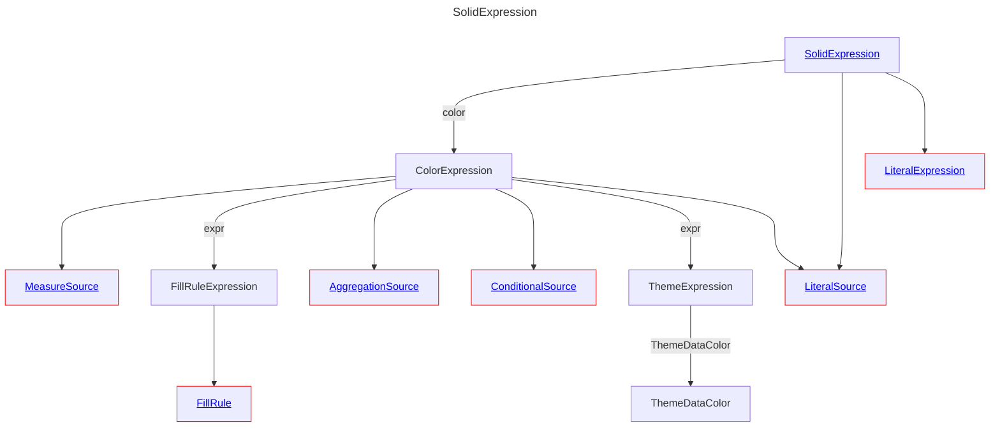

```mermaid
---
title: SolidExpression
---
graph 
AggregationSource[<a href='/layout/erd/AggregationSource'>AggregationSource</a>]
style AggregationSource stroke:#ff0000,stroke-width:1px
ColorExpression[ColorExpression]
ConditionalSource[<a href='/layout/erd/ConditionalSource'>ConditionalSource</a>]
style ConditionalSource stroke:#ff0000,stroke-width:1px
FillRule[<a href='/layout/erd/FillRule'>FillRule</a>]
style FillRule stroke:#ff0000,stroke-width:1px
FillRuleExpression[FillRuleExpression]
LiteralExpression[<a href='/layout/erd/LiteralExpression'>LiteralExpression</a>]
style LiteralExpression stroke:#ff0000,stroke-width:1px
LiteralSource[<a href='/layout/erd/LiteralSource'>LiteralSource</a>]
style LiteralSource stroke:#ff0000,stroke-width:1px
MeasureSource[<a href='/layout/erd/MeasureSource'>MeasureSource</a>]
style MeasureSource stroke:#ff0000,stroke-width:1px
SolidExpression[<a href='/layout/erd/SolidExpression'>SolidExpression</a>]
ThemeDataColor[ThemeDataColor]
ThemeExpression[ThemeExpression]
FillRuleExpression ---> FillRule
ColorExpression ---> MeasureSource
SolidExpression --->|color| ColorExpression
ColorExpression --->|expr| FillRuleExpression
ColorExpression ---> AggregationSource
ColorExpression ---> ConditionalSource
SolidExpression ---> LiteralSource
ColorExpression --->|expr| ThemeExpression
ThemeExpression --->|ThemeDataColor| ThemeDataColor
SolidExpression ---> LiteralExpression
ColorExpression ---> LiteralSource
```