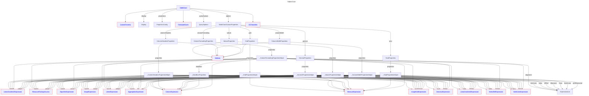

```mermaid
---
title: TableChart
---
graph 
AggregationExpression[<a href='/layout/erd/AggregationExpression'>AggregationExpression</a>]
style AggregationExpression stroke:#ff0000,stroke-width:1px
AlgorithmExpression[<a href='/layout/erd/AlgorithmExpression'>AlgorithmExpression</a>]
style AlgorithmExpression stroke:#ff0000,stroke-width:1px
ColumnExpression[<a href='/layout/erd/ColumnExpression'>ColumnExpression</a>]
style ColumnExpression stroke:#ff0000,stroke-width:1px
ColumnFormattingProperties[ColumnFormattingProperties]
ColumnHeadersProperties[ColumnHeadersProperties]
ColumnProperty[<a href='/layout/erd/ColumnProperty'>ColumnProperty</a>]
style ColumnProperty stroke:#ff0000,stroke-width:1px
ColumnWidthProperties[ColumnWidthProperties]
Display[Display]
ExpressionList[ExpressionList]
GeneralProperties[GeneralProperties]
GeoJsonExpression[<a href='/layout/erd/GeoJsonExpression'>GeoJsonExpression</a>]
style GeoJsonExpression stroke:#ff0000,stroke-width:1px
GridProperties[GridProperties]
ImageExpression[<a href='/layout/erd/ImageExpression'>ImageExpression</a>]
style ImageExpression stroke:#ff0000,stroke-width:1px
ImageKindExpression[<a href='/layout/erd/ImageKindExpression'>ImageKindExpression</a>]
style ImageKindExpression stroke:#ff0000,stroke-width:1px
LinearGradient2Expression[<a href='/layout/erd/LinearGradient2Expression'>LinearGradient2Expression</a>]
style LinearGradient2Expression stroke:#ff0000,stroke-width:1px
LinearGradient3Expression[<a href='/layout/erd/LinearGradient3Expression'>LinearGradient3Expression</a>]
style LinearGradient3Expression stroke:#ff0000,stroke-width:1px
LiteralExpression[<a href='/layout/erd/LiteralExpression'>LiteralExpression</a>]
style LiteralExpression stroke:#ff0000,stroke-width:1px
MeasureExpression[<a href='/layout/erd/MeasureExpression'>MeasureExpression</a>]
style MeasureExpression stroke:#ff0000,stroke-width:1px
ProjectionConfig[ProjectionConfig]
PrototypeQuery[<a href='/layout/erd/PrototypeQuery'>PrototypeQuery</a>]
style PrototypeQuery stroke:#ff0000,stroke-width:1px
QueryOptions[QueryOptions]
ResourcePackageAccess[<a href='/layout/erd/ResourcePackageAccess'>ResourcePackageAccess</a>]
style ResourcePackageAccess stroke:#ff0000,stroke-width:1px
SelectRefExpression[<a href='/layout/erd/SelectRefExpression'>SelectRefExpression</a>]
style SelectRefExpression stroke:#ff0000,stroke-width:1px
Selector[<a href='/layout/erd/Selector'>Selector</a>]
style Selector stroke:#ff0000,stroke-width:1px
SolidColorExpression[<a href='/layout/erd/SolidColorExpression'>SolidColorExpression</a>]
style SolidColorExpression stroke:#ff0000,stroke-width:1px
TableChart[<a href='/layout/erd/TableChart'>TableChart</a>]
TableChartColumnProperties[TableChartColumnProperties]
TotalProperties[TotalProperties]
VCProperties[<a href='/layout/erd/VCProperties'>VCProperties</a>]
style VCProperties stroke:#ff0000,stroke-width:1px
ValuesProperties[ValuesProperties]
_ColumnFormattingPropertiesHelper[_ColumnFormattingPropertiesHelper]
_ColumnHeadersPropertiesHelper[_ColumnHeadersPropertiesHelper]
_ColumnWidthPropertiesHelper[_ColumnWidthPropertiesHelper]
_DataBarsProperties[_DataBarsProperties]
_GeneralPropertiesHelper[_GeneralPropertiesHelper]
_GridPropertiesHelper[_GridPropertiesHelper]
_TotalPropertiesHelper[_TotalPropertiesHelper]
_ValuesPropertiesHelper[_ValuesPropertiesHelper]
_ColumnFormattingPropertiesHelper ---> LiteralExpression
_ColumnWidthPropertiesHelper ---> LiteralExpression
_DataBarsProperties ---> ImageKindExpression
_ValuesPropertiesHelper ---> LiteralExpression
TableChart --->|queryOptions| QueryOptions
_GridPropertiesHelper ---> MeasureExpression
_ColumnFormattingPropertiesHelper ---> ImageKindExpression
_ColumnFormattingPropertiesHelper --->|alignment| ExpressionList
_GridPropertiesHelper ---> AlgorithmExpression
_ColumnWidthPropertiesHelper ---> ColumnExpression
_DataBarsProperties ---> AlgorithmExpression
ValuesProperties ---> Selector
_ColumnHeadersPropertiesHelper ---> LinearGradient2Expression
_ColumnHeadersPropertiesHelper ---> ResourcePackageAccess
_ColumnWidthPropertiesHelper ---> GeoJsonExpression
_DataBarsProperties ---> SolidColorExpression
_ValuesPropertiesHelper ---> AlgorithmExpression
_ColumnWidthPropertiesHelper ---> MeasureExpression
_ValuesPropertiesHelper ---> ImageExpression
TableChart ---> ColumnProperty
_ColumnHeadersPropertiesHelper ---> AlgorithmExpression
_ColumnHeadersPropertiesHelper ---> ImageExpression
_ColumnFormattingPropertiesHelper ---> LinearGradient3Expression
TableChartColumnProperties --->|columnHeaders| ColumnHeadersProperties
TableChartColumnProperties --->|general| GeneralProperties
_GeneralPropertiesHelper ---> SolidColorExpression
TableChart ---> PrototypeQuery
_GeneralPropertiesHelper ---> LinearGradient3Expression
_ColumnFormattingPropertiesHelper ---> ResourcePackageAccess
_ColumnWidthPropertiesHelper ---> SolidColorExpression
_ColumnHeadersPropertiesHelper ---> LiteralExpression
_DataBarsProperties --->|axisColor| ExpressionList
_DataBarsProperties ---> AggregationExpression
_ValuesPropertiesHelper ---> LinearGradient3Expression
_GeneralPropertiesHelper ---> MeasureExpression
_ColumnHeadersPropertiesHelper ---> AggregationExpression
ColumnHeadersProperties --->|properties| _ColumnHeadersPropertiesHelper
_DataBarsProperties ---> LiteralExpression
_ColumnFormattingPropertiesHelper ---> AlgorithmExpression
_DataBarsProperties ---> MeasureExpression
_GridPropertiesHelper ---> LinearGradient3Expression
_TotalPropertiesHelper ---> ImageExpression
_ValuesPropertiesHelper ---> ResourcePackageAccess
ColumnWidthProperties ---> Selector
_GridPropertiesHelper ---> LinearGradient2Expression
_ValuesPropertiesHelper ---> ImageKindExpression
_ValuesPropertiesHelper ---> ColumnExpression
_GridPropertiesHelper ---> SelectRefExpression
_DataBarsProperties ---> ResourcePackageAccess
_TotalPropertiesHelper ---> LinearGradient2Expression
_ColumnWidthPropertiesHelper ---> ImageKindExpression
_DataBarsProperties ---> ImageExpression
_GeneralPropertiesHelper ---> LiteralExpression
_ValuesPropertiesHelper ---> SolidColorExpression
_TotalPropertiesHelper ---> GeoJsonExpression
_GeneralPropertiesHelper ---> ImageExpression
_DataBarsProperties ---> SelectRefExpression
_GridPropertiesHelper ---> AggregationExpression
_GeneralPropertiesHelper ---> AlgorithmExpression
_ColumnHeadersPropertiesHelper ---> ColumnExpression
TableChartColumnProperties --->|columnFormatting| ColumnFormattingProperties
_ColumnHeadersPropertiesHelper ---> MeasureExpression
_ColumnHeadersPropertiesHelper ---> ImageKindExpression
_GeneralPropertiesHelper ---> SelectRefExpression
_ColumnWidthPropertiesHelper ---> AlgorithmExpression
_TotalPropertiesHelper ---> AggregationExpression
_GridPropertiesHelper ---> LiteralExpression
TableChart --->|display| Display
_ColumnHeadersPropertiesHelper ---> GeoJsonExpression
TableChart ---> VCProperties
ColumnFormattingProperties --->|properties| _ColumnFormattingPropertiesHelper
TableChartColumnProperties --->|total| TotalProperties
_GeneralPropertiesHelper ---> AggregationExpression
_TotalPropertiesHelper ---> AlgorithmExpression
_GeneralPropertiesHelper ---> ImageKindExpression
_GridPropertiesHelper ---> ImageExpression
ColumnFormattingProperties ---> Selector
_GeneralPropertiesHelper ---> GeoJsonExpression
_ColumnHeadersPropertiesHelper ---> LinearGradient3Expression
_ColumnWidthPropertiesHelper --->|value| ExpressionList
_TotalPropertiesHelper ---> SelectRefExpression
_TotalPropertiesHelper ---> LinearGradient3Expression
TotalProperties --->|properties| _TotalPropertiesHelper
TableChart --->|projections| ProjectionConfig
_ColumnFormattingPropertiesHelper ---> LinearGradient2Expression
_ColumnHeadersPropertiesHelper ---> SelectRefExpression
_ColumnWidthPropertiesHelper ---> ImageExpression
_GridPropertiesHelper ---> GeoJsonExpression
_TotalPropertiesHelper ---> ImageKindExpression
_GridPropertiesHelper ---> ColumnExpression
_GeneralPropertiesHelper ---> LinearGradient2Expression
_ColumnFormattingPropertiesHelper ---> AggregationExpression
GridProperties --->|properties| _GridPropertiesHelper
_ValuesPropertiesHelper ---> AggregationExpression
_ColumnWidthPropertiesHelper ---> SelectRefExpression
_ValuesPropertiesHelper ---> GeoJsonExpression
_ValuesPropertiesHelper ---> MeasureExpression
_GridPropertiesHelper ---> SolidColorExpression
_TotalPropertiesHelper ---> ColumnExpression
TableChart --->|objects| TableChartColumnProperties
_TotalPropertiesHelper ---> LiteralExpression
TableChartColumnProperties --->|columnWidth| ColumnWidthProperties
_GeneralPropertiesHelper --->|altText| ExpressionList
ColumnHeadersProperties ---> Selector
_ColumnHeadersPropertiesHelper ---> SolidColorExpression
_ColumnHeadersPropertiesHelper --->|alignment| ExpressionList
ValuesProperties --->|properties| _ValuesPropertiesHelper
_GeneralPropertiesHelper ---> ColumnExpression
_ColumnFormattingPropertiesHelper ---> ImageExpression
ColumnWidthProperties --->|properties| _ColumnWidthPropertiesHelper
_TotalPropertiesHelper ---> MeasureExpression
_ColumnWidthPropertiesHelper ---> AggregationExpression
TableChartColumnProperties --->|grid| GridProperties
_GridPropertiesHelper ---> ImageKindExpression
_ColumnWidthPropertiesHelper ---> LinearGradient3Expression
_DataBarsProperties ---> LinearGradient3Expression
_GridPropertiesHelper ---> ResourcePackageAccess
_ColumnFormattingPropertiesHelper --->|dataBars| _DataBarsProperties
_ColumnFormattingPropertiesHelper ---> MeasureExpression
_GeneralPropertiesHelper ---> ResourcePackageAccess
_TotalPropertiesHelper --->|show| ExpressionList
_ColumnFormattingPropertiesHelper ---> SelectRefExpression
_ColumnWidthPropertiesHelper ---> ResourcePackageAccess
_ValuesPropertiesHelper --->|backColor| ExpressionList
_DataBarsProperties ---> LinearGradient2Expression
_TotalPropertiesHelper ---> ResourcePackageAccess
_DataBarsProperties ---> ColumnExpression
_DataBarsProperties ---> GeoJsonExpression
_ColumnFormattingPropertiesHelper ---> GeoJsonExpression
_GridPropertiesHelper --->|gridHorizontal| ExpressionList
_TotalPropertiesHelper ---> SolidColorExpression
GeneralProperties --->|properties| _GeneralPropertiesHelper
_ColumnFormattingPropertiesHelper ---> SolidColorExpression
_ValuesPropertiesHelper ---> LinearGradient2Expression
GridProperties ---> Selector
_ColumnWidthPropertiesHelper ---> LinearGradient2Expression
_ValuesPropertiesHelper ---> SelectRefExpression
_ColumnFormattingPropertiesHelper ---> ColumnExpression
TableChartColumnProperties --->|values| ValuesProperties
```