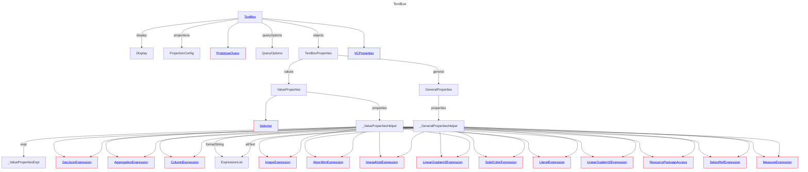

```mermaid
---
title: TextBox
---
graph 
AggregationExpression[<a href='/layout/erd/AggregationExpression'>AggregationExpression</a>]
style AggregationExpression stroke:#ff0000,stroke-width:1px
AlgorithmExpression[<a href='/layout/erd/AlgorithmExpression'>AlgorithmExpression</a>]
style AlgorithmExpression stroke:#ff0000,stroke-width:1px
ColumnExpression[<a href='/layout/erd/ColumnExpression'>ColumnExpression</a>]
style ColumnExpression stroke:#ff0000,stroke-width:1px
Display[Display]
ExpressionList[ExpressionList]
GeneralProperties[GeneralProperties]
GeoJsonExpression[<a href='/layout/erd/GeoJsonExpression'>GeoJsonExpression</a>]
style GeoJsonExpression stroke:#ff0000,stroke-width:1px
ImageExpression[<a href='/layout/erd/ImageExpression'>ImageExpression</a>]
style ImageExpression stroke:#ff0000,stroke-width:1px
ImageKindExpression[<a href='/layout/erd/ImageKindExpression'>ImageKindExpression</a>]
style ImageKindExpression stroke:#ff0000,stroke-width:1px
LinearGradient2Expression[<a href='/layout/erd/LinearGradient2Expression'>LinearGradient2Expression</a>]
style LinearGradient2Expression stroke:#ff0000,stroke-width:1px
LinearGradient3Expression[<a href='/layout/erd/LinearGradient3Expression'>LinearGradient3Expression</a>]
style LinearGradient3Expression stroke:#ff0000,stroke-width:1px
LiteralExpression[<a href='/layout/erd/LiteralExpression'>LiteralExpression</a>]
style LiteralExpression stroke:#ff0000,stroke-width:1px
MeasureExpression[<a href='/layout/erd/MeasureExpression'>MeasureExpression</a>]
style MeasureExpression stroke:#ff0000,stroke-width:1px
ProjectionConfig[ProjectionConfig]
PrototypeQuery[<a href='/layout/erd/PrototypeQuery'>PrototypeQuery</a>]
style PrototypeQuery stroke:#ff0000,stroke-width:1px
QueryOptions[QueryOptions]
ResourcePackageAccess[<a href='/layout/erd/ResourcePackageAccess'>ResourcePackageAccess</a>]
style ResourcePackageAccess stroke:#ff0000,stroke-width:1px
SelectRefExpression[<a href='/layout/erd/SelectRefExpression'>SelectRefExpression</a>]
style SelectRefExpression stroke:#ff0000,stroke-width:1px
Selector[<a href='/layout/erd/Selector'>Selector</a>]
style Selector stroke:#ff0000,stroke-width:1px
SolidColorExpression[<a href='/layout/erd/SolidColorExpression'>SolidColorExpression</a>]
style SolidColorExpression stroke:#ff0000,stroke-width:1px
TextBox[<a href='/layout/erd/TextBox'>TextBox</a>]
TextBoxProperties[TextBoxProperties]
VCProperties[<a href='/layout/erd/VCProperties'>VCProperties</a>]
style VCProperties stroke:#ff0000,stroke-width:1px
ValueProperties[ValueProperties]
_GeneralPropertiesHelper[_GeneralPropertiesHelper]
_ValuePropertiesExpr[_ValuePropertiesExpr]
_ValuePropertiesHelper[_ValuePropertiesHelper]
ValueProperties ---> Selector
_ValuePropertiesHelper ---> GeoJsonExpression
_GeneralPropertiesHelper --->|altText| ExpressionList
TextBox --->|display| Display
_ValuePropertiesHelper ---> LinearGradient3Expression
TextBox ---> PrototypeQuery
_ValuePropertiesHelper ---> ImageExpression
_GeneralPropertiesHelper ---> AggregationExpression
_GeneralPropertiesHelper ---> ColumnExpression
_ValuePropertiesHelper ---> AlgorithmExpression
_GeneralPropertiesHelper ---> ImageKindExpression
_ValuePropertiesHelper ---> ColumnExpression
_GeneralPropertiesHelper ---> LiteralExpression
_GeneralPropertiesHelper ---> GeoJsonExpression
_ValuePropertiesHelper ---> AggregationExpression
TextBox --->|projections| ProjectionConfig
_ValuePropertiesHelper --->|formatString| ExpressionList
_GeneralPropertiesHelper ---> ImageExpression
_GeneralPropertiesHelper ---> ResourcePackageAccess
_ValuePropertiesHelper ---> SolidColorExpression
_GeneralPropertiesHelper ---> AlgorithmExpression
TextBox ---> VCProperties
TextBox --->|objects| TextBoxProperties
_ValuePropertiesHelper ---> ImageKindExpression
_GeneralPropertiesHelper ---> LinearGradient2Expression
GeneralProperties --->|properties| _GeneralPropertiesHelper
_GeneralPropertiesHelper ---> SolidColorExpression
_ValuePropertiesHelper --->|expr| _ValuePropertiesExpr
TextBoxProperties --->|values| ValueProperties
ValueProperties --->|properties| _ValuePropertiesHelper
_GeneralPropertiesHelper ---> SelectRefExpression
_GeneralPropertiesHelper ---> LinearGradient3Expression
_ValuePropertiesHelper ---> LinearGradient2Expression
_ValuePropertiesHelper ---> SelectRefExpression
_ValuePropertiesHelper ---> MeasureExpression
TextBox --->|queryOptions| QueryOptions
TextBoxProperties --->|general| GeneralProperties
_ValuePropertiesHelper ---> ResourcePackageAccess
_GeneralPropertiesHelper ---> MeasureExpression
_ValuePropertiesHelper ---> LiteralExpression
```