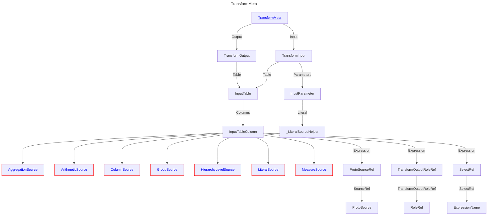

```mermaid
---
title: TransformMeta
---
graph 
AggregationSource[<a href='/layout/erd/AggregationSource'>AggregationSource</a>]
style AggregationSource stroke:#ff0000,stroke-width:1px
ArithmeticSource[<a href='/layout/erd/ArithmeticSource'>ArithmeticSource</a>]
style ArithmeticSource stroke:#ff0000,stroke-width:1px
ColumnSource[<a href='/layout/erd/ColumnSource'>ColumnSource</a>]
style ColumnSource stroke:#ff0000,stroke-width:1px
ExpressionName[ExpressionName]
GroupSource[<a href='/layout/erd/GroupSource'>GroupSource</a>]
style GroupSource stroke:#ff0000,stroke-width:1px
HierarchyLevelSource[<a href='/layout/erd/HierarchyLevelSource'>HierarchyLevelSource</a>]
style HierarchyLevelSource stroke:#ff0000,stroke-width:1px
InputParameter[InputParameter]
InputTable[InputTable]
InputTableColumn[InputTableColumn]
LiteralSource[<a href='/layout/erd/LiteralSource'>LiteralSource</a>]
style LiteralSource stroke:#ff0000,stroke-width:1px
MeasureSource[<a href='/layout/erd/MeasureSource'>MeasureSource</a>]
style MeasureSource stroke:#ff0000,stroke-width:1px
ProtoSource[ProtoSource]
ProtoSourceRef[ProtoSourceRef]
RoleRef[RoleRef]
SelectRef[SelectRef]
TransformInput[TransformInput]
TransformMeta[<a href='/layout/erd/TransformMeta'>TransformMeta</a>]
TransformOutput[TransformOutput]
TransformOutputRoleRef[TransformOutputRoleRef]
_LiteralSourceHelper[_LiteralSourceHelper]
InputTableColumn --->|Expression| ProtoSourceRef
TransformInput --->|Parameters| InputParameter
TransformMeta --->|Output| TransformOutput
TransformOutput --->|Table| InputTable
ProtoSourceRef --->|SourceRef| ProtoSource
InputTableColumn --->|Expression| TransformOutputRoleRef
InputTableColumn ---> MeasureSource
TransformOutputRoleRef --->|TransformOutputRoleRef| RoleRef
TransformInput --->|Table| InputTable
InputTableColumn ---> AggregationSource
InputTable --->|Columns| InputTableColumn
InputTableColumn ---> ColumnSource
InputTableColumn ---> LiteralSource
InputTableColumn ---> GroupSource
SelectRef --->|SelectRef| ExpressionName
InputParameter --->|Literal| _LiteralSourceHelper
InputTableColumn ---> HierarchyLevelSource
InputTableColumn ---> ArithmeticSource
TransformMeta --->|Input| TransformInput
InputTableColumn --->|Expression| SelectRef
```