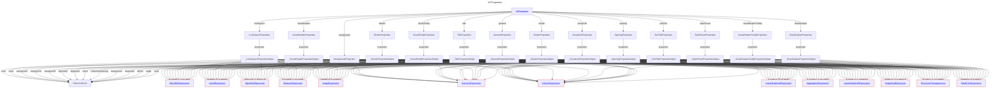

```mermaid
---
title: VCProperties
---
graph 
AggregationExpression[<a href='/layout/erd/AggregationExpression'>AggregationExpression</a>]
style AggregationExpression stroke:#ff0000,stroke-width:1px
AlgorithmExpression[<a href='/layout/erd/AlgorithmExpression'>AlgorithmExpression</a>]
style AlgorithmExpression stroke:#ff0000,stroke-width:1px
BackgroundProperties[BackgroundProperties]
BorderProperties[BorderProperties]
ColumnExpression[<a href='/layout/erd/ColumnExpression'>ColumnExpression</a>]
style ColumnExpression stroke:#ff0000,stroke-width:1px
DividerProperties[DividerProperties]
DropShadowProperties[DropShadowProperties]
ExpressionList[ExpressionList]
GeneralProperties[GeneralProperties]
GeoJsonExpression[<a href='/layout/erd/GeoJsonExpression'>GeoJsonExpression</a>]
style GeoJsonExpression stroke:#ff0000,stroke-width:1px
ImageExpression[<a href='/layout/erd/ImageExpression'>ImageExpression</a>]
style ImageExpression stroke:#ff0000,stroke-width:1px
ImageKindExpression[<a href='/layout/erd/ImageKindExpression'>ImageKindExpression</a>]
style ImageKindExpression stroke:#ff0000,stroke-width:1px
LinearGradient2Expression[<a href='/layout/erd/LinearGradient2Expression'>LinearGradient2Expression</a>]
style LinearGradient2Expression stroke:#ff0000,stroke-width:1px
LinearGradient3Expression[<a href='/layout/erd/LinearGradient3Expression'>LinearGradient3Expression</a>]
style LinearGradient3Expression stroke:#ff0000,stroke-width:1px
LiteralExpression[<a href='/layout/erd/LiteralExpression'>LiteralExpression</a>]
style LiteralExpression stroke:#ff0000,stroke-width:1px
LockAspectProperties[LockAspectProperties]
MeasureExpression[<a href='/layout/erd/MeasureExpression'>MeasureExpression</a>]
style MeasureExpression stroke:#ff0000,stroke-width:1px
ResourcePackageAccess[<a href='/layout/erd/ResourcePackageAccess'>ResourcePackageAccess</a>]
style ResourcePackageAccess stroke:#ff0000,stroke-width:1px
SelectRefExpression[<a href='/layout/erd/SelectRefExpression'>SelectRefExpression</a>]
style SelectRefExpression stroke:#ff0000,stroke-width:1px
SolidColorExpression[<a href='/layout/erd/SolidColorExpression'>SolidColorExpression</a>]
style SolidColorExpression stroke:#ff0000,stroke-width:1px
SpacingProperties[SpacingProperties]
StylePresetProperties[StylePresetProperties]
SubTitleProperties[SubTitleProperties]
TitleProperties[TitleProperties]
VCProperties[<a href='/layout/erd/VCProperties'>VCProperties</a>]
VisualHeaderProperties[VisualHeaderProperties]
VisualHeaderTooltipProperties[VisualHeaderTooltipProperties]
VisualLinkProperties[VisualLinkProperties]
VisualTooltipProperties[VisualTooltipProperties]
_BorderPropertiesHelper[_BorderPropertiesHelper]
_DividerPropertiesHelper[_DividerPropertiesHelper]
_DropShadowPropertiesHelper[_DropShadowPropertiesHelper]
_GeneralPropertiesHelper[_GeneralPropertiesHelper]
_LockAspectPropertiesHelper[_LockAspectPropertiesHelper]
_SpacingPropertiesHelper[_SpacingPropertiesHelper]
_StylePresetPropertiesHelper[_StylePresetPropertiesHelper]
_SubTitlePropertiesHelper[_SubTitlePropertiesHelper]
_TitlePropertiesHelper[_TitlePropertiesHelper]
_VisualHeaderPropertiesHelper[_VisualHeaderPropertiesHelper]
_VisualHeaderTooltipPropertiesHelper[_VisualHeaderTooltipPropertiesHelper]
_VisualLinkPropertiesHelper[_VisualLinkPropertiesHelper]
_VisualTooltipPropertiesHelper[_VisualTooltipPropertiesHelper]
_DividerPropertiesHelper ---> MeasureExpression
_DividerPropertiesHelper --->|color| ExpressionList
_LockAspectPropertiesHelper ---> ResourcePackageAccess
_LockAspectPropertiesHelper --->|show| ExpressionList
VCProperties --->|visualTooltip| VisualTooltipProperties
_VisualLinkPropertiesHelper ---> SelectRefExpression
BackgroundProperties ---> ImageExpression
_BorderPropertiesHelper ---> ImageExpression
LockAspectProperties --->|properties| _LockAspectPropertiesHelper
BackgroundProperties ---> AggregationExpression
_LockAspectPropertiesHelper ---> ImageExpression
_VisualTooltipPropertiesHelper --->|background| ExpressionList
VCProperties --->|title| TitleProperties
BackgroundProperties ---> LinearGradient2Expression
_VisualHeaderTooltipPropertiesHelper ---> MeasureExpression
_VisualHeaderPropertiesHelper ---> AggregationExpression
TitleProperties --->|properties| _TitlePropertiesHelper
_VisualTooltipPropertiesHelper ---> SelectRefExpression
_VisualTooltipPropertiesHelper ---> LiteralExpression
VCProperties --->|general| GeneralProperties
DropShadowProperties --->|properties| _DropShadowPropertiesHelper
_LockAspectPropertiesHelper ---> SolidColorExpression
BackgroundProperties ---> SolidColorExpression
BackgroundProperties ---> ColumnExpression
_VisualHeaderPropertiesHelper ---> MeasureExpression
_LockAspectPropertiesHelper ---> ImageKindExpression
_TitlePropertiesHelper ---> AggregationExpression
VCProperties --->|divider| DividerProperties
_SubTitlePropertiesHelper ---> AggregationExpression
_DividerPropertiesHelper ---> ImageExpression
_TitlePropertiesHelper ---> LinearGradient2Expression
_TitlePropertiesHelper ---> GeoJsonExpression
_GeneralPropertiesHelper ---> SolidColorExpression
_BorderPropertiesHelper ---> AlgorithmExpression
_SpacingPropertiesHelper ---> ColumnExpression
_TitlePropertiesHelper ---> SolidColorExpression
_VisualHeaderPropertiesHelper ---> ResourcePackageAccess
DividerProperties --->|properties| _DividerPropertiesHelper
SubTitleProperties --->|properties| _SubTitlePropertiesHelper
_GeneralPropertiesHelper ---> LinearGradient3Expression
_DividerPropertiesHelper ---> ResourcePackageAccess
_TitlePropertiesHelper ---> AlgorithmExpression
_VisualHeaderPropertiesHelper ---> LiteralExpression
_DividerPropertiesHelper ---> GeoJsonExpression
_VisualHeaderPropertiesHelper --->|background| ExpressionList
_GeneralPropertiesHelper ---> MeasureExpression
_SubTitlePropertiesHelper ---> LiteralExpression
_StylePresetPropertiesHelper ---> MeasureExpression
BackgroundProperties ---> MeasureExpression
_TitlePropertiesHelper ---> SelectRefExpression
VCProperties --->|visualHeader| VisualHeaderProperties
_VisualHeaderTooltipPropertiesHelper --->|background| ExpressionList
_VisualHeaderTooltipPropertiesHelper ---> ImageKindExpression
_DropShadowPropertiesHelper ---> GeoJsonExpression
_VisualLinkPropertiesHelper ---> ImageExpression
_BorderPropertiesHelper ---> LiteralExpression
_StylePresetPropertiesHelper ---> ResourcePackageAccess
_DropShadowPropertiesHelper ---> SelectRefExpression
_BorderPropertiesHelper ---> SelectRefExpression
_SubTitlePropertiesHelper --->|alignment| ExpressionList
_SubTitlePropertiesHelper ---> MeasureExpression
_StylePresetPropertiesHelper ---> AggregationExpression
_VisualHeaderPropertiesHelper ---> GeoJsonExpression
_SubTitlePropertiesHelper ---> AlgorithmExpression
_VisualHeaderTooltipPropertiesHelper ---> SelectRefExpression
_VisualTooltipPropertiesHelper ---> AlgorithmExpression
_VisualTooltipPropertiesHelper ---> MeasureExpression
_SpacingPropertiesHelper ---> GeoJsonExpression
VCProperties --->|visualHeaderTooltip| VisualHeaderTooltipProperties
BackgroundProperties ---> ImageKindExpression
_VisualLinkPropertiesHelper ---> GeoJsonExpression
_BorderPropertiesHelper ---> LinearGradient3Expression
_StylePresetPropertiesHelper ---> LiteralExpression
_SpacingPropertiesHelper ---> ImageKindExpression
_GeneralPropertiesHelper ---> LiteralExpression
StylePresetProperties --->|properties| _StylePresetPropertiesHelper
VCProperties --->|background| BackgroundProperties
_SpacingPropertiesHelper ---> SolidColorExpression
_LockAspectPropertiesHelper ---> LinearGradient2Expression
_DividerPropertiesHelper ---> SelectRefExpression
_SubTitlePropertiesHelper ---> ResourcePackageAccess
_GeneralPropertiesHelper ---> ImageExpression
_VisualTooltipPropertiesHelper ---> ImageExpression
_LockAspectPropertiesHelper ---> LiteralExpression
_VisualLinkPropertiesHelper ---> ColumnExpression
VCProperties --->|subTitle| SubTitleProperties
_GeneralPropertiesHelper ---> AlgorithmExpression
_VisualHeaderPropertiesHelper ---> ImageKindExpression
_VisualLinkPropertiesHelper ---> LinearGradient3Expression
_VisualHeaderTooltipPropertiesHelper ---> ResourcePackageAccess
_SpacingPropertiesHelper ---> LiteralExpression
_VisualHeaderPropertiesHelper ---> SelectRefExpression
_DropShadowPropertiesHelper ---> AlgorithmExpression
_VisualTooltipPropertiesHelper ---> GeoJsonExpression
_SubTitlePropertiesHelper ---> ColumnExpression
_LockAspectPropertiesHelper ---> MeasureExpression
_SubTitlePropertiesHelper ---> GeoJsonExpression
_VisualLinkPropertiesHelper ---> SolidColorExpression
_SpacingPropertiesHelper ---> SelectRefExpression
_LockAspectPropertiesHelper ---> GeoJsonExpression
VCProperties --->|border| BorderProperties
BorderProperties --->|properties| _BorderPropertiesHelper
_VisualLinkPropertiesHelper ---> LinearGradient2Expression
_VisualHeaderPropertiesHelper ---> LinearGradient2Expression
_StylePresetPropertiesHelper ---> LinearGradient3Expression
_GeneralPropertiesHelper ---> SelectRefExpression
_StylePresetPropertiesHelper ---> SolidColorExpression
_VisualTooltipPropertiesHelper ---> ColumnExpression
_DropShadowPropertiesHelper ---> LiteralExpression
_VisualTooltipPropertiesHelper ---> LinearGradient2Expression
_DividerPropertiesHelper ---> LiteralExpression
_TitlePropertiesHelper ---> ResourcePackageAccess
VCProperties --->|visualLink| VisualLinkProperties
_LockAspectPropertiesHelper ---> AggregationExpression
VisualLinkProperties --->|properties| _VisualLinkPropertiesHelper
_VisualHeaderPropertiesHelper ---> ColumnExpression
_LockAspectPropertiesHelper ---> LinearGradient3Expression
VCProperties --->|dropShadow| DropShadowProperties
_TitlePropertiesHelper ---> LinearGradient3Expression
_SpacingPropertiesHelper ---> AggregationExpression
_DividerPropertiesHelper ---> ColumnExpression
_VisualLinkPropertiesHelper ---> MeasureExpression
_LockAspectPropertiesHelper ---> ColumnExpression
_GeneralPropertiesHelper ---> AggregationExpression
_DividerPropertiesHelper ---> AlgorithmExpression
_SubTitlePropertiesHelper ---> LinearGradient2Expression
_SpacingPropertiesHelper ---> ResourcePackageAccess
BackgroundProperties ---> GeoJsonExpression
BackgroundProperties ---> LinearGradient3Expression
_DropShadowPropertiesHelper ---> LinearGradient2Expression
_VisualHeaderTooltipPropertiesHelper ---> ColumnExpression
_VisualHeaderPropertiesHelper ---> SolidColorExpression
_BorderPropertiesHelper ---> ImageKindExpression
_GeneralPropertiesHelper ---> ImageKindExpression
_VisualHeaderTooltipPropertiesHelper ---> AggregationExpression
_DividerPropertiesHelper ---> ImageKindExpression
_TitlePropertiesHelper --->|alignment| ExpressionList
_GeneralPropertiesHelper ---> GeoJsonExpression
VisualHeaderProperties --->|properties| _VisualHeaderPropertiesHelper
_VisualTooltipPropertiesHelper ---> AggregationExpression
_StylePresetPropertiesHelper --->|name| ExpressionList
VisualHeaderTooltipProperties --->|properties| _VisualHeaderTooltipPropertiesHelper
_DividerPropertiesHelper ---> AggregationExpression
_VisualHeaderTooltipPropertiesHelper ---> LiteralExpression
_SpacingPropertiesHelper --->|customizeSpacing| ExpressionList
_VisualHeaderTooltipPropertiesHelper ---> ImageExpression
_SpacingPropertiesHelper ---> AlgorithmExpression
_StylePresetPropertiesHelper ---> ImageKindExpression
_DropShadowPropertiesHelper ---> ResourcePackageAccess
_DropShadowPropertiesHelper ---> ImageExpression
_GeneralPropertiesHelper ---> LinearGradient2Expression
_BorderPropertiesHelper ---> LinearGradient2Expression
_VisualTooltipPropertiesHelper ---> LinearGradient3Expression
_VisualLinkPropertiesHelper ---> LiteralExpression
BackgroundProperties ---> ResourcePackageAccess
_BorderPropertiesHelper --->|background| ExpressionList
_DividerPropertiesHelper ---> SolidColorExpression
_VisualHeaderPropertiesHelper ---> ImageExpression
_TitlePropertiesHelper ---> LiteralExpression
_StylePresetPropertiesHelper ---> SelectRefExpression
_DropShadowPropertiesHelper ---> ColumnExpression
_BorderPropertiesHelper ---> ColumnExpression
SpacingProperties --->|properties| _SpacingPropertiesHelper
_VisualLinkPropertiesHelper --->|bookmark| ExpressionList
_GeneralPropertiesHelper --->|altText| ExpressionList
_BorderPropertiesHelper ---> ResourcePackageAccess
_VisualTooltipPropertiesHelper ---> ImageKindExpression
_BorderPropertiesHelper ---> MeasureExpression
_VisualHeaderPropertiesHelper ---> LinearGradient3Expression
VCProperties --->|stylePreset| StylePresetProperties
_GeneralPropertiesHelper ---> ColumnExpression
_VisualLinkPropertiesHelper ---> ResourcePackageAccess
_DropShadowPropertiesHelper ---> LinearGradient3Expression
VCProperties --->|lockAspect| LockAspectProperties
_BorderPropertiesHelper ---> AggregationExpression
_SubTitlePropertiesHelper ---> LinearGradient3Expression
_StylePresetPropertiesHelper ---> AlgorithmExpression
_TitlePropertiesHelper ---> ImageKindExpression
_LockAspectPropertiesHelper ---> AlgorithmExpression
_DropShadowPropertiesHelper ---> AggregationExpression
_SpacingPropertiesHelper ---> LinearGradient2Expression
_VisualHeaderTooltipPropertiesHelper ---> GeoJsonExpression
_BorderPropertiesHelper ---> GeoJsonExpression
BackgroundProperties ---> SelectRefExpression
_SpacingPropertiesHelper ---> MeasureExpression
_LockAspectPropertiesHelper ---> SelectRefExpression
_DividerPropertiesHelper ---> LinearGradient3Expression
_GeneralPropertiesHelper ---> ResourcePackageAccess
_TitlePropertiesHelper ---> ColumnExpression
_SubTitlePropertiesHelper ---> SelectRefExpression
_DropShadowPropertiesHelper ---> ImageKindExpression
_VisualTooltipPropertiesHelper ---> ResourcePackageAccess
_TitlePropertiesHelper ---> ImageExpression
_VisualHeaderTooltipPropertiesHelper ---> SolidColorExpression
BackgroundProperties ---> LiteralExpression
_DividerPropertiesHelper ---> LinearGradient2Expression
VisualTooltipProperties --->|properties| _VisualTooltipPropertiesHelper
_SpacingPropertiesHelper ---> LinearGradient3Expression
_VisualTooltipPropertiesHelper ---> SolidColorExpression
_DropShadowPropertiesHelper ---> SolidColorExpression
_SpacingPropertiesHelper ---> ImageExpression
_BorderPropertiesHelper ---> SolidColorExpression
_VisualLinkPropertiesHelper ---> AggregationExpression
_VisualHeaderTooltipPropertiesHelper ---> LinearGradient3Expression
_DropShadowPropertiesHelper ---> MeasureExpression
_StylePresetPropertiesHelper ---> ImageExpression
_SubTitlePropertiesHelper ---> ImageKindExpression
GeneralProperties --->|properties| _GeneralPropertiesHelper
VCProperties --->|spacing| SpacingProperties
_VisualLinkPropertiesHelper ---> AlgorithmExpression
_DropShadowPropertiesHelper --->|angle| ExpressionList
_SubTitlePropertiesHelper ---> ImageExpression
_StylePresetPropertiesHelper ---> LinearGradient2Expression
_StylePresetPropertiesHelper ---> ColumnExpression
_SubTitlePropertiesHelper ---> SolidColorExpression
BackgroundProperties ---> AlgorithmExpression
_TitlePropertiesHelper ---> MeasureExpression
_VisualHeaderTooltipPropertiesHelper ---> AlgorithmExpression
_StylePresetPropertiesHelper ---> GeoJsonExpression
_VisualHeaderPropertiesHelper ---> AlgorithmExpression
_VisualLinkPropertiesHelper ---> ImageKindExpression
BackgroundProperties --->|show| ExpressionList
_VisualHeaderTooltipPropertiesHelper ---> LinearGradient2Expression
```