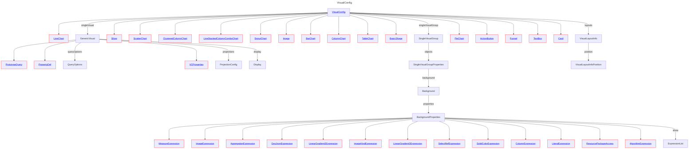

```mermaid
---
title: VisualConfig
---
graph 
ActionButton[<a href='/layout/erd/ActionButton'>ActionButton</a>]
style ActionButton stroke:#ff0000,stroke-width:1px
AggregationExpression[<a href='/layout/erd/AggregationExpression'>AggregationExpression</a>]
style AggregationExpression stroke:#ff0000,stroke-width:1px
AlgorithmExpression[<a href='/layout/erd/AlgorithmExpression'>AlgorithmExpression</a>]
style AlgorithmExpression stroke:#ff0000,stroke-width:1px
Background[Background]
BackgroundProperties[BackgroundProperties]
BarChart[<a href='/layout/erd/BarChart'>BarChart</a>]
style BarChart stroke:#ff0000,stroke-width:1px
BasicShape[<a href='/layout/erd/BasicShape'>BasicShape</a>]
style BasicShape stroke:#ff0000,stroke-width:1px
Card[<a href='/layout/erd/Card'>Card</a>]
style Card stroke:#ff0000,stroke-width:1px
ClusteredColumnChart[<a href='/layout/erd/ClusteredColumnChart'>ClusteredColumnChart</a>]
style ClusteredColumnChart stroke:#ff0000,stroke-width:1px
ColumnChart[<a href='/layout/erd/ColumnChart'>ColumnChart</a>]
style ColumnChart stroke:#ff0000,stroke-width:1px
ColumnExpression[<a href='/layout/erd/ColumnExpression'>ColumnExpression</a>]
style ColumnExpression stroke:#ff0000,stroke-width:1px
Display[Display]
DonutChart[<a href='/layout/erd/DonutChart'>DonutChart</a>]
style DonutChart stroke:#ff0000,stroke-width:1px
ExpressionList[ExpressionList]
Funnel[<a href='/layout/erd/Funnel'>Funnel</a>]
style Funnel stroke:#ff0000,stroke-width:1px
GenericVisual[GenericVisual]
GeoJsonExpression[<a href='/layout/erd/GeoJsonExpression'>GeoJsonExpression</a>]
style GeoJsonExpression stroke:#ff0000,stroke-width:1px
Image[<a href='/layout/erd/Image'>Image</a>]
style Image stroke:#ff0000,stroke-width:1px
ImageExpression[<a href='/layout/erd/ImageExpression'>ImageExpression</a>]
style ImageExpression stroke:#ff0000,stroke-width:1px
ImageKindExpression[<a href='/layout/erd/ImageKindExpression'>ImageKindExpression</a>]
style ImageKindExpression stroke:#ff0000,stroke-width:1px
LineChart[<a href='/layout/erd/LineChart'>LineChart</a>]
style LineChart stroke:#ff0000,stroke-width:1px
LineStackedColumnComboChart[<a href='/layout/erd/LineStackedColumnComboChart'>LineStackedColumnComboChart</a>]
style LineStackedColumnComboChart stroke:#ff0000,stroke-width:1px
LinearGradient2Expression[<a href='/layout/erd/LinearGradient2Expression'>LinearGradient2Expression</a>]
style LinearGradient2Expression stroke:#ff0000,stroke-width:1px
LinearGradient3Expression[<a href='/layout/erd/LinearGradient3Expression'>LinearGradient3Expression</a>]
style LinearGradient3Expression stroke:#ff0000,stroke-width:1px
LiteralExpression[<a href='/layout/erd/LiteralExpression'>LiteralExpression</a>]
style LiteralExpression stroke:#ff0000,stroke-width:1px
MeasureExpression[<a href='/layout/erd/MeasureExpression'>MeasureExpression</a>]
style MeasureExpression stroke:#ff0000,stroke-width:1px
PieChart[<a href='/layout/erd/PieChart'>PieChart</a>]
style PieChart stroke:#ff0000,stroke-width:1px
ProjectionConfig[ProjectionConfig]
PropertyDef[<a href='/layout/erd/PropertyDef'>PropertyDef</a>]
style PropertyDef stroke:#ff0000,stroke-width:1px
PrototypeQuery[<a href='/layout/erd/PrototypeQuery'>PrototypeQuery</a>]
style PrototypeQuery stroke:#ff0000,stroke-width:1px
QueryOptions[QueryOptions]
ResourcePackageAccess[<a href='/layout/erd/ResourcePackageAccess'>ResourcePackageAccess</a>]
style ResourcePackageAccess stroke:#ff0000,stroke-width:1px
ScatterChart[<a href='/layout/erd/ScatterChart'>ScatterChart</a>]
style ScatterChart stroke:#ff0000,stroke-width:1px
SelectRefExpression[<a href='/layout/erd/SelectRefExpression'>SelectRefExpression</a>]
style SelectRefExpression stroke:#ff0000,stroke-width:1px
SingleVisualGroup[SingleVisualGroup]
SingleVisualGroupProperties[SingleVisualGroupProperties]
Slicer[<a href='/layout/erd/Slicer'>Slicer</a>]
style Slicer stroke:#ff0000,stroke-width:1px
SolidColorExpression[<a href='/layout/erd/SolidColorExpression'>SolidColorExpression</a>]
style SolidColorExpression stroke:#ff0000,stroke-width:1px
TableChart[<a href='/layout/erd/TableChart'>TableChart</a>]
style TableChart stroke:#ff0000,stroke-width:1px
TextBox[<a href='/layout/erd/TextBox'>TextBox</a>]
style TextBox stroke:#ff0000,stroke-width:1px
VCProperties[<a href='/layout/erd/VCProperties'>VCProperties</a>]
style VCProperties stroke:#ff0000,stroke-width:1px
VisualConfig[<a href='/layout/erd/VisualConfig'>VisualConfig</a>]
VisualLayoutInfo[VisualLayoutInfo]
VisualLayoutInfoPosition[VisualLayoutInfoPosition]
BackgroundProperties ---> MeasureExpression
VisualConfig ---> LineChart
VisualConfig --->|singleVisual| GenericVisual
VisualConfig ---> Slicer
BackgroundProperties ---> ImageExpression
BackgroundProperties ---> AggregationExpression
VisualConfig ---> ScatterChart
VisualConfig ---> ClusteredColumnChart
VisualConfig ---> LineStackedColumnComboChart
BackgroundProperties ---> GeoJsonExpression
BackgroundProperties ---> LinearGradient2Expression
BackgroundProperties ---> ImageKindExpression
BackgroundProperties ---> LinearGradient3Expression
GenericVisual ---> PrototypeQuery
VisualConfig ---> DonutChart
BackgroundProperties ---> SelectRefExpression
GenericVisual ---> PropertyDef
VisualConfig ---> Image
BackgroundProperties ---> SolidColorExpression
VisualConfig ---> BarChart
VisualConfig ---> ColumnChart
BackgroundProperties ---> ColumnExpression
GenericVisual --->|queryOptions| QueryOptions
BackgroundProperties ---> LiteralExpression
GenericVisual ---> VCProperties
VisualConfig ---> TableChart
VisualLayoutInfo --->|position| VisualLayoutInfoPosition
VisualConfig ---> BasicShape
VisualConfig --->|singleVisualGroup| SingleVisualGroup
VisualConfig ---> PieChart
VisualConfig ---> ActionButton
SingleVisualGroupProperties --->|background| Background
SingleVisualGroup --->|objects| SingleVisualGroupProperties
BackgroundProperties ---> ResourcePackageAccess
GenericVisual --->|projections| ProjectionConfig
GenericVisual --->|display| Display
BackgroundProperties ---> AlgorithmExpression
VisualConfig ---> Funnel
Background --->|properties| BackgroundProperties
VisualConfig ---> TextBox
VisualConfig ---> Card
VisualConfig --->|layouts| VisualLayoutInfo
BackgroundProperties --->|show| ExpressionList
```