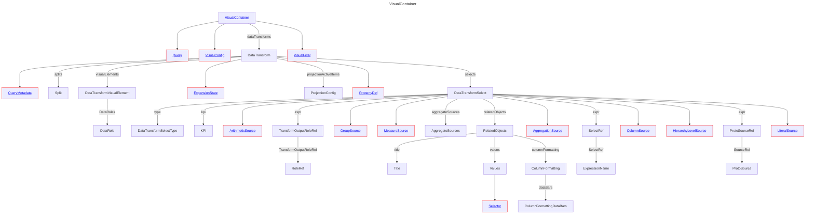

```mermaid
---
title: VisualContainer
---
graph 
AggregateSources[AggregateSources]
AggregationSource[<a href='/layout/erd/AggregationSource'>AggregationSource</a>]
style AggregationSource stroke:#ff0000,stroke-width:1px
ArithmeticSource[<a href='/layout/erd/ArithmeticSource'>ArithmeticSource</a>]
style ArithmeticSource stroke:#ff0000,stroke-width:1px
ColumnFormatting[ColumnFormatting]
ColumnFormattingDataBars[ColumnFormattingDataBars]
ColumnSource[<a href='/layout/erd/ColumnSource'>ColumnSource</a>]
style ColumnSource stroke:#ff0000,stroke-width:1px
DataRole[DataRole]
DataTransform[DataTransform]
DataTransformSelect[DataTransformSelect]
DataTransformSelectType[DataTransformSelectType]
DataTransformVisualElement[DataTransformVisualElement]
ExpansionState[<a href='/layout/erd/ExpansionState'>ExpansionState</a>]
style ExpansionState stroke:#ff0000,stroke-width:1px
ExpressionName[ExpressionName]
GroupSource[<a href='/layout/erd/GroupSource'>GroupSource</a>]
style GroupSource stroke:#ff0000,stroke-width:1px
HierarchyLevelSource[<a href='/layout/erd/HierarchyLevelSource'>HierarchyLevelSource</a>]
style HierarchyLevelSource stroke:#ff0000,stroke-width:1px
KPI[KPI]
LiteralSource[<a href='/layout/erd/LiteralSource'>LiteralSource</a>]
style LiteralSource stroke:#ff0000,stroke-width:1px
MeasureSource[<a href='/layout/erd/MeasureSource'>MeasureSource</a>]
style MeasureSource stroke:#ff0000,stroke-width:1px
ProjectionConfig[ProjectionConfig]
PropertyDef[<a href='/layout/erd/PropertyDef'>PropertyDef</a>]
style PropertyDef stroke:#ff0000,stroke-width:1px
ProtoSource[ProtoSource]
ProtoSourceRef[ProtoSourceRef]
Query[<a href='/layout/erd/Query'>Query</a>]
style Query stroke:#ff0000,stroke-width:1px
QueryMetadata[<a href='/layout/erd/QueryMetadata'>QueryMetadata</a>]
style QueryMetadata stroke:#ff0000,stroke-width:1px
RelatedObjects[RelatedObjects]
RoleRef[RoleRef]
SelectRef[SelectRef]
Selector[<a href='/layout/erd/Selector'>Selector</a>]
style Selector stroke:#ff0000,stroke-width:1px
Split[Split]
Title[Title]
TransformOutputRoleRef[TransformOutputRoleRef]
Values[Values]
VisualConfig[<a href='/layout/erd/VisualConfig'>VisualConfig</a>]
style VisualConfig stroke:#ff0000,stroke-width:1px
VisualContainer[<a href='/layout/erd/VisualContainer'>VisualContainer</a>]
VisualFilter[<a href='/layout/erd/VisualFilter'>VisualFilter</a>]
style VisualFilter stroke:#ff0000,stroke-width:1px
DataTransform ---> QueryMetadata
ColumnFormatting --->|dataBars| ColumnFormattingDataBars
DataTransformSelect --->|type| DataTransformSelectType
DataTransformSelect --->|kpi| KPI
DataTransform --->|splits| Split
DataTransformVisualElement --->|DataRoles| DataRole
RelatedObjects --->|title| Title
DataTransformSelect ---> ArithmeticSource
DataTransformSelect --->|expr| TransformOutputRoleRef
ProtoSourceRef --->|SourceRef| ProtoSource
RelatedObjects --->|values| Values
VisualContainer ---> Query
DataTransformSelect ---> GroupSource
VisualContainer ---> VisualConfig
DataTransform --->|visualElements| DataTransformVisualElement
DataTransformSelect ---> MeasureSource
VisualContainer --->|dataTransforms| DataTransform
DataTransform ---> ExpansionState
DataTransform --->|projectionActiveItems| ProjectionConfig
TransformOutputRoleRef --->|TransformOutputRoleRef| RoleRef
VisualContainer ---> VisualFilter
DataTransformSelect --->|aggregateSources| AggregateSources
DataTransformSelect --->|relatedObjects| RelatedObjects
DataTransformSelect ---> AggregationSource
SelectRef --->|SelectRef| ExpressionName
DataTransform ---> PropertyDef
DataTransformSelect --->|expr| SelectRef
Values ---> Selector
DataTransformSelect ---> ColumnSource
DataTransformSelect ---> HierarchyLevelSource
DataTransformSelect --->|expr| ProtoSourceRef
DataTransform --->|selects| DataTransformSelect
RelatedObjects --->|columnFormatting| ColumnFormatting
DataTransformSelect ---> LiteralSource
```