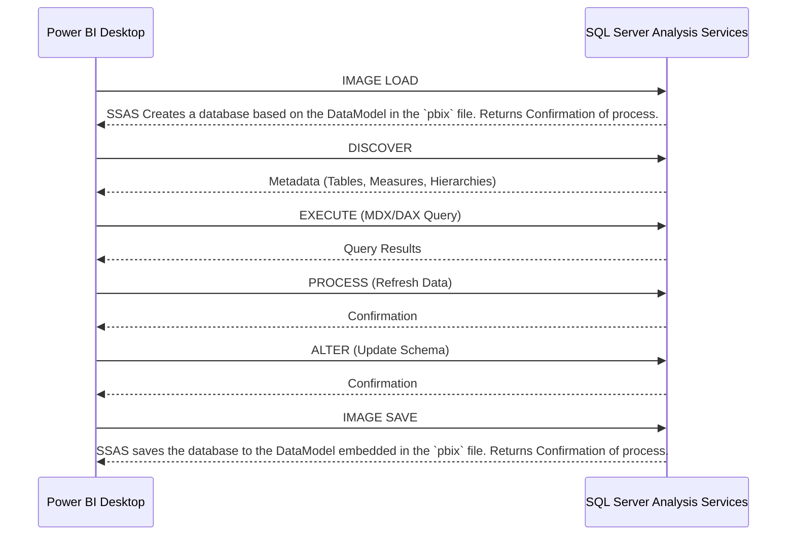

### XMLA Commands Between Power BI and SSAS

Power BI uses XMLA (XML for Analysis) commands to communicate with SQL Server Analysis Services (SSAS). These commands are essential for querying, managing, and interacting with SSAS data models. Below is a detailed explanation of the specific XMLA commands sent between Power BI files (`.pbix`) and SSAS, along with examples.

#### Common XMLA Commands

1. **DISCOVER**:
   - Used to retrieve metadata about the SSAS model, such as available tables, measures, and hierarchies.
     ```xml
     <Discover xmlns="urn:schemas-microsoft-com:xml-analysis">
       <RequestType>DISCOVER_SCHEMA_ROWSETS</RequestType>
       <Restrictions />
       <Properties>
         <PropertyList>
           <Catalog>AdventureWorks</Catalog>
         </PropertyList>
       </Properties>
     </Discover>
     ```
   - Output Example:
     ```xml
     <root>
       <row>
         <TABLE_NAME>Sales</TABLE_NAME>
         <MEASURE_NAME>Sales Amount</MEASURE_NAME>
         <HIERARCHY_NAME>Calendar Year</HIERARCHY_NAME>
       </row>
       <row>
         <TABLE_NAME>Products</TABLE_NAME>
         <MEASURE_NAME>Product Count</MEASURE_NAME>
         <HIERARCHY_NAME>Category</HIERARCHY_NAME>
       </row>
     </root>
     ```

1. **EXECUTE**:
   - Used to execute MDX (Multidimensional Expressions) or DAX (Data Analysis Expressions) queries against the SSAS model.
     ```xml
     <Execute xmlns="urn:schemas-microsoft-com:xml-analysis">
       <Command>
         <Statement>
           EVALUATE SUMMARIZE(
             Sales,
             "Year", Sales[Calendar Year],
             "Total Sales", SUM(Sales[Sales Amount])
           )
         </Statement>
       </Command>
       <Properties>
         <PropertyList>
           <Catalog>AdventureWorks</Catalog>
         </PropertyList>
       </Properties>
     </Execute>
     ```
   - Output Example:
     ```xml
     <root>
       <row>
         <Year>2020</Year>
         <Total Sales>100000</Total Sales>
       </row>
       <row>
         <Year>2021</Year>
         <Total Sales>150000</Total Sales>
       </row>
     </root>
     ```

2. **PROCESS**:
   - Used to refresh SSAS objects, such as tables or partitions, ensuring that data is up-to-date.
     ```xml
     <Process xmlns="urn:schemas-microsoft-com:xml-analysis">
       <Type>ProcessFull</Type>
       <Object>
         <DatabaseID>AdventureWorks</DatabaseID>
         <CubeID>Sales</CubeID>
       </Object>
     </Process>
     ```
   - Output Example:
     ```xml
     <root>
       <ProcessResult>
         <Status>Success</Status>
         <Message>Data refreshed successfully.</Message>
       </ProcessResult>
     </root>
     ```

3. **ALTER**:
   - Used to modify SSAS objects, such as updating the schema or changing properties.
     ```xml
     <Alter xmlns="urn:schemas-microsoft-com:xml-analysis">
       <Object>
         <DatabaseID>AdventureWorks</DatabaseID>
         <CubeID>Sales</CubeID>
       </Object>
       <ObjectDefinition>
         <Cube>
           <Name>Sales</Name>
           <Description>Updated Sales Cube</Description>
         </Cube>
       </ObjectDefinition>
     </Alter>
     ```
   - Output Example:
     ```xml
     <root>
       <AlterResult>
         <Status>Success</Status>
         <Message>Schema updated successfully.</Message>
       </AlterResult>
     </root>
     ```


#### Workflow of XMLA Commands in Power BI

1. **Initialization**:
   - When a Power BI file connects to SSAS, it sends a `DISCOVER` command to retrieve metadata about the data model.

2. **Query Execution**:
   - Power BI sends `EXECUTE` commands to fetch data based on user-defined queries or visualizations.

3. **Data Refresh**:
   - During scheduled refreshes, Power BI may send `PROCESS` commands to ensure the SSAS model is updated.

4. **Model Updates**:
   - If changes are made to the SSAS model, Power BI can send `ALTER` commands to apply updates.


#### Interaction Diagram: Power BI Desktop and SSAS

Below is a mermaid diagram illustrating the flow of XMLA commands between Power BI Desktop and SSAS:



This diagram visually represents the communication between Power BI Desktop and SSAS, highlighting the key XMLA commands and their responses.