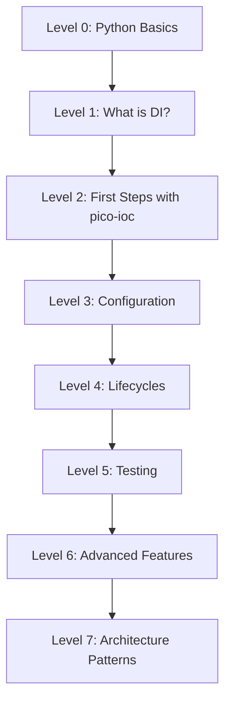

# Learning Roadmap

This roadmap takes you from zero to advanced usage of **pico-ioc**.

## Roadmap Overview



---

## 🚀 Level 0: Prerequisites

What you need to know before starting: ✅ Basic Python (3.10+)

### 1. Classes and inheritance

```python
class Animal:
    def __init__(self, name: str):
        self.name = name

    def speak(self) -> str:
        return "..."

class Dog(Animal):
    def speak(self) -> str:
        return f"{self.name} says: Woof!"
```

### 2. Type hints (CRITICAL for DI)

```python
from typing import Protocol

class Sender(Protocol):
    def send(self, msg: str) -> None: ...

class EmailSender:
    def send(self, msg: str) -> None:
        print(f"[EMAIL] {msg}")
```

> Why this matters: **pico-ioc** resolves dependencies using type annotations.

---

## 🧩 Level 1: What is DI?

```python
# Without DI: class creates its own dependency
class Notifier:
    def __init__(self):
        self._sender = EmailSender()

    def notify(self, text: str) -> None:
        self._sender.send(text)
```

```python
# With DI: dependency is injected
class Notifier:
    def __init__(self, sender: Sender):
        self._sender = sender

    def notify(self, text: str) -> None:
        self._sender.send(text)
```

---

## 🧪 Level 5: Testing (preview)

```python
class FakeSender:
    def __init__(self):
        self.messages: list[str] = []

    def send(self, msg: str) -> None:
        self.messages.append(msg)

def test_notifier():
    fake = FakeSender()
    n = Notifier(sender=fake)
    n.notify("hello")
    assert fake.messages == ["hello"]
```

---

## FAQ

**If a component only requests `Sender`, how does the container know which one to inject?**
Mark one binding as **primary** via `primary=True`. See [Conditional binding](/advanced-features/conditional-binding/).

