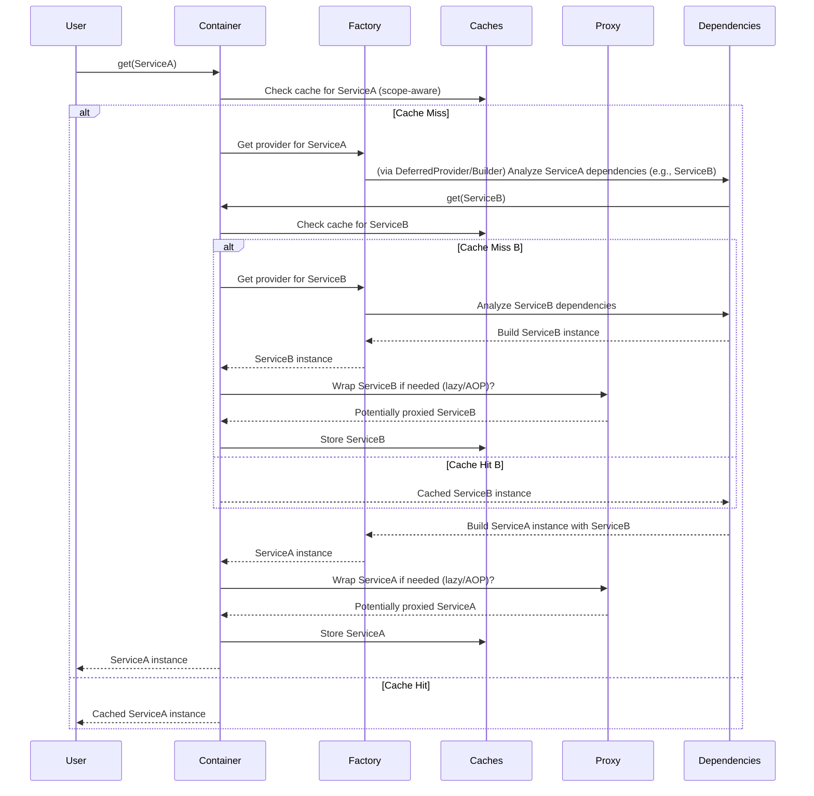

# Internal Architecture Deep-Dive

This document describes the internal "How-it-works" of `pico-ioc`, intended for contributors and architects. It details the core components and algorithms that power the container.

---

## 1. Core Components

The framework is built from a few key internal components, all orchestrated by the `PicoContainer`.

```text
┌─────────────────────────────────────────────────────┐
│                 PicoContainer (Facade)              │
├─────────────────────────────────────────────────────┤
│ ComponentFactory │  ScopedCaches  │  ScopeManager   │
├─────────────────────────────────────────────────────┤
│ ComponentLocator (Metadata) │    Registrar          │
├─────────────────────────────────────────────────────┤
│        ConfigResolver       │ ObjectGraphBuilder    │
├─────────────────────────────────────────────────────┤
│          UnifiedComponentProxy (AOP/Lazy)           │
└─────────────────────────────────────────────────────┘
```

  * `PicoContainer`: The public API and facade. It orchestrates get/aget calls, manages scope and container contexts, and holds references to the other components.
  * `Registrar`: A short-lived object used only during init(). It scans modules, discovers all components (including @component, @factory, @provides, and @configured), evaluates conditional logic, selects the final providers, populates the ComponentFactory, and builds the ComponentLocator's metadata.
  * `ComponentFactory`: A simple dictionary that stores the final "recipe" (a Provider callable, often a DeferredProvider) for creating each component.
  * `ComponentLocator`: An queryable index of all final component metadata (ProviderMetadata). This is used for introspection and to resolve type-based or Qualifier-based list injections.
  * `ConfigResolver` / `ObjectGraphBuilder`: The engine for the @configured feature. Based on the ContextConfig provided to init(), ConfigResolver loads, merges, and interpolates configuration sources (e.g., YAML/JSON/ENV) into a final structure. ObjectGraphBuilder then maps parts of this structure onto @configured dataclass graphs, handling both flat and tree mappings.
  * `ScopeManager` / `ScopedCaches`: Manages the lifecycle and storage of component instances. ScopeManager handles which scope is active (using contextvars), and ScopedCaches provides the storage for that scope (e.g., the singleton cache vs. a request-scope cache), including LRU eviction for context-aware scopes.
  * `UnifiedComponentProxy`: The dynamic proxy class used to implement lazy=True loading and AOP (@intercepted_by).



-----

## 2. The Initialization Flow (init())

When you call init(), the Registrar executes the following sequence:

1. Prepare Config: The ConfigurationManager is initialized with the ContextConfig passed to init().
2. Scan: _iter_input_modules walks packages (if given) to find all modules for scanning.
3. Discover: Registrar.scan_module (via ComponentScanner) inspects every member of every module for decorators (@component, @factory, @provides, @configured). Conditional logic (conditional_*) is evaluated here based on profiles and environ. Components that fail their condition are discarded. Discovered providers are queued as candidates. @configured classes are registered via the ConfigurationManager.
4. Select Providers: ProviderSelector.select_providers iterates through candidates for each key. It selects the "best" one based on rank (e.g., respecting primary, and for @configured components, checking if their configuration prefix exists).
5. Bind Winners: The winning provider for each key is "bound" into the ComponentFactory. ProviderMetadata is stored.
6. Promote Scopes: _promote_scopes runs to prevent scope leaks (see below).
7. Apply Fallbacks: on_missing_selector components are registered only if their target key/type is still missing after the main binding phase.
8. Build Metadata & Indexes: The final _metadata dictionary (Key -> ProviderMetadata) is compiled, and inverted indexes (for qualifiers, primary, etc.) are built for the ComponentLocator.
9. Validate: DependencyValidator.validate_bindings performs a static analysis of the dependency graph based on the final metadata. It inspects all __init__ and factory method dependencies and cross-references them with the bound providers to ensure everything required exists (respecting is_optional). This enables fail-fast startup validation.
10. Finalize: The PicoContainer is created. The finalized ComponentFactory, ComponentLocator, and scope/cache managers are attached. Deferred providers are attached to the container/locator. Lazy providers are wrapped.

-----

## 3. The Resolution Algorithm (get/aget)

Resolution is handled by PicoContainer._resolve_or_create_internal, called by get(key) and aget(key).

1. Canonicalize Key: Map the requested key (e.g., a type) to the actual registered key if needed (e.g., finding the primary implementation).
2. Check Cache: Identify the correct cache (ScopedCaches.for_scope) based on the component's registered scope and the current active scope ID (ScopeManager.get_id). If an instance exists, return it immediately (on_cache_hit triggered).
3. Get Provider: Retrieve the Provider callable (often a DeferredProvider) from the ComponentFactory. Raise ProviderNotFoundError if missing.
4. Create Instance:
   - Activate the current container context (as_current).
   - Call the Provider. For DeferredProvider, this triggers its builder function (e.g., PicoContainer.build_class or PicoContainer.build_method).
   - The builder function calls _resolve_args to get dependencies based on analyzed DependencyRequests.
   - _resolve_args is recursive: it calls pico.get() or pico.aget() for each dependency, restarting this flow at step 1. Circular dependencies are typically caught here by checking an internal resolution stack, leading to InvalidBindingError.
   - The builder constructs the raw instance (calling __init__).
   - If __ainit__ or async def @configure methods exist, and aget was called, they are awaited. If get was called on an async component, AsyncResolutionError is raised.
   - Synchronous @configure methods are called.
   - Deactivate the container context.
5. Wrap Proxy: The new instance is passed to _maybe_wrap_with_aspects to wrap it in a UnifiedComponentProxy only if it has @intercepted_by methods (AOP) or was registered with lazy=True.
6. Put in Cache: The (possibly proxied) final instance is stored in the correct scope cache (from step 2).
7. Notify Observers: on_resolve is triggered for registered observers.
8. Return Instance.

-----

## 4. Internals: Unified Configuration (@configured)

Managed primarily by config_registrar.py and config_runtime.py, based on the ContextConfig provided.

  * `ConfigurationManager`: Created by the Registrar, holds the ContextConfig and owns the ConfigResolver and ObjectGraphBuilder. It handles registration of @configured classes during scanning.
  * `ConfigResolver`: Initialized with the TreeSources from ContextConfig. When first accessed, it:
    1. Loads all tree sources (e.g., YAML files).
    2. Performs a deep merge according to precedence rules.
    3. Walks the merged tree to interpolate variables (${ENV:VAR}, ${ref:path}).
    4. Caches the final, resolved configuration tree.
  * `ObjectGraphBuilder`: Used by the provider for @configured(mapping="tree") components.
    1. Gets the relevant sub-tree from ConfigResolver using the prefix.
    2. Recursively walks the target type (e.g., a dataclass) and the config sub-tree.
    3. Coerces primitive values, builds nested dataclasses, handles List, Dict, Enum, Union, Annotated[Union[...], Discriminator(...)].
  * Flat Mapping (@configured(mapping="flat")): Handled more directly by ConfigurationManager._build_flat_instance. It iterates through the FlatSources defined in ContextConfig, looking up keys as PREFIX_FIELDNAME.upper() and performing basic coercion.

-----

## 5. Internals: Scope Management

  * `ScopeManager`: A registry mapping scope names (e.g., "request") to a ScopeProtocol implementation. For built-ins like "request", it uses ContextVarScope, which wraps a contextvars.ContextVar.
      - activate(scope_id) calls _var.set(scope_id).
      - deactivate(token) calls _var.reset(token).
      - get_id() calls _var.get().
  * `ScopedCaches`: Holds the actual component instances.
      - `_singleton`: A single ComponentContainer (a dict wrapper) for all singleton components.
      - `_by_scope`: A dict mapping scope names (e.g., "request") to an OrderedDict.
      - This OrderedDict maps a scope ID (e.g., "req-123") to its own ComponentContainer. It acts as an LRU cache to evict component caches for older, inactive scope IDs (e.g., old HTTP requests), calling @cleanup on evicted instances.
      - `_no_cache`: A dummy container used for prototype scope that never stores instances.

-----

## 6. Internals: AOP & Lazy Loading

Both features are powered by the UnifiedComponentProxy.

  * lazy=True: When get()/aget() resolves a lazy component, the Registrar binds a special provider that returns an uninitialized proxy.
      - _target is None.
      - _creator is the component's real provider function.
      - On the first attribute access (e.g., proxy.some_method()), __getattr__ calls _get_real_object().
      - _get_real_object() executes the _creator (triggering the full resolution/creation flow), saves the result to _target, and returns it.
      - Subsequent access hits the (now populated) _target.
  * AOP (@intercepted_by): When get()/aget() resolves a component with intercepted methods, the real object is created first, then wrapped by the proxy via _maybe_wrap_with_aspects.
      - _target is set immediately to the real instance.
      - _creator is None.
      - On every attribute access, __getattr__ is called.
      - It checks a cache (_cache) for an already-built wrapped method for the current scope signature.
      - If not cached, or if scope changed: It retrieves the interceptor classes (_gather_interceptors_for_method), resolves the interceptor instances from the container (container.get(InterceptorCls)), and builds a new wrapper function (_build_wrapped).
      - The wrapper function uses dispatch_method to execute the interceptor chain (invoke calls) around the original method (ctx.method).
      - The wrapper is cached and returned.
  * Serialization (__getstate__/__setstate__/__reduce_ex__): Implemented to ensure that pickle serializes/deserializes the real object (_target), not the proxy, allowing proxied objects to be potentially sent across processes (if the target is serializable).

-----

## 7. Internals: ComponentLocator

The ComponentLocator is primarily an introspection tool built from the Registrar's final _metadata (Key -> ProviderMetadata) and _indexes. It maintains several inverted indexes (as dicts) derived from the metadata to allow fast querying:

  * "qualifier": Qualifier string -> List[KeyT]
  * "primary": bool -> List[KeyT]
  * "infra": str -> List[KeyT] (e.g., "component", "factory")
  * "pico_name": str -> List[KeyT]

The list injection logic in _resolve_args (collect_by_type) uses the raw metadata, while other potential locator features might use the indexes.

-----

## 8. Advanced Internal Mechanisms

### 8.1. Automatic Scope Promotion

The Registrar._promote_scopes method prevents scope leaks (e.g., a singleton depending directly on a request-scoped object). It iterates through all component metadata after initial binding. If a component (e.g., a singleton) has a dependency with a narrower scope (e.g., request), the component's own scope is automatically "promoted" to match the narrowest dependency's scope. This ensures instances don't hold onto dependencies from expired scopes.

### 8.2. Event Bus

The EventBus (from pico_ioc.event_bus) is registered like a normal component. Internally, it maintains a dictionary mapping Event types to a sorted list (_Subscriber dataclass includes priority) of registered handler callbacks (found via AutoSubscriberMixin's @configure hook). The publish method iterates this list for the given event type, handling async and sync subscribers according to their ExecPolicy (e.g., awaiting inline async handlers, using asyncio.create_task for TASK, or loop.run_in_executor for THREADPOOL).

-----

## 9. Design Patterns Used

  * Inversion of Control (IoC) / Dependency Injection (DI): Core principle.
  * Service Locator: ComponentLocator for querying; PicoContainer.get_current() for contextual access.
  * Proxy Pattern: UnifiedComponentProxy for lazy loading and AOP.
  * Chain of Responsibility: Interceptor chain (dispatch_method).
  * Factory Pattern: @factory and @provides.
  * Strategy Pattern: Multiple implementations (e.g., Database) with primary selecting the default.
  * Observer Pattern: ContainerObserver for monitoring.
  * Publisher/Subscriber: The EventBus.
  * Builder Pattern: configuration(...) creating ContextConfig.
  * Facade Pattern: PicoContainer simplifying access to internal components.
