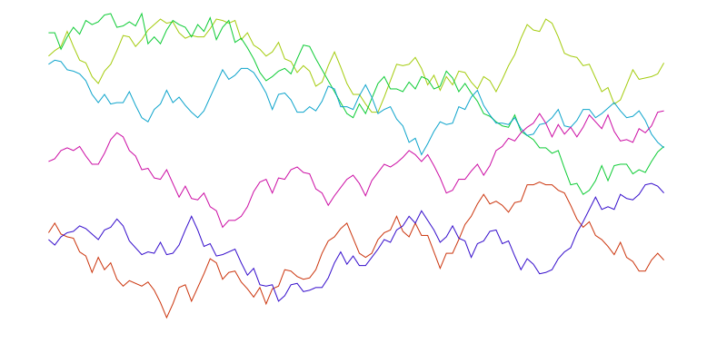
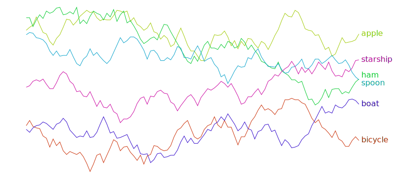
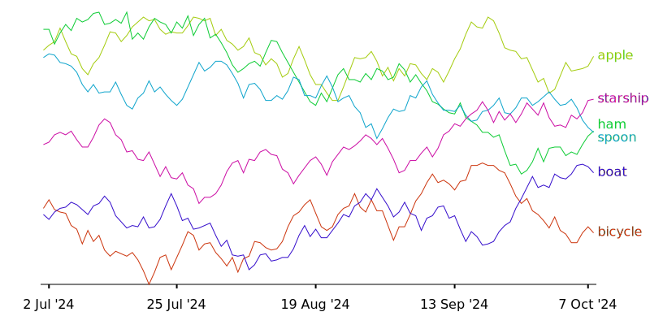
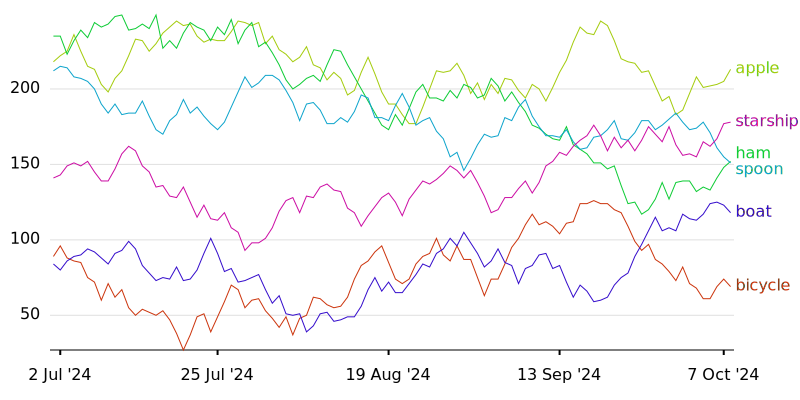

## Introduction

In this tutorial, we will build a line chart that visualizes random (yet smoothly varying) numeric data for multiple products over a set of dates. We will use:

- **Polars** to store and manipulate our data,
- **pyDreamplet** to generate an SVG chart,
- **pendulum** for dates handling.

Ensure that you have these libraries available.
By the end, you’ll have a clear example of how to create a multi-line chart with labels, axes, and grid lines.

Now, import everything we need:

```py
import pendulum
import polars as pl
import pydreamplet as dp

from pydreamplet.scales import LinearScale, PointScale
from pydreamplet.noise import Noise
from pydreamplet.typography import TypographyMeasurer
from pydreamplet.colors import generate_colors
from pydreamplet.utils import force_distance, sample_uniform, calculate_ticks
from pydreamplet.markers import Marker, TICK_BOTTOM, TICK_LEFT
```

## Generating Fake Data

We will create a Polars `DataFrame` containing daily sales data for 6 products across 100 days. To ensure our random data has a smooth, realistic progression, we’ll use `Noise` from **pyDreamplet**.

```py
# Define product names
products = ["bicycle", "apple", "ham", "spoon", "boat", "starship"]

# Generate synthetic data using pydreamplet's Noise
data = []
for product in products:
    noise = Noise(0, 250, 0.1)
    daily_sales = [noise.int_value for _ in range(100)]
    data.append(daily_sales)

# Create a Polars DataFrame
df = pl.DataFrame(data, schema=products)

# Add a date column (starting from 1 July 2024)
start_date = pendulum.date(2024, 7, 1)
end_date = start_date.add(days=df.height - 1)  # 100 days
df = df.with_columns(
    date=pl.date_range(start_date, end_date, interval="1d")
).select(["date"] + products)
```

At this point, `df` looks something like this (showing the first few rows):

| date                |   bicycle |   apple |   ham |   spoon |   boat |   starship |
|:--------------------|----------:|--------:|------:|--------:|-------:|-----------:|
| 2024-07-01 00:00:00 |        85 |      52 |   197 |      15 |     33 |         96 |
| 2024-07-02 00:00:00 |        90 |      47 |   185 |      17 |     41 |        108 |
| 2024-07-03 00:00:00 |        81 |      36 |   173 |      14 |     52 |        108 |
| ...                 |       ... |      ...|   ... |     ... |    ... |        ... |

## Determining Chart Bounds and Layout

We’ll need to figure out the minimum and maximum values to properly scale our chart. We also measure label text widths so that we can position them neatly later.


```py
# Determine min and max across all products
min_value = df.select(products).min_horizontal().min()
max_value = df.select(products).max_horizontal().max()

# Measure text width to handle right margin for product labels
measurer = TypographyMeasurer()
max_label_width = 0
for product in products:
    label_dimensions = measurer.measure_text(
        product, font_family="Roboto", weight=400, font_size=16
    )
    max_label_width = max(max_label_width, label_dimensions[0])

print("Data range:", min_value, "to", max_value)
print("Max label width:", max_label_width)
```

## Setting Up the SVG Canvas and Scales

Create an SVG with pydreamplet and define our margins. We’ll use:

- A [`PointScale`](../../reference/scales/pointscale.md) for the **X-axis** (mapping discrete dates to positions),
- A [`LinearScale`](../../reference/scales/linearscale.md) for the **Y-axis** (mapping numeric values to vertical positions).

```py
# Create an SVG element
svg = dp.SVG(800, 400)

# Create a <defs> container for markers
defs = dp.SvgElement("defs")
layer0 = dp.G()

# Append them to the SVG
svg.append(defs, layer0)

# Margins
margin = dict(l=50, r=15 + max_label_width, t=15, b=50)

# Extract the dates as a Python list
dates = df["date"].to_list()

# Define scales
scale_x = PointScale(dates, (margin["l"], svg.w - margin["r"]))
scale_y = LinearScale(
    (min_value, max_value),
    (svg.h - margin["b"], margin["t"])
)
```

## Plotting the Lines

For each product, we’ll map each value to the X/Y coordinates and create a `Polyline`. We’ll also assign a different color to each line using `generate_colors`.

```py
# Prepare X positions for each date
x_values = [scale_x.map(date) for date in dates]

# Generate distinct colors
colors = generate_colors("#cc340c", len(products))

last_points_y = []
for i, product in enumerate(products):
    # Collect (x, y) for each data point
    points = []
    for j, value in enumerate(df[product].to_list()):
        points.extend([x_values[j], scale_y.map(value)])

    # Create the polyline for this product
    data_line = dp.Polyline(points, stroke=colors[i], fill="none")
    svg.append(data_line)

    # Store the last y-position for label placement
    last_points_y.append(points[-1])
```

{.img-light-dark-bg}

## Adding Labels to the Lines

We want to place the product name at the end of each line. Since lines might overlap near the end, we use [`force_distance`](../../reference/utils/index.md#force_distance) to spread them out vertically.

```py
# Spread out the label positions so they don't collide
label_y_positions = force_distance(last_points_y, 16)

for i, product in enumerate(products):
    label = dp.Text(
        product,
        x=x_values[-1] + 5,
        y=label_y_positions[i] + 4,
        font_family="Roboto",
        font_size=16,
        fill=colors[i],
        anchor="start",
    )
    svg.append(label)
```

{.img-light-dark-bg}

## Creating the X-Axis

We will draw the X-axis at the bottom of the chart and place a few ticks along the date range. We’ll sample 5 dates evenly using [`sample_uniform`](../../reference/utils/index.md#sample_uniform) and then add text for each tick.

```py
# Sample 5 dates across the entire range
x_values_indices = sample_uniform(scale_x.domain, 5, None)

# Draw a base line for the X-axis
layer0.append(
    dp.Line(
        x1=margin["l"],
        y1=scale_y.output_range[0],
        x2=svg.w - margin["r"],
        y2=scale_y.output_range[0],
        stroke="black",
    )
)

# Optionally, create tick markers
polyline_points = []
for ix in x_values_indices:
    polyline_points.extend([x_values[ix], scale_y.output_range[0]])

polyline = dp.Polyline(polyline_points, stroke="none", fill="none")
layer0.append(polyline)

marker = Marker("bottom-tick", TICK_BOTTOM, 10, 10)
defs.append(marker)
polyline.marker_start = marker.id_ref
polyline.marker_mid = marker.id_ref
polyline.marker_end = marker.id_ref

# Add text labels for each tick
for ix in x_values_indices:
    tick_date = pendulum.instance(dates[ix])
    tick_label = dp.Text(
        tick_date.format("D MMM 'YY"),  # e.g. "2 Jul '24"
        x=x_values[ix],
        y=scale_y.output_range[0] + 30,
        font_family="Roboto",
        font_size=16,
        fill="black",
        text_anchor="middle",
    )
    layer0.append(tick_label)
```

{.img-light-dark-bg}

## Creating the Y-Axis and Grid Lines

We’ll generate about 5 ticks on the Y-axis and draw horizontal grid lines for each. Then, we add numeric labels to the left side.

```py
# Generate ~5 evenly spaced ticks for the Y-axis
# Generate ~5 evenly spaced ticks for the Y-axis
ticks = calculate_ticks(min_value, max_value, 5)
print("Y Ticks:", ticks)

for tick in ticks:
    y = scale_y.map(tick)

    # Horizontal grid line
    layer0.append(
        dp.Line(x1=margin["l"], y1=y, x2=svg.w - margin["r"], y2=y, stroke="#e0e0e0")
    )

    # Tick label
    tick_text = dp.Text(
        str(tick),
        x=margin["l"] - 10,
        y=y + 4,
        font_family="Roboto",
        font_size=16,
        text_anchor="end",
    )
    layer0.append(tick_text)
```

At this point, the svg object holds all of our chart elements. Depending on your environment, you might:

- Save the SVG to a file:
```py
svg.save_svg("line_chart.svg")
```
- Render it directly in a notebook environment that supports inline SVG.
The final result should look like this:

{.img-light-dark-bg}

## Conclusion

Congratulations! You’ve created a multi-line chart using **Polars** for data manipulation and **pydreamplet** for SVG rendering. You learned how to:

- Generate synthetic data using `Noise`,
- Build a Polars `DataFrame` and identify min/max values,
- Set up SVG canvas and scales,
- Draw polylines for each product,
- Label each line and axis ticks,
- Add horizontal grid lines.

Feel free to experiment with different color schemes, font sizes, or data intervals. You can also add interactive tooltips or other enhancements to make your chart even more dynamic.

Happy charting!
