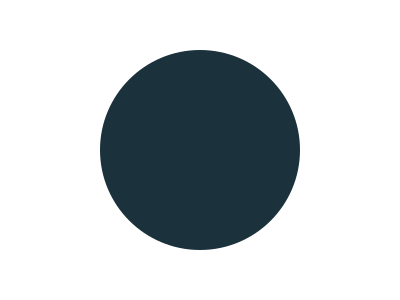
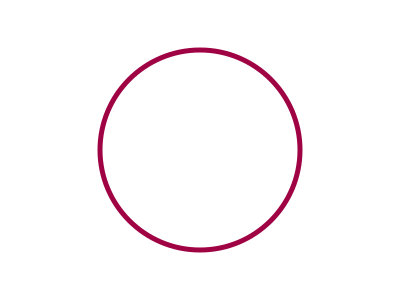

# Basics

In this section, you will get familiar with the basic functionality.

## Creating an SVG Instance

### Empty SVG

You have two options to create an [SVG](../reference/core/svg.md) instance. The first one is an empty SVG.

```py
import pydreamplet as dp

svg = dp.SVG(400, 300)
print(svg)  # <svg xmlns="http://www.w3.org/2000/svg" viewBox="0 0 400 300" width="400px" height="300px" />
```

If you need to change `x` and `y` of the `viewBox`, you can do so by providing four arguments or a tuple with all four values.

```py
svg = dp.SVG(10, 10, 400, 300)
print(svg)  # <svg xmlns="http://www.w3.org/2000/svg" viewBox="10 10 400 300" width="400px" height="300px" />
```

You can see that the width and height are automatically set to the width and height of the `viewBox` with the `px` unit. You can change this by explicitly specifying the width and height.

```py
svg = dp.SVG(400, 300, width="800px", height="600px")
print(svg)  # <svg xmlns="http://www.w3.org/2000/svg" width="800px" height="600px" viewBox="0 0 400 300" />
```

### SVG Instance From Existing File

You can also create a new instance from an existing SVG file. To do so, you must use the class method [`from_file`](../reference/core/svg.md#from_file).

## Creating SVG Elements

You can create any SVG element using the [`SvgElement`](../reference/core/svgelement.md) class. However, use `SvgElement` only if there is no dedicated class for that specific element. Check the reference to see which classes are available. Let’s look at an example.

This code:

```py
svg = dp.SVG(400, 300)
circle = dp.SvgElement("circle", cx=200, cy=150, r=100, fill="#1b313b")
svg.append(circle)
```

will produce the same result as:

```py
svg = dp.SVG(400, 300)
circle = dp.Circle(cx=200, cy=150, r=100, fill="#1b313b")
svg.append(circle)
```

Both snippets create the following file:

{.img-light-dark-bg}

However:

```py
circle = dp.Circle(cx=200, cy=150, r=100, fill="#1b313b")
print(circle.area)
```

will print the area of the circle, while:

<!--skip-->
```py
circle = dp.SvgElement("circle", cx=200, cy=150, r=100, fill="#1b313b")
print(circle.area) # Will not work
```

raises an `AttributeError: 'SvgElement' object has no attribute 'area'`

## Changing Element Attributes

You can set or change the attributes of SVG elements in a few different ways. The first is by passing keyword arguments (`kwargs`) to the constructor, as shown in the previous examples.

An alternative method is to use instance properties:

```py hl_lines="3-5"
svg = dp.SVG(400, 300)
circle = dp.SvgElement("circle", cx=200, cy=150, r=100)
circle.fill = "none"
circle.stroke = "#a00344"
circle.stroke_width = 5
svg.append(circle)
```

{.img-light-dark-bg}

Notice that while the SVG specification uses hyphens in attribute names (e.g., `stroke-width`), the corresponding instance properties use underscores (e.g., `stroke_width`).

The third method is to use the [`attrs`](../reference/core/svgelement.md#attrs) function. The following code:

```py
svg = dp.SVG(400, 300)
circle = dp.SvgElement("circle", cx=200, cy=150, r=100)
circle.attrs({"fill": "none", "stroke": "#a00344", "stroke-width": 5})
svg.append(circle)
```

produces the same file.


## Building the SVG tree

You can append any element—or multiple elements at once—using the [`append`](../reference/core/svgelement.md#append) method. You saw this when we appended a circle in the examples above. There are other useful methods, such as [`remove`](../reference/core/svgelement.md#remove), [`find`](../reference/core/svgelement.md#find-and-find_all), and [`find_all`](../reference/core/svgelement.md#find-and-find_all). Let's see them in action.

First, we create a new SVG with 5 circles.

```py
import pydreamplet as dp

svg = dp.SVG(400, 200)
for i in range(5):
    svg.append(
        dp.Circle(
            cx=100 + i * 50,
            cy=100,
            r=20,
            fill="#a00344",
            id=f"circle-{i + 1}",
            class_name="even" if i % 2 == 0 else "odd",
        )
    )
```

This creates the following SVG structure. Remember that `class` is a reserved word in Python, which is why we use the property `class_name`.

```xml
<svg xmlns="http://www.w3.org/2000/svg" viewBox="0 0 400 200" width="400px" height="200px">
  <circle cx="100" cy="100" r="20" fill="#a00344" id="circle-1" class="even" />
  <circle cx="150" cy="100" r="20" fill="#a00344" id="circle-2" class="odd" />
  <circle cx="200" cy="100" r="20" fill="#a00344" id="circle-3" class="even" />
  <circle cx="250" cy="100" r="20" fill="#a00344" id="circle-4" class="odd" />
  <circle cx="300" cy="100" r="20" fill="#a00344" id="circle-5" class="even" />
</svg>
```

{.img-light-dark-bg}

Now we can change the properties of the odd circles.

```py
odd = svg.find_all("circle", class_name="odd")
for circle in odd:
    circle.fill = "none"
    circle.stroke = "#000000"
```

{.img-light-dark-bg}

!!! warning

    We use the string "none", not Python's None, because None is used to remove an attribute. The code

    <!--skip-->
    ```py hl_lines="3"
    odd = svg.find_all("circle", class_name="odd")
    for circle in odd:
        circle.fill = None
        circle.stroke = "#000000"
    ```
    will remove the fill attribute completely, and the circles will then have the default black fill.

    ```xml hl_lines="3 5"
    <svg xmlns="http://www.w3.org/2000/svg" viewBox="0 0 400 200" width="400px" height="200px">
    <circle cx="100" cy="100" r="20" fill="#a00344" id="circle-1" class="even" />
    <circle cx="150" cy="100" r="20" id="circle-2" class="odd" stroke="#000000" />
    <circle cx="200" cy="100" r="20" fill="#a00344" id="circle-3" class="even" />
    <circle cx="250" cy="100" r="20" id="circle-4" class="odd" stroke="#000000" />
    <circle cx="300" cy="100" r="20" fill="#a00344" id="circle-5" class="even" />
    </svg>
    ```

    {.img-light-dark-bg}


Now, let's remove the middle circle.

```py
middle = svg.find("circle", id="circle-3")
svg.remove(middle)
```

{.img-light-dark-bg}
