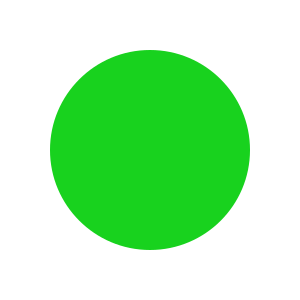

# Installation and quick intro

pyDreamplet is a Python library designed for creating stunning SVG visualizations effortlessly. This guide covers installation, basic usage, and pointers for exploring additional features to help create captivating visual art with code.

## Installation

=== "uv"

    ```shell
    uv add pydreamplet
    ```

=== "pip"

    ```shell
    pip install pydreamplet
    ```

## Basic Example

The following example demonstrates how to create a simple SVG canvas, draw a shape, and save the result to a file.

```py title="Your first SVG" linenums="1"
import pydreamplet as dp
from pydreamplet.colors import random_color

svg = dp.SVG(300, 300)

circle = dp.Circle(
    cx=svg.w/2,
    cy=svg.h/2,
    r=100,
    fill=random_color(),
)
svg.append(circle)

svg.display()  # to display result in jupyter notebook

svg.save("example.svg")
```

This will create such a image

{.img-light-dark-bg}


pyDreamplet provides various functions to generate complex visuals, such as:

- **Drawing Multiple Shapes:** Create combinations of lines, circles, and custom paths.
- **Styling Options:** Apply gradients, patterns, and advanced styling techniques.
- **Animations:** If supported, add animation effects to SVG elements.

Let's take a look at a little more interesting example. In this snippet, we create a 600×600 SVG canvas and build an animated radial design with 35 circles. Each circle animates its position and size, while its stroke color transitions smoothly from black to red. Here’s a detailed breakdown:

First, import `pydreamplet` and scales.

```py
import pydreamplet as dp
from pydreamplet.scales import LinearScale, ColorScale
```

Next, we create a 600×600 SVG canvas. A group element (`G`) is defined with its position set at the center of the canvas. This ensures that all contained elements are rendered relative to the center, making the radial design easier to manage.

```py
svg = dp.SVG(600, 600)
g = dp.G(pos=dp.Vector(svg.w / 2, svg.h / 2))
svg.append(g)
```

We define the total number of circles (`circles_count`) and set the minimum and maximum radius values. The `LinearScale` maps the circle’s index (from 0 to 35) to a radius that varies between `min_radius` and `max_radius`. Similarly, the `ColorScale` maps these indices to a color gradient from black to red.

```py
circles_count = 35
max_radius = 250
min_radius = 5
r_scale = LinearScale((0, circles_count - 1), (min_radius, max_radius))
color_scale = ColorScale((0, circles_count - 1), ("#000000", "#FF0000"))
```

We start from a point on the right of an imaginary circle (at the maximum radius) and then loop over the total number of circles. For each iteration:

- A circle is created with no fill and a stroke color determined by its index.
- Animations are added to the circle for the x (`cx`) and y (`cy`) coordinates. These animate the circle’s center from its starting position to the center of the canvas and then back.
- The circle’s radius is animated from a minimum value to a computed value (using the linear scale) and back.
- The starting position is rotated slightly (by 360° divided by the total number of circles) for the next circle, creating the radial layout.

```py
start_pos = dp.Vector(max_radius, 0)
for i in range(circles_count):
    # Create a circle with a dynamic stroke color.
    c = dp.Circle(fill="none", stroke=color_scale.map(i))
    c.pos = start_pos
    
    # Animate the circle's horizontal and vertical positions.
    pos_x_anim = dp.Animate("cx", values=[start_pos.x, 0, start_pos.x], dur="5s")
    pos_y_anim = dp.Animate("cy", values=[start_pos.y, 0, start_pos.y], dur="5s")
    
    # Rotate the starting position for the next circle.
    start_pos.direction += 360 / circles_count
    
    # Animate the circle's radius using the linear scale.
    r_anim = dp.Animate("r", values=[min_radius, r_scale.map(i), min_radius], dur="5s")
    
    # Append animations to the circle.
    c.append(pos_x_anim)
    c.append(pos_y_anim)
    c.append(r_anim)
    
    # Add the circle to the group.
    g.append(c)
```

Finally, we can render the SVG. In environments like Jupyter Notebook, calling `svg.display()` will show the animated visualization directly in your notebook. Alternatively, you can save your art by calling `svg.save("circles.svg")`.

{.img-light-dark-bg}

For detailed information on all available functions and parameters, consult the API reference.


!!! info "Next steps"

    - **Experiment with Examples:** Modify the basic example by adding new shapes or changing colors to see different effects.
    - [**Check the tutorial**](tutorial.md).
    - [**Review the API Documentation:**](../reference/core/svg.md) Learn about the full range of functions available in pyDreamplet.
    - [**Explore the Blog:**](../blog/index.md) Discover advanced examples and creative projects that showcase the library’s capabilities.