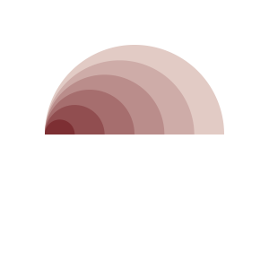
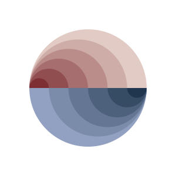
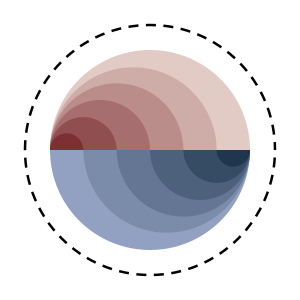
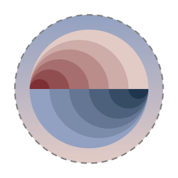

# Tutorial

**Creating Layered and Animated SVG Art with pydreamplet**

In this tutorial, we use the pydreamplet library to generate an SVG artwork that features two layers. One layer holds a series of arcs with blended colors, and the other contains an animated circle enhanced by a linear gradient. The code demonstrates how to import necessary modules, organize elements into groups, and add both static and animated components.

## Importing Libraries and Defining Colors

We begin by importing the core pydreamplet module and specific helpers for creating arc paths and blending colors. We also define four color variables that are used later for color blending and gradients.

```py
import pydreamplet as dp
from pydreamplet.shapes import ring
from pydreamplet.colors import blend

# Define the colors used in the design
color1 = "#e2cbc5"
color2 = "#691016"
color3 = "#92a1c2"
color4 = "#082137"
```

## Setting Up the SVG Canvas and Groups (Layers)

We create an SVG canvas of 600×600 units, then set its display size to 300×300 pixels. We also create two group elements (layers) to control the stacking order of our elements.

- **layer0** is used for the animated circle.
- **layer1** holds all the arcs.

```py
# Create an SVG canvas with a viewBox of 600x600 and set display dimensions
svg = dp.SVG(600, 600)
svg.width = "300px"
svg.height = "300px"

# Create two groups to manage layering:
# layer0 for the animated circle, layer1 for the arcs
layer0 = dp.G()
layer1 = dp.G()
svg.append(layer0).append(layer1)
```

*Using groups allows you to separately control transformations or styling of different sets of elements.*

## Drawing the Arcs (Layer1)

Two loops create arcs that form the bottom and top halves of a circle. The arcs are generated with a decreasing radius and blended colors for a gradient-like effect.

### Top-Half Arcs

For the top half, arcs are drawn from 180° to 360°. The starting x-coordinate is at the canvas center and shifts left on each iteration. The radius shrinks gradually, and the blend proportion increases to interpolate between `color1` and `color2`.


```py
# Initialize parameters for the top half arcs
x = svg.w / 2          # Starting at the horizontal center
blend_prop = 0         # Initial blend proportion for color blending
radius = 200           # Initial radius for arcs
radius_delta = radius / 6  # Amount to reduce the radius on each loop

for i in range(6):
    # Create an arc for the top half using the ring function
    arc = dp.Path(
        d=ring(
            x,
            svg.h / 2,          # y-coordinate remains centered
            inner_radius=0,     # arcs start from the center
            outer_radius=radius, 
            start_angle=180,    # start at 180° (left side)
            end_angle=360,      # end at 360° (completing the top half)
        ),
    )
    # Set the arc's fill by blending color1 and color2
    arc.fill = blend(color1, color2, blend_prop)
    # Update parameters for next arc: shift x left, decrease radius, and increase blend proportion
    x -= radius_delta
    radius -= radius_delta
    blend_prop += 1 / 6
    # Append arc to the group for arcs (layer1)
    layer1.append(arc)
```

<figure class="light-dark-bg" markdown="span">
  { width="300" }
  <figcaption>Each iteration creates an arc with slightly different dimensions and a gradually changing fill color.</figcaption>
</figure>

### Bottom-Half Arcs

The next loop draws the bottom half from 0° to 180°. Here, the x-coordinate shifts right on each iteration, and the fill color blends between `color3` and `color4`.

```py
# Reset parameters for the bottom half arcs
x = svg.w / 2          # Restart from the center
blend_prop = 0         # Reset blend proportion
radius = 200           # Reset radius to initial value

for i in range(6):
    # Create an arc for the bottom half using the ring function
    arc = dp.Path(
        d=ring(
            x,
            svg.h / 2,
            inner_radius=0,
            outer_radius=radius,
            start_angle=0,    # start at 0° (right side)
            end_angle=180,    # end at 180° (completing the bottom half)
        ),
    )
    # Set the arc's fill by blending color3 and color4
    arc.fill = blend(color3, color4, blend_prop)
    # Update parameters for the next arc: shift x right, decrease radius, and increase blend proportion
    x += radius_delta
    radius -= radius_delta
    blend_prop += 1 / 6
    # Append arc to layer1
    layer1.append(arc)
```

<figure class="light-dark-bg" markdown="span">
  { width="300" }
  <figcaption>Together, these two loops produce a layered effect with complementary color transitions on both halves of the circle.</figcaption>
</figure>

## Adding an Animated Circle with Gradient Fill (Layer0)

An animated circle is created to overlay the arcs. It features:

- `Animation:` Two animations – one for the stroke-dashoffset (moving dashes) and one for the circle’s radius (pulsating effect).
- `Gradient Fill:` A linear gradient defined in the `<defs>` section, applied as the circle’s fill.
- `Stroke Styling:` The stroke is set to "gray" to enhance the contrast.

### Creating the Animated Circle

Place the circle in **layer0** to ensure it sits behind the arcs.

```py
# Create a circle with a radius of 250, dashed stroke, and no initial fill
circle = dp.Circle(
    r=250,
    fill="none",
    stroke="black",
    stroke_width=5,
    stroke_dasharray="20,15",
    stroke_dashoffset=20
)
# Position the circle at the center of the canvas
circle.pos = dp.Vector(svg.w / 2, svg.h / 2)

# Define an animation for stroke-dashoffset to create moving dashes
animate = dp.Animate(attr="stroke-dashoffset", dur="2s")
animate.values = [0, 100]

# Define an animation for the circle's radius for a pulsating effect
aniate2 = dp.Animate(attr="r", dur="2s")
aniate2.values = [250, 200, 250]

# Append the animations to the circle
circle.append(animate)
circle.append(aniate2)

layer0.append(circle)
```

<figure class="light-dark-bg" markdown="span">
  
  <figcaption>The animations run continuously, making the circle appear to breathe and animate its dashed stroke.</figcaption>
</figure>

### Defining and Applying a Linear Gradient

A linear gradient is defined to enhance the circle’s fill. The gradient transitions from `color3` to `color1` and is rotated by 90°.

```py
# Create a linear gradient element with a rotation transform
grad = dp.SvgElement("linearGradient", id="grad", gradientTransform="rotate(90)")
# Define the starting color stop at 0%
grad.append(dp.SvgElement("stop", offset="0%", style=f"stop-color:{color3};stop-opacity:1"))
# Define the ending color stop at 100%
grad.append(dp.SvgElement("stop", offset="100%", style=f"stop-color:{color1};stop-opacity:1"))

# Wrap the gradient definition in a defs element
defs = dp.SvgElement("defs")
defs.append(grad)
# Append the defs element to the SVG canvas so that the gradient is recognized
svg.append(defs)
```

*The gradient is now available with the ID "grad" and can be applied to any shape using a fill of "url(#grad)".*

### Updating the Circle’s Styling and Layer Placement

After creating the gradient, update the circle's fill to use the gradient and change its stroke to "gray".

```py
# Apply the gradient fill to the circle and update its stroke color
circle.fill = "url(#grad)"
circle.stroke = "gray"

svg.display() # in jupyter notebook
```

<figure class="light-dark-bg" markdown="span">
  
  <figcaption>Final Output </figcaption>
</figure>

*This completes the SVG artwork, which now consists of a layered composition of blended arcs and an animated, gradient-filled circle.*

