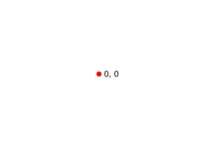
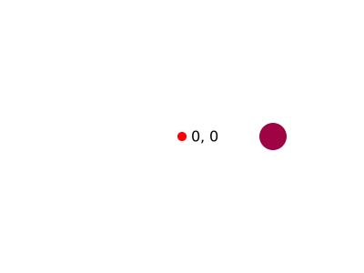
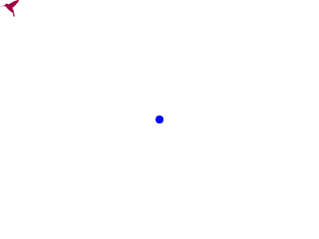
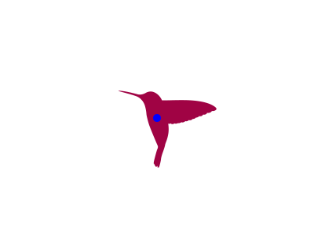
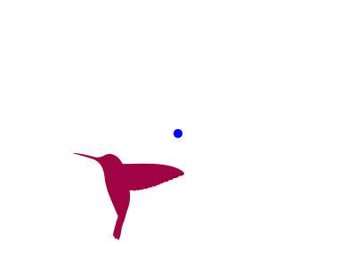

# Vector transformations

## Vector math

You can control the position of elements like [`Circle`](../reference/core/circle.md), [`Ellipse`](../reference/core/ellipse.md), [`Rect`](../reference/core/rect.md), [`Text`](../reference/core/text.md), and even groups ([`G`](../reference/core/g.md)) using vector operations. In the case of a `G` element, vectors are additionally used to control scaling and the pivot point for rotation.

Consider the following example:

```py
from pydreamplet import Circle, G, SVG, Text, Vector

svg = SVG(400, 300)
origin = G(id="origin")
svg.append(origin)
origin.append(
    Circle(cx=0, cy=0, r=5, fill="red"),
    Text("0, 0", x=10, y=0, dominant_baseline="middle"),
)
```

{.img-light-dark-bg}

The SVG’s origin is at the top left, so much of the content is off-screen. To center it, you can transform the origin (`<g>` element) like so:

```py
origin.pos += Vector(svg.w / 2, svg.h / 2)
```

{.img-light-dark-bg}

Now let’s add a circle relative to the new origin. We define a vector for its position:

```py
circle_pos = Vector(100, 0)
origin.append(Circle(pos=circle_pos, r=15, fill="#a00344"))
```

{.img-light-dark-bg}

Next, you can use vector math to add additional circles evenly spaced around the origin. By incrementing the vector’s direction by 72° each time, you form a ring of 5 circles:

```py
for _ in range(4):
    circle_pos.direction += 72
    origin.append(Circle(pos=circle_pos, r=15, fill="#a00344"))
```

{.img-light-dark-bg}


## Transformation order

When combining multiple transformations—translation, rotation, and scaling—the order in which they are applied is critical. In the `pydreamplet` library, the transformation order is controlled by the `order` property on a group (or container) element.

### Initial setup

First, we load an SVG file containing a hummingbird, change its fill color, and then add it to an SVG canvas:

```py
from importlib.resources import files
from pydreamplet import SVG, G, resources, Vector

# Load the hummingbird SVG and change its fill color
hummingbird = SVG.from_file(files(resources) / "hummingbird.svg").find("path")
hummingbird.fill = "#a00344"

# Create a new SVG canvas and group element; append the hummingbird to the group
svg = SVG(400, 300)
g = G()
svg.append(g.append(hummingbird))
```

{.img-light-dark-bg}

### Applying Transformations

Suppose we want to:

- Rotate the hummingbird by 30 degrees,
- Scale it by a factor of 5,
- Translate (move) it so that it is centered on the canvas.

We can achieve this by setting the transformation order and properties on the group 'g':

```py hl_lines="1"
# Specify the transformation order: Translate -> Rotate -> Scale
g.order = "trs"  # demo only, because this is the default order

# Define scaling factor and the center of the hummingbird in its original coordinate space
scale = 5
hummingbird_center = Vector(12, 10)

# Set the pivot point for rotation.
# The pivot is adjusted by the scale factor because the transformations will scale the coordinate system.
g.pivot = hummingbird_center * scale

# Apply a rotation of 30 degrees
g.angle = 30

# Move (translate) the group so that the scaled hummingbird centers in the SVG canvas.
g.pos += Vector(svg.w / 2, svg.h / 2) - hummingbird_center * scale

# Apply scaling uniformly in both x and y directions
g.scale = Vector(scale, scale)
```

{.img-light-dark-bg}

### How Transformation Order Works

The order property determines the sequence in which the three types of transformations are applied. In our example:

- `T` (Translate): Moves the element first.
- `R` (Rotate): Rotates the element around its pivot point after it has been moved.
- `S` (Scale): Finally, scales the element relative to its pivot.

This sequence can be modified by changing the `order` string. For instance, if we set:

```py
g.order = "rts"  # Rotate -> Translate -> Scale
```

the element would first be rotated, then translated, and finally scaled. Because these operations are not commutative, changing their order will lead to a different final appearance:

{.img-light-dark-bg}

### Key Takeaways

- `Transformation Order Matters:` The final position, orientation, and size of an element depend on the order of translation, rotation, and scaling.
- `Pivot Point:` Setting the pivot correctly is essential, as both rotation and scaling are performed around this point.
- E`xperimentation:` Changing the `order` property (e.g., from `"trs"` to `"rts"`) can yield significantly different results, so choose the order that achieves your desired effect.