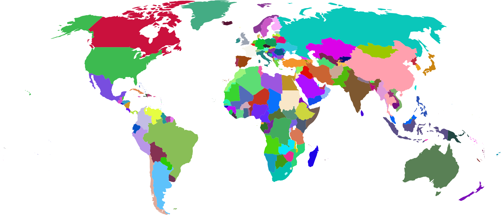

# The world of creative visualizations

Welcome to [pyDreamplet](https://pypi.org/project/pydreamplet/) – a gateway to creating stunning SVG visualizations with Python. Whether crafting charts, generating artistic SVG imagery, or exploring innovative ways to manipulate vector graphics, pyDreamplet is designed to bring creative visions to life. This library offers an intuitive yet powerful toolkit for developers and digital artists alike, making it effortless to transform code into captivating visual art.

Check out the examples below. Ready to dive in? Explore the Getting Started section to discover a guide that will help you create your first visual. For more inspiration and advanced examples, check out the reference materials and blog, which showcase creative projects and real-world applications of pyDreamplet. Unleash your creativity and start building beautiful visualizations today!

<figure markdown="span">
  
  
  <figcaption>Data Vizualization Example - Supplier Quality Performance</figcaption>
</figure>

<figure markdown="span">
  
  <figcaption>Data Vizualization Example - World Map</figcaption>
</figure>

<figure markdown="span">
  
  <figcaption>Creative coding example</figcaption>
</figure>
