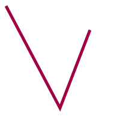

# `Polyline`

The `Polyline` class represents an SVG polyline element. It allows setting a list of points and automatically formats these into the SVG-compatible `"x,y x,y …"` string.

!!! info

    This class inherits from [**`SvgElement`**](svgelement.md).

## <span class=class></span>`pydreamplet.core.Polyline`

<!--skip-->
<!--skip-->
<!--skip-->
```py
Polyline(
    points: list[Real],
    **kwargs
)
```

Initializes a new polyline with the specified vertices. The points must be provided as a list of numbers where every two elements represent the x and y coordinates of a vertex.

<span class="param">**Parameters**</span>

- `points` *(list[Real])*: A list of numbers representing the polyline's vertices, for example: `[x1, y1, x2, y2, x3, y3, ...]`.
- `**kwargs`: Additional attributes for the polyline element.

<!--skip-->
```py
from pydreamplet import SVG, Polyline

svg = SVG(200, 200)
svg.append(
    Polyline([10, 10, 100, 180, 150, 50], stroke="#a00344", fill="none", stroke_width=5)
)
```

{.img-light-dark-bg}

### <span class="prop"></span>`points`

**Getters and Setters:** Retrieve or update the polyline's points. When setting new points, the list is automatically formatted into a string where each vertex is expressed as `"x,y"` and each pair is separated by a space.

<!--skip-->
<!--skip-->
<!--skip-->
```py
print(polyline.points)  # [0, 0, 50, 50, 100, 0]
polyline.points = [0, 0, 0, 20, 20, 20, 20, 0]
```

When the `points` setter is called, the underlying SVG element's `points` attribute is updated to: `points="0,0 0,20 20,20 20,0"`.