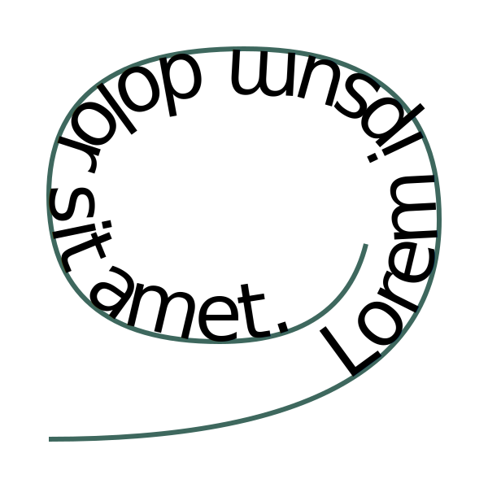

# `TextOnPath`

The TextOnPath class represents an SVG text element that follows a path. It wraps a <textPath> element to render text along a specified path.

!!! info

    This class inherits from [**`SvgElement`**](svgelement.md).

## <span class=class></span>`pydreamplet.core.TextOnPath`

<!--skip-->
```py
TextOnPath(
    initial_text: str = "",
    path: str = "",
    text_path_args: dict = None, 
    **kwargs
)
```

Initializes a new text-on-path element with optional initial content and a reference to a path.

<span class="param">**Parameters**</span>

- `initial_text` *(str, optional)*: The initial text content.
- `path` *(str, optional)*: The path identifier (e.g., an href value) to bind the text to.
- `text_path_args` *(dict, optional)*: Additional attributes for the `<textPath>` element.
- `**kwargs`: Additional attributes for the text element.

```py
from pydreamplet import TextOnPath

text_on_path = TextOnPath("Curved Text", path="#myPath", fill="blue")
```

### <span class="prop"></span>`content`

`Getter:` Returns the text content rendered on the path.

`Setter:` Updates the text content on the path.

<!--skip-->
```py
print(text_on_path.content)
text_on_path.content = "Updated Text"
```

```py title="Usage example"
import pydreamplet as dp

svg = dp.SVG(100, 100)
svg.width = "600px"
svg.height = "600px"

path = dp.Path(
    id="my-path",
    d="M10,90 Q90,90 90,45 Q90,10 50,10 Q10,10 10,40 Q10,70 45,70 Q70,70 75,50",
    fill="none", 
    stroke="#3e685e"
)

text = dp.TextOnPath(
    "Lorem ipsum dolor sit amet.",
    path_id="#my-path",
    text_path_args={"startOffset": "20%"},
)
svg.append(path).append(text)
svg.display()
```

{.img-light-dark-bg}
