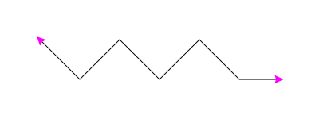

# `Marker`

The `Marker` class represents an SVG marker element used to define reusable graphics for lines and paths, such as arrows or custom symbols.

!!! info

    This class inherits from [**`SvgElement`**](../core/svgelement.md).

## <span class=class></span>`dreamplet.markers.Marker`

<!--skip-->
```py
Marker(id: str, d: str, width: Real, height: Real, **kwargs)
```

Initializes a new marker. The marker is defined by a path string `d` and dimensions `width` and `height`. It creates an SVG `<marker>` element with a default viewBox of `"0 0 10 10"` and preconfigured attributes. Additional attributes—such as refX, refY, and orient—can be specified via kwargs to customize the marker’s positioning and orientation. A nested `Path` element is automatically created with its own default style attributes.

<span class="param">**Parameters**</span>

- `id` *(str)*: A unique identifier for the marker.
- `d` *(str)*: A string representing the SVG path data that defines the shape of the marker. There are [predefined markers](predefined_markers.md) you can use, or you can create your own.
- `width` *(Real)*: The width of the marker viewport.
- `height` *(Real)*: The height of the marker viewport.
- `**kwargs`: Additional attributes for the marker element. Supported overrides include:
    - `refX`: The x-coordinate for the marker’s reference point (default: `"5"`).
    - `refY`: The y-coordinate for the marker’s reference point (default: `"5"`).
    - `orient`: The orientation of the marker (default: `"0"`).
    - `fill`: Fill color for the marker’s path (default: `"#000000"`).
    - `stroke`: Stroke color for the marker’s path (default: `"none"`).
    - `stroke-width`: Stroke width for the marker’s path (default: `"1"`).

<!--skip-->
<!--skip-->
<!--skip-->
<!--skip-->
```py
from pydreamplet import SVG, SvgElement, Polyline
from pydreamplet.markers import Marker, ARROW

svg = SVG(400, 150)

svg.append(SvgElement("defs"))

marker = Marker(
    "arrow-head", ARROW, 16, 16, fill="magenta", orient="auto-start-reverse"
)
svg.find("defs").append(marker)

polyline = Polyline(
    [50, 50, 100, 100, 150, 50, 200, 100, 250, 50, 300, 100, 350, 100],
    stroke="#000",
    fill="none",
)
polyline.marker_end = marker.id_ref
polyline.marker_start = marker.id_ref
svg.append(polyline)
```

{.img-light-dark-bg}

### <span class="prop"></span>`d`

**Getter:** Returns the SVG path data string of the marker.

**Setter:** Updates the marker's path data and reflects the change in the underlying path element.

<!--skip-->
```py
print(marker.d)
marker.d = ARROW_CONVEX  # Update to a different arrow style
```

### <span class="prop"></span>`fill`

**Getter:** Retrieves the fill color of the marker's path.

**Setter:** Sets the fill color for the marker's path.

<!--skip-->
```py
print(marker.fill)
marker.fill = "#ff0000"
```

### <span class="prop"></span>`stroke`

**Getter:** Returns the stroke color of the marker's path.

**Setter:** Updates the stroke color of the marker's path.

<!--skip-->
```py
print(marker.stroke)
marker.stroke = "#00ff00"
```

### <span class="prop"></span>`stroke_width`

**Getter:** Retrieves the stroke width of the marker's path.

**Setter:** Sets the stroke width for the marker's path.

<!--skip-->
```py
print(marker.stroke_width)
marker.stroke_width = 2
```

### <span class="prop"></span>`id_ref`

**Getter:** Returns a URL reference string for the marker (e.g., `"url(#arrow)"`), which can be used to reference the marker within other SVG elements.
