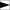
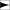
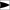
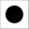
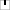
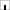
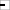
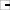
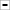

# Predefined Markers

### `ARROW`

  {width="32"}

### `ARROW_BASIC`

  {width="32"}

### `ARROW_CONCAVE`

  {width="32"}

### `ARROW_CONVEX`

  {width="32"}

### `ARROW_SIMPLE`

  {width="32"}

### `CROSS`

  {width="32"}

### `DIAMOND`

  {width="32"}

### `DOT`

  {width="32"}

### `SQUARE`

  {width="32"}

### `TICK_TOP`

  {width="32"}

### `TICK_BOTTOM`

  {width="32"}

### `TICK_LEFT`

  {width="32"}

### `TICK_RIGHT`

  {width="32"}

### `TICK_HORIZONTAL`

  {width="32"}

### `TICK_VERTICAL`

  {width="32"}
