# QuickHooks

[](https://www.python.org/downloads/)
[](https://github.com/astral-sh/uv)
[](https://github.com/astral-sh/uv)
[](https://opensource.org/licenses/MIT)
[](https://github.com/astral-sh/ruff)
[](https://mypy-lang.org/)
[](https://pytest.org/)

A streamlined TDD framework for Claude Code hooks with intelligent agent analysis, discovery, and Agent OS integration. Built with Python 3.12+ and modern UV package management, featuring automatic agent detection from your `~/.claude/agents` directory, smart prompt modification for optimal AI collaboration, and seamless Agent OS workflow execution for spec-driven agentic development.

## 🚀 UV-Powered Development

QuickHooks leverages the blazing-fast [UV package manager](https://github.com/astral-sh/uv) for 10-100x faster dependency resolution and installation. Our development workflow is optimized for UV's modern Python project management.

## Features

### 🧠 Intelligent Agent Analysis
- **AI-powered prompt analysis** using Groq and Pydantic AI
- **Automatic agent discovery** from `~/.claude/agents` directory
- **Semantic similarity matching** with Chroma vector database
- **Smart prompt modification** for guaranteed agent usage
- **Context-aware chunking** for large inputs (up to 128K tokens)

### 🤖 Agent OS Integration
- **Spec-driven agentic development** with Agent OS workflows
- **Instruction execution** directly from QuickHooks CLI
- **Workflow management** with state persistence and resumption
- **Claude Code integration** with automatic intent detection
- **Pre/post-execution hooks** for comprehensive workflow support

### 🔧 Development Tools
- **Hot-reload development server** with `watchfiles`
- **Test-driven development** workflow
- **Fast** and **efficient** file watching
- **Modern Python** with type hints and async/await
- **Developer-friendly** CLI with rich output

### 🔗 Claude Code Integration
- **Seamless hook integration** with Claude Code settings
- **Automatic prompt interception** and modification
- **Environment-based configuration**
- **Verbose logging** and debugging support

## 📦 Installation

### Quick Start (PyPI)
```bash
# Install via pip (when published)
pip install quickhooks[agent-analysis,agent_os]
export GROQ_API_KEY=your_groq_api_key_here

# Agent Analysis
quickhooks agents analyze "Write a Python function"

# Agent OS (requires Agent OS installation)
quickhooks agent-os list-instructions
quickhooks agent-os execute-instruction plan-product
```

### 🛠️ Development Installation with UV

1. **Install UV** (if not already installed):
   ```bash
   # macOS/Linux
   curl -LsSf https://astral.sh/uv/install.sh | sh
   
   # Windows PowerShell
   powershell -ExecutionPolicy ByPass -c "irm https://astral.sh/uv/install.ps1 | iex"
   ```

2. **Clone and setup**:
   ```bash
   git clone https://github.com/kivo360/quickhooks.git
   cd quickhooks
   ```

3. **Install with UV** (recommended):
   ```bash
   uv sync --all-extras  # Install all dependencies including dev extras
   ```

4. **Alternative: Classic installation**:
   ```bash
   make install  # Uses UV under the hood
   ```

### 🔧 UV Project Workflow

```mermaid
graph TD
    A["🚀 uv init"] --> B["📦 uv add dependency"]
    B --> C["🏃 uv run command"]
    C --> D["🔒 uv lock"]
    D --> E["🔄 uv sync"]
    E --> F["🏗️ uv build"]
    F --> G["📤 uv publish"]
    
    style A fill:#e1f5fe
    style B fill:#f3e5f5
    style C fill:#e8f5e8
    style D fill:#fff3e0
    style E fill:#fce4ec
    style F fill:#f1f8e9
    style G fill:#e3f2fd
```



### 🔗 Claude Code Integration Setup

#### Option 1: PEP 723 Self-Contained Hooks (Recommended)

Self-contained hooks with inline dependencies using [PEP 723](https://peps.python.org/pep-0723/):

```bash
# Install PEP 723 hooks to your project
uv run -s scripts/setup_pep723_hooks.py install

# Or copy to current directory manually
cp -r .claude/ your-project/
chmod +x your-project/.claude/hooks/*.py

# Configure settings
edit .claude/settings.json  # Set GROQ_API_KEY and enable hooks

# Test hooks
uv run -s scripts/setup_pep723_hooks.py test
```

**Benefits**:
- ✅ Self-contained scripts with inline dependencies
- ✅ No global installation required
- ✅ Dependencies auto-install from PyPI via PEP 723
- ✅ Fast execution with UV dependency caching
- ✅ Portable across projects

See **[PEP 723 Hooks Guide](PEP723_HOOKS_GUIDE.md)** for complete documentation.

#### Option 2: Global Installation

```bash
# Install globally for Claude Code integration
uv run python -m quickhooks install install-global

# OR setup via script
uv run python scripts/setup_claude_code_integration.py

# Verify integration
quickhooks agents analyze "Write a Python function"
```

## 🛠️ Development Workflow

### 🏃 Start Development Server

```bash
# UV-native approach (recommended)
uv run quickhooks-dev run src/ --delay 0.5

# Using Makefile (UV under the hood)
make dev
```

This starts the development server with hot-reload enabled. The server automatically restarts when you make changes.

### 🧪 Run Tests

```bash
# UV-native testing
uv run pytest tests/ -v --cov=quickhooks

# Using Makefile
make test
```

### 🎨 Code Quality

```bash
# Format code
uv run ruff format src/ tests/  # or: make format

# Lint code  
uv run ruff check src/ tests/   # or: make lint

# Type checking
uv run mypy src/quickhooks       # or: make typecheck

# All quality checks
uv run make check               # or: make check
```

### 📋 UV Command Reference

| Task | UV Command | Makefile Equivalent |
|------|------------|--------------------|
| Install deps | `uv sync --all-extras` | `make install` |
| Dev server | `uv run quickhooks-dev run src/` | `make dev` |
| Run tests | `uv run pytest` | `make test` |
| Format code | `uv run ruff format` | `make format` |
| Type check | `uv run mypy src/` | `make typecheck` |
| Add dependency | `uv add package-name` | N/A |
| Lock deps | `uv lock` | N/A |
| Build package | `uv build --no-sources` | N/A |

## Project Structure

```
quickhooks/
├── src/
│   └── quickhooks/          # Main package
│       ├── __init__.py      # Package initialization
│       ├── cli/             # CLI commands
│       ├── agent_analysis/  # Agent analysis system
│       │   ├── analyzer.py  # Core analysis engine
│       │   ├── agent_discovery.py # Local agent discovery
│       │   ├── context_manager.py # Context chunking
│       │   ├── command.py   # CLI commands
│       │   └── types.py     # Type definitions
│       ├── dev.py           # Development server
│       └── ...
├── hooks/                   # Claude Code hooks
│   └── agent_analysis_hook.py # Main integration hook
├── examples/                # Example configurations
│   ├── claude_code_settings.json
│   └── agent_analysis_demo.py
├── scripts/                 # Setup and utility scripts
│   └── setup_claude_code_integration.py
├── tests/                   # Test files
├── .gitignore
├── Makefile                 # Development commands
├── pyproject.toml          # Project configuration
├── README.md
└── AGENT_ANALYSIS_README.md # Detailed agent analysis docs
```

## Development Server

The development server provides a smooth development experience with:

- Automatic reload on file changes
- Rich console output
- Clean error reporting
- Configurable watch paths and reload delay

### Usage

```bash
# Start the development server
python -m quickhooks.dev run src/

# With custom reload delay (in seconds)
python -m quickhooks.dev run src/ --delay 1.0
```

Or using the CLI:

```bash
quickhooks-dev run src/
```

## CLI Commands

### Agent Analysis
```bash
# Analyze a prompt for agent recommendations
quickhooks agents analyze "Write a Python function that sorts a list"

# With context file
quickhooks agents analyze "Review this code for security issues" --context code.py

# Custom configuration
quickhooks agents analyze "Debug this error" \
    --model qwen/qwen3-32b \
    --threshold 0.8 \
    --format rich
```

### Agent OS Commands
```bash
# List available Agent OS instructions
quickhooks agent-os list-instructions
quickhooks agent-os list-instructions --category core

# Execute Agent OS instructions
quickhooks agent-os execute-instruction plan-product
quickhooks agent-os execute-instruction create-spec --verbose

# Workflow management
quickhooks agent-os list-workflows
quickhooks agent-os init-workflows
quickhooks agent-os create-workflow my-workflow \
  --description "Custom development workflow" \
  --instructions "plan-product,create-spec,analyze-product"
quickhooks agent-os execute-workflow product-planning

# Show instruction details
quickhooks agent-os show-instruction plan-product
```

### Development Commands
```bash
# Show version
quickhooks version

# Say hello
quickhooks hello
quickhooks hello --name "Your Name"

# Development server
quickhooks-dev run src/
```

## 📚 Documentation

### 🤖 Agent Analysis System
For detailed documentation on the AI-powered agent analysis system, see [AGENT_ANALYSIS_README.md](AGENT_ANALYSIS_README.md).

**Key Topics:**
- 📄 **Complete API Reference** - All classes, methods, and types
- 📝 **Agent File Formats** - Python, Markdown, JSON examples
- 🔗 **Claude Code Integration** - Step-by-step setup guide
- 🔧 **Troubleshooting** - Common issues and solutions
- 🏁 **Performance Optimization** - Tips for faster analysis

### 🤖 Agent OS Integration
For comprehensive documentation on the Agent OS integration, see [docs/agent-os-integration.md](docs/agent-os-integration.md).

**Key Topics:**
- 🔄 **Workflow Execution** - Execute predefined and custom workflows
- 📋 **Instruction Management** - List and execute Agent OS instructions
- 🔗 **Claude Code Integration** - Automatic intent detection and hook setup
- ⚙️ **Configuration** - Environment variables and customization options
- 🏗️ **API Reference** - Complete Python API for programmatic usage

### 🚀 UV Package Management
Comprehensive guides for modern Python development with UV:

- 📋 **[UV Development Guide](docs/uv-guide.md)** - Complete UV workflow and best practices
- 📉 **[Package Lifecycle](docs/workflows/package-lifecycle.md)** - Mermaid diagrams of development workflows
- 🚀 **[Deployment Guide](docs/deployment.md)** - PyPI publishing and production deployment
- 🤝 **[Contributing Guide](CONTRIBUTING.md)** - UV-based contribution workflow

### 📊 Workflow Diagrams
Visual documentation with Mermaid charts:
- 🔄 Development lifecycle workflows
- 📦 Dependency management flows  
- 🏗️ Build and distribution pipelines
- 🗂 CI/CD integration patterns

## 🤝 Contributing

We welcome contributions! Please see our [Contributing Guide](CONTRIBUTING.md) for detailed information about our UV-based development workflow.

### 🏃 Quick Start for Contributors

1. **Fork & Clone**:
   ```bash
   git clone https://github.com/YOUR_USERNAME/quickhooks.git
   cd quickhooks
   ```

2. **Setup Development Environment**:
   ```bash
   uv sync --all-extras  # Install all dependencies
   ```

3. **Create Feature Branch**:
   ```bash
   git checkout -b feature/your-amazing-feature
   ```

4. **Develop & Test**:
   ```bash
   uv run pytest tests/ -v        # Run tests
   uv run ruff format src/ tests/  # Format code
   uv run mypy src/quickhooks      # Type check
   ```

5. **Submit PR**:
   ```bash
   git push origin feature/your-amazing-feature
   # Create Pull Request on GitHub
   ```

### 📊 Development Commands

```bash
# Core development workflow
uv sync --dev                    # Sync dev environment
uv run pytest tests/ -v         # Run comprehensive tests
uv run pytest tests/test_agent_analysis.py -v  # Specific tests
uv run make check               # Run all quality checks
uv build --no-sources          # Test build

# Code quality
uv run ruff format src/ tests/  # Format code
uv run ruff check src/ tests/   # Check linting
uv run mypy src/quickhooks      # Type checking
```

See our [UV Guide](docs/uv-guide.md) for detailed development practices and [workflow diagrams](docs/workflows/package-lifecycle.md) for visual references.

## License

MIT

## 📊 Project Stats

- 🔥 **UV-Powered**: 10-100x faster dependency management
- 🧠 **AI-Enhanced**: Intelligent agent analysis with Groq + Pydantic AI
- 🔄 **Hot-Reload**: Development server with instant feedback
- 🧪 **Well-Tested**: Comprehensive test suite with 90%+ coverage
- 📄 **Type-Safe**: Full type annotations with mypy validation
- 🎨 **Modern Code**: Ruff formatting and linting
- 🚀 **Production-Ready**: Docker support and CI/CD pipelines

---

<p align="center">
  <strong>Made with ❤️ and ⚡ UV for the Claude Code community</strong><br>
  <sub>Powered by Rust-speed dependency management and AI-driven development</sub>
</p>