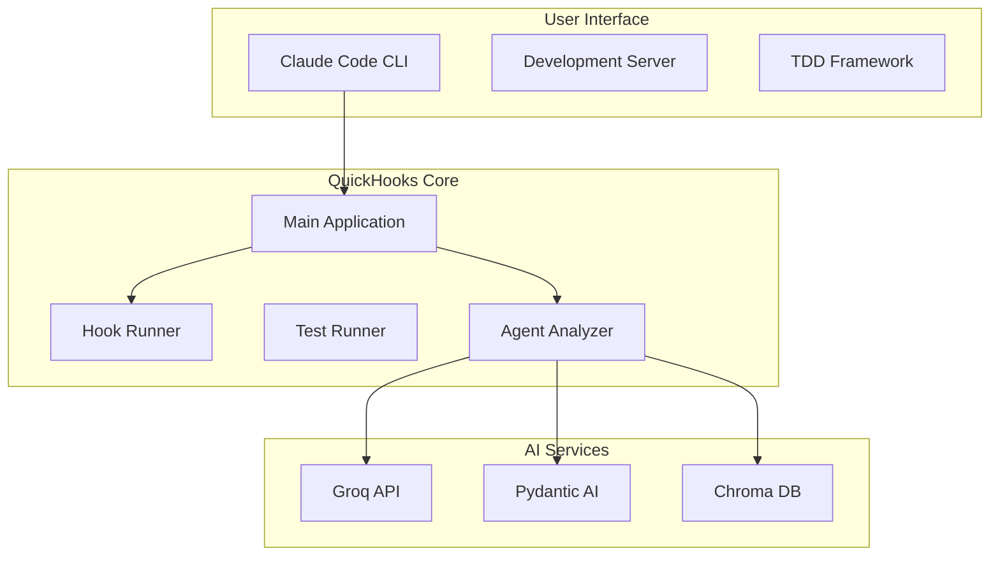

# QuickHooks Documentation

Welcome to the comprehensive documentation for QuickHooks - a streamlined TDD framework for Claude Code hooks with intelligent agent analysis and discovery.

## 📚 Documentation Structure

### Getting Started
- [User Guide](user-guide/getting-started.md) - Complete guide for users new to QuickHooks
- [Installation Guide](user-guide/getting-started.md#installation) - Step-by-step installation instructions
- [Quick Start](user-guide/getting-started.md#quick-start) - Get up and running in minutes

### Core Concepts
- [Basic Concepts](user-guide/getting-started.md#basic-concepts) - Understanding hooks, inputs, and outputs
- [Creating Hooks](user-guide/getting-started.md#creating-your-first-hook) - Building your first hook
- [Testing Hooks](user-guide/getting-started.md#testing-hooks) - Testing framework and best practices

### API Reference
- [API Documentation](api/openapi.yaml) - Complete OpenAPI specification
- [CLI Commands](api/cli-commands.md) - Command-line interface reference
- [Hook Models](api/models.md) - Data models and schemas

### Architecture
- [System Architecture](architecture/system-overview.md) - Complete system overview with diagrams
- [Component Design](architecture/components.md) - Detailed component architecture
- [Plugin System](architecture/plugins.md) - Extensible plugin architecture

### Development
- [Developer Guide](developer/README.md) - Comprehensive developer documentation
- [Extending QuickHooks](developer/README.md#extending-quickhooks) - Adding new functionality
- [Plugin Development](developer/README.md#plugin-development) - Creating custom plugins
- [Contributing Guidelines](developer/README.md#contributing) - How to contribute to QuickHooks

### Examples & Tutorials
- [Interactive Playground](examples/interactive-playground.html) - Hands-on learning with live examples
- [Example Hooks](examples/hooks/) - Real-world hook examples
- [Use Cases](examples/use-cases.md) - Common use cases and solutions

### Agent Analysis
- [Agent Analysis System](agent-analysis/overview.md) - AI-powered agent recommendations
- [Local Agent Discovery](agent-analysis/discovery.md) - Discover and use local agents
- [Prompt Enhancement](agent-analysis/prompt-enhancement.md) - Improve prompts with AI

### Advanced Topics
- [Performance Optimization](advanced/performance.md) - Tuning and optimization techniques
- [Error Handling](advanced/error-handling.md) - Comprehensive error management
- [Security Best Practices](advanced/security.md) - Security considerations and guidelines

## 🚀 Quick Start

1. **Install QuickHooks**
   ```bash
   # Install UV for fast dependency management
   curl -LsSf https://astral.sh/uv/install.sh | sh

   # Install QuickHooks
   uv add quickhooks[all]

   # Set up API key
   export GROQ_API_KEY=your_api_key_here
   ```

2. **Create Your First Hook**
   ```python
   from quickhooks.models import BaseHook, HookInput, HookOutput, HookStatus

   class MyHook(BaseHook):
       async def run(self, input_data: HookInput) -> HookOutput:
           return HookOutput(
               status=HookStatus.SUCCESS,
               data={"message": "Hello, QuickHooks!"},
               message="Hook executed successfully"
           )
   ```

3. **Run Your Hook**
   ```bash
   quickhooks run my_hook.py --input '{"name": "World"}'
   ```

4. **Test Your Hook**
   ```bash
   quickhooks test --hooks-dir ./ --tests-dir ./tests
   ```

## 📖 Learning Path

### For Beginners
1. Read the [User Guide](user-guide/getting-started.md)
2. Try the [Interactive Playground](examples/interactive-playground.html)
3. Build your first hook following the examples
4. Learn about testing with the testing guide

### For Developers
1. Study the [System Architecture](architecture/system-overview.md)
2. Read the [Developer Guide](developer/README.md)
3. Explore the [API Documentation](api/openapi.yaml)
4. Learn about [Plugin Development](developer/README.md#plugin-development)

### For Advanced Users
1. Master [Agent Analysis](agent-analysis/overview.md)
2. Optimize performance with [Performance Guide](advanced/performance.md)
3. Implement custom plugins and extensions
4. Contribute to the QuickHooks project

## 🔧 Key Features

- **🤖 AI-Powered Agent Analysis**: Intelligent prompt analysis with automatic agent discovery
- **⚡ Async-First Design**: High-performance concurrent execution
- **🧪 Comprehensive Testing**: Built-in TDD framework with parallel execution
- **🔌 Extensible Plugin System**: Add custom functionality through plugins
- **📊 Rich Analytics**: Detailed metrics and performance monitoring
- **🔒 Type Safety**: Full Pydantic models and type annotations
- **🚀 Hot Reload Development**: Instant feedback during development
- **🌐 CLI Integration**: Seamless Claude Code integration

## 📊 System Overview



## 🛠️ CLI Commands

### Core Commands
```bash
# Version information
quickhooks version

# Run a hook
quickhooks run hook.py --input '{"data": "value"}'

# Run tests
quickhooks test --hooks-dir hooks/ --tests-dir tests/
```

### Agent Analysis
```bash
# Analyze a prompt
quickhooks agents analyze "Write Python function for data processing"

# With context and options
quickhooks agents analyze "Debug authentication issue" \
  --context "Flask app with JWT" \
  --threshold 0.8 \
  --format json
```

### Development
```bash
# Start development server
quickhooks-dev run hooks/ --delay 0.5

# Create new hook
quickhooks create hook MyHook

# Install globally
quickhooks install install-global
```

## 📚 Additional Resources

- [GitHub Repository](https://github.com/kivo360/quickhooks)
- [Issue Tracker](https://github.com/kivo360/quickhooks/issues)
- [Discord Community](https://discord.gg/quickhooks)
- [Blog and Tutorials](https://blog.quickhooks.dev)

## 🤝 Contributing

We welcome contributions! Please read our [Contributing Guide](developer/README.md#contributing) for details on:
- Code style and standards
- Pull request process
- Issue reporting
- Development setup

## 📄 License

QuickHooks is licensed under the MIT License. See [LICENSE](https://github.com/kivo360/quickhooks/blob/main/LICENSE) for details.

## 🔗 Related Projects

- [Claude Code](https://claude.ai/code) - AI-powered development environment
- [Pydantic AI](https://pydantic-ai.readthedocs.io/) - Agent framework
- [Groq](https://groq.com/) - Fast AI inference
- [UV](https://docs.astral.sh/uv/) - Fast Python package manager

---

**Made with ❤️ by the QuickHooks team**