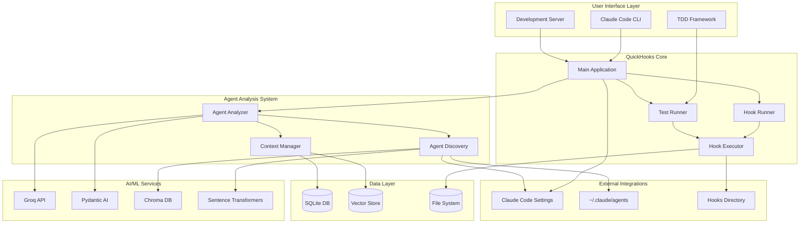
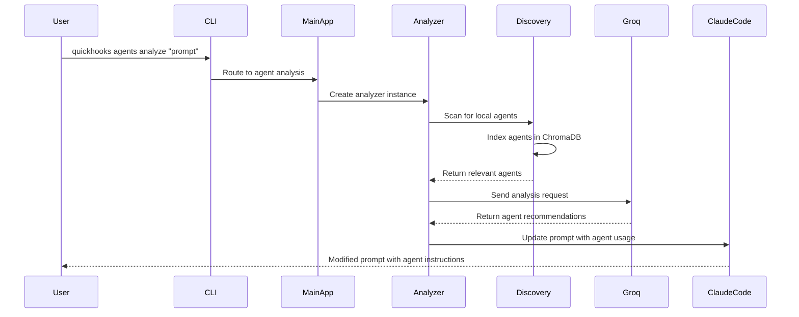
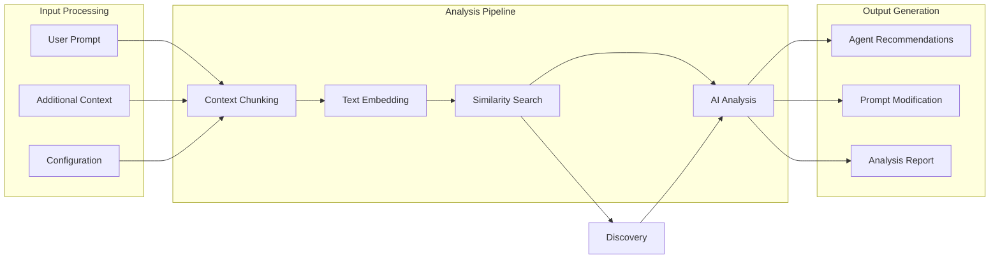
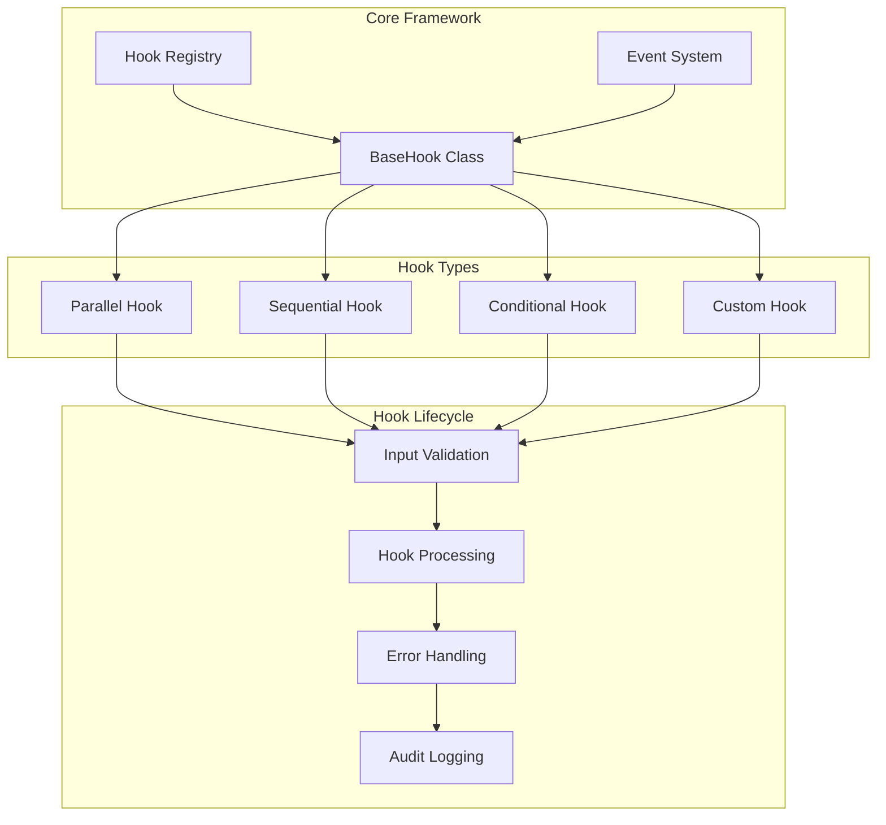
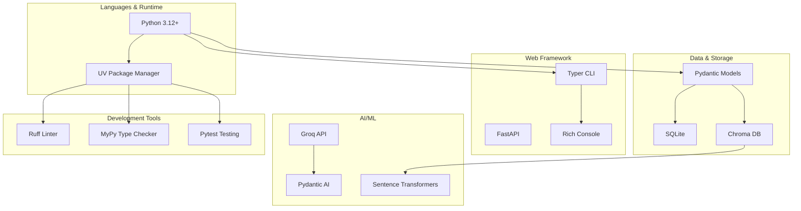
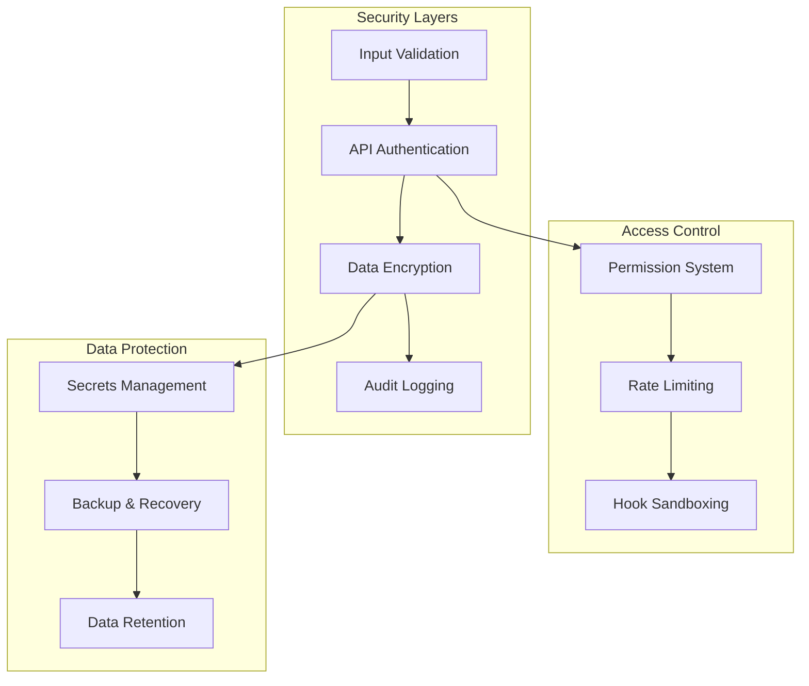
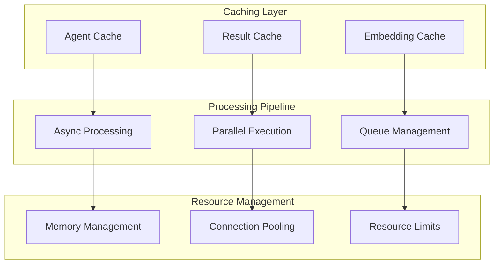
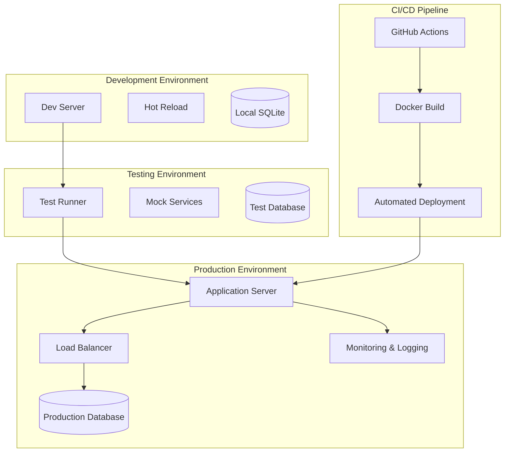
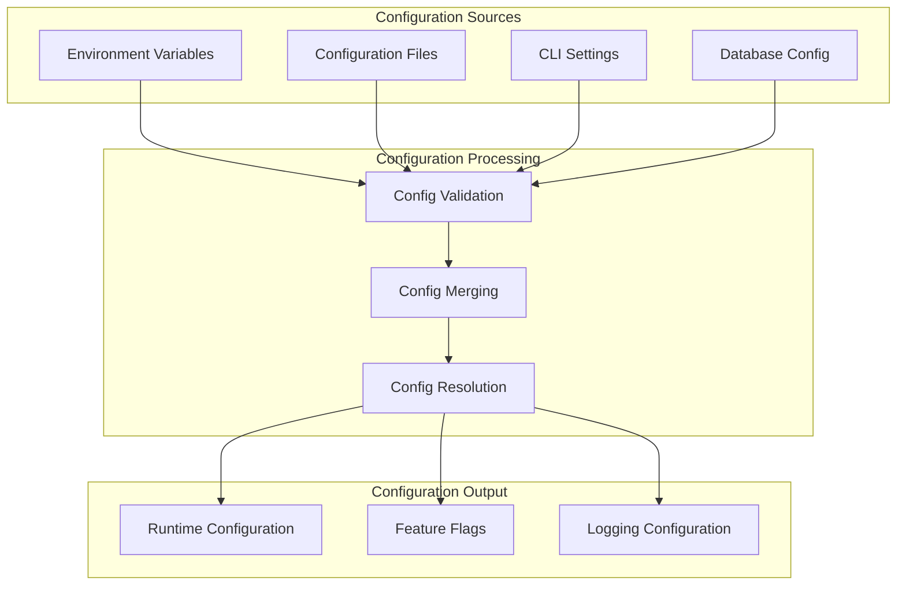

# QuickHooks System Architecture

## System Overview Diagram

## Component Interaction Flow

## Data Flow Architecture

## Plugin Architecture

## Technology Stack

## Security Architecture

## Performance Architecture

## Deployment Architecture

## Configuration Management

