# 🚀 Deployment Guide for QuickHooks

This guide covers deployment strategies, PyPI publishing, and production configuration for QuickHooks using UV.

## 📋 Table of Contents

- [Deployment Overview](#deployment-overview)
- [PyPI Publishing](#pypi-publishing)
- [Production Configuration](#production-configuration)
- [CI/CD Integration](#cicd-integration)
- [Monitoring & Maintenance](#monitoring--maintenance)

## 🌐 Deployment Overview

### Deployment Strategies

```mermaid
graph TD
    A[📦 QuickHooks Package] --> B{Deployment Type}
    
    B -->|📚 Library| C[PyPI Distribution]
    B -->|🔗 Integration| D[Claude Code Hook]
    B -->|🛠️ Development| E[Local Installation]
    B -->|☁️ Cloud| F[Container Deployment]
    
    C --> G[pip install quickhooks]
    D --> H[Global Hook Installation]
    E --> I[UV Development Setup]
    F --> J[Docker Container]
    
    style A fill:#e3f2fd
    style C fill:#e8f5e8
    style D fill:#fff3e0
    style E fill:#f3e5f5
    style F fill:#e1f5fe
```



### Environment Matrix

| Environment | Installation Method | Dependencies | Purpose |
|-------------|-------------------|--------------|---------|
| **Development** | `uv sync --dev` | All + Dev tools | Local development |
| **Testing** | `uv sync --frozen` | Production only | CI/CD testing |
| **Staging** | `pip install -e .` | Production only | Pre-production testing |
| **Production** | `pip install quickhooks` | Minimal | End-user installation |

## 📦 PyPI Publishing

### Pre-Publishing Checklist

```mermaid
graph TD
    A[🚀 Ready to Publish?] --> B{Version Updated?}
    B -->|No| C[📝 Update pyproject.toml version]
    B -->|Yes| D{Changelog Updated?}
    D -->|No| E[📋 Update CHANGELOG.md]
    D -->|Yes| F{Tests Pass?}
    F -->|No| G[🧪 Fix failing tests]
    F -->|Yes| H{Build Clean?}
    H -->|No| I[🏗️ Fix build issues]
    H -->|Yes| J[✅ Ready to Publish!]
    
    C --> D
    E --> F
    G --> F
    I --> H
    
    style A fill:#e3f2fd
    style J fill:#e8f5e8
    style B fill:#fff3e0
    style D fill:#fff3e0
    style F fill:#fff3e0
    style H fill:#fff3e0
```



### Publishing Workflow

#### 1. Environment Setup

```bash
# Set up PyPI credentials
export PYPI_TOKEN="your-pypi-api-token"
export TESTPYPI_TOKEN="your-testpypi-api-token"

# Verify environment
uv --version
uv sync --dev
uv run python --version
```

#### 2. Version Management

```bash
# Update version in pyproject.toml
# Example: 0.1.0 -> 0.2.0

# Verify version consistency
grep -n "version" pyproject.toml
grep -n "__version__" src/quickhooks/__init__.py
```

#### 3. Pre-Publication Testing

```bash
# Comprehensive testing
uv run make check  # lint, typecheck, test

# Build verification
uv build --no-sources
ls -la dist/

# Test build installation
cd /tmp
python -m venv test-env
source test-env/bin/activate
pip install /path/to/quickhooks/dist/quickhooks-*.whl
python -c "import quickhooks; print('✅ Build OK')"
deactivate
```

#### 4. Test PyPI Upload

```bash
# Upload to Test PyPI
uv publish --index testpypi --token $TESTPYPI_TOKEN

# Test installation from Test PyPI
pip install --index-url https://test.pypi.org/simple/ quickhooks

# Verify functionality
quickhooks --version
quickhooks hello --name "Test User"
```

#### 5. Production PyPI Upload

```bash
# Final build
uv build --no-sources

# Upload to PyPI
uv publish --token $PYPI_TOKEN

# Verify on PyPI
open https://pypi.org/project/quickhooks/

# Test production installation
pip install quickhooks
quickhooks --version
```

#### 6. Post-Publication

```bash
# Create git tag
git tag v0.2.0
git push origin v0.2.0

# Create GitHub release
gh release create v0.2.0 \
  --title "QuickHooks v0.2.0" \
  --notes-file CHANGELOG.md \
  --generate-notes

# Update documentation
uv run python scripts/update_docs.py
```

### Publishing Automation

```yaml
# .github/workflows/publish.yml
name: Publish to PyPI

on:
  release:
    types: [published]

jobs:
  publish:
    runs-on: ubuntu-latest
    steps:
    - uses: actions/checkout@v4
    
    - name: Install UV
      run: curl -LsSf https://astral.sh/uv/install.sh | sh
      
    - name: Set up Python
      run: uv python pin 3.12
      
    - name: Install dependencies
      run: uv sync --frozen
      
    - name: Run tests
      run: uv run pytest
      
    - name: Build package
      run: uv build --no-sources
      
    - name: Publish to PyPI
      run: uv publish --token ${{ secrets.PYPI_TOKEN }}
```

## ⚙️ Production Configuration

### Minimal Production Installation

```bash
# Install core package only
pip install quickhooks

# Verify installation
python -c "import quickhooks; print(quickhooks.__version__)"
```

### Feature-Specific Installation

```bash
# Install with agent analysis features
pip install quickhooks[agent-analysis]

# Install with all optional features
pip install quickhooks[all]
```

### Environment Configuration

```python
# production_config.py
from quickhooks.config import QuickHooksConfig

# Production configuration
config = QuickHooksConfig(
    # Minimal logging in production
    logging_level="WARNING",
    
    # Disable development features
    development_mode=False,
    hot_reload=False,
    
    # Production optimizations
    cache_enabled=True,
    performance_monitoring=True,
    
    # Security settings
    validate_hooks=True,
    sanitize_inputs=True
)
```

### Docker Deployment

```dockerfile
# Dockerfile
FROM python:3.12-slim

# Install UV
RUN pip install uv

# Set working directory
WORKDIR /app

# Copy project files
COPY pyproject.toml uv.lock ./
COPY src/ ./src/

# Install dependencies (production only)
RUN uv sync --frozen --no-dev

# Install the package
RUN uv pip install -e .

# Create non-root user
RUN useradd --create-home --shell /bin/bash app
USER app

# Expose port for web interface (if applicable)
EXPOSE 8000

# Health check
HEALTHCHECK --interval=30s --timeout=3s --start-period=5s --retries=3 \
  CMD python -c "import quickhooks; print('healthy')" || exit 1

# Default command
CMD ["quickhooks", "--help"]
```

### Docker Compose for Development

```yaml
# docker-compose.yml
version: '3.8'

services:
  quickhooks:
    build: .
    volumes:
      - ./src:/app/src
      - ./tests:/app/tests
    environment:
      - GROQ_API_KEY=${GROQ_API_KEY}
      - QUICKHOOKS_ENV=development
    ports:
      - "8000:8000"
    command: uv run quickhooks-dev run src/

  quickhooks-test:
    build: .
    volumes:
      - ./src:/app/src
      - ./tests:/app/tests
    command: uv run pytest tests/ -v
    depends_on:
      - quickhooks
```

## 🔄 CI/CD Integration

### GitHub Actions Workflow

```yaml
# .github/workflows/ci.yml
name: CI/CD Pipeline

on:
  push:
    branches: [main, develop]
  pull_request:
    branches: [main]

jobs:
  test:
    runs-on: ubuntu-latest
    strategy:
      matrix:
        python-version: ['3.12', '3.13']
    
    steps:
    - uses: actions/checkout@v4
    
    - name: Install UV
      run: curl -LsSf https://astral.sh/uv/install.sh | sh
      
    - name: Set up Python ${{ matrix.python-version }}
      run: uv python pin ${{ matrix.python-version }}
      
    - name: Install dependencies
      run: uv sync --all-extras --frozen
      
    - name: Run tests
      run: |
        uv run pytest tests/ --cov=quickhooks --cov-report=xml
        
    - name: Upload coverage
      uses: codecov/codecov-action@v3
      with:
        file: ./coverage.xml
        
    - name: Run type checking
      run: uv run mypy src/quickhooks
      
    - name: Run linting
      run: uv run ruff check src/ tests/
      
    - name: Test build
      run: uv build --no-sources

  deploy:
    needs: test
    runs-on: ubuntu-latest
    if: github.ref == 'refs/heads/main'
    
    steps:
    - uses: actions/checkout@v4
    
    - name: Install UV
      run: curl -LsSf https://astral.sh/uv/install.sh | sh
      
    - name: Build package
      run: uv build --no-sources
      
    - name: Publish to PyPI
      if: startsWith(github.ref, 'refs/tags/')
      run: uv publish --token ${{ secrets.PYPI_TOKEN }}
```

### GitLab CI Configuration

```yaml
# .gitlab-ci.yml
stages:
  - test
  - build
  - deploy

variables:
  UV_CACHE_DIR: .uv-cache

cache:
  paths:
    - .uv-cache/

before_script:
  - curl -LsSf https://astral.sh/uv/install.sh | sh
  - export PATH="$HOME/.cargo/bin:$PATH"

test:
  stage: test
  script:
    - uv sync --frozen --all-extras
    - uv run pytest tests/ --cov=quickhooks
    - uv run mypy src/quickhooks
    - uv run ruff check src/ tests/

build:
  stage: build
  script:
    - uv build --no-sources
  artifacts:
    paths:
      - dist/
    expire_in: 1 hour

deploy:
  stage: deploy
  script:
    - uv publish --token $PYPI_TOKEN
  only:
    - tags
  dependencies:
    - build
```

## 📊 Monitoring & Maintenance

### Performance Monitoring

```python
# monitoring.py
import time
import logging
from functools import wraps

def monitor_performance(func):
    """Monitor function execution time."""
    @wraps(func)
    def wrapper(*args, **kwargs):
        start_time = time.time()
        try:
            result = func(*args, **kwargs)
            execution_time = time.time() - start_time
            logging.info(f"{func.__name__} executed in {execution_time:.2f}s")
            return result
        except Exception as e:
            execution_time = time.time() - start_time
            logging.error(f"{func.__name__} failed after {execution_time:.2f}s: {e}")
            raise
    return wrapper

# Usage
@monitor_performance
def analyze_agents(prompt: str) -> AnalysisResult:
    # Agent analysis logic
    pass
```

### Health Checks

```python
# health.py
from quickhooks import __version__
from quickhooks.config import load_config

def health_check() -> dict:
    """Comprehensive health check."""
    try:
        config = load_config()
        return {
            "status": "healthy",
            "version": __version__,
            "config_loaded": True,
            "dependencies": check_dependencies(),
            "timestamp": time.time()
        }
    except Exception as e:
        return {
            "status": "unhealthy",
            "error": str(e),
            "timestamp": time.time()
        }

def check_dependencies() -> dict:
    """Check critical dependencies."""
    deps = {}
    try:
        import typer
        deps["typer"] = typer.__version__
    except ImportError:
        deps["typer"] = "missing"
    
    # Check other critical dependencies
    return deps
```

### Automated Maintenance

```bash
#!/bin/bash
# maintenance.sh - Weekly maintenance script

echo "🔄 Running weekly maintenance..."

# Update dependencies
echo "📦 Updating dependencies..."
uv lock --upgrade

# Run security audit
echo "🔒 Security audit..."
uv audit || echo "⚠️ Security issues found"

# Run comprehensive tests
echo "🧪 Running tests..."
uv run pytest tests/ --cov=quickhooks

# Check for outdated packages
echo "📋 Checking package status..."
uv tree --show-version-specifiers

# Generate dependency report
echo "📊 Generating reports..."
uv export --format requirements-txt > requirements-frozen.txt

echo "✅ Maintenance complete!"
```

### Dependency Updates

```mermaid
graph TD
    A[📅 Weekly Schedule] --> B[🔍 Check Updates]
    B --> C[📦 uv lock --upgrade]
    C --> D[🧪 Test Suite]
    D --> E{Tests Pass?}
    
    E -->|No| F[📋 Review Breaking Changes]
    F --> G[🔧 Fix Compatibility]
    G --> D
    
    E -->|Yes| H[🔒 Security Audit]
    H --> I[📊 Performance Check]
    I --> J[✅ Approve Updates]
    J --> K[🔄 Deploy]
    
    style A fill:#e3f2fd
    style K fill:#e8f5e8
    style E fill:#fff3e0
```



## 🛡️ Security Considerations

### API Key Management

```bash
# Production environment variables
export GROQ_API_KEY="your-production-api-key"
export QUICKHOOKS_ENV="production"
export QUICKHOOKS_LOG_LEVEL="WARNING"

# Using secrets in CI/CD
# GitHub Secrets: GROQ_API_KEY, PYPI_TOKEN
# GitLab Variables: GROQ_API_KEY, PYPI_TOKEN
```

### Input Validation

```python
# security.py
from pydantic import BaseModel, validator
import re

class SecureInput(BaseModel):
    """Secure input validation."""
    
    prompt: str
    
    @validator('prompt')
    def validate_prompt(cls, v):
        # Remove dangerous patterns
        if re.search(r'<script|javascript:|data:', v, re.IGNORECASE):
            raise ValueError("Potentially dangerous input detected")
        
        # Limit length
        if len(v) > 10000:
            raise ValueError("Input too long")
            
        return v.strip()
```

### Audit Logging

```python
# audit.py
import logging
from datetime import datetime

audit_logger = logging.getLogger('quickhooks.audit')

def log_agent_analysis(user_id: str, prompt: str, result: str):
    """Log agent analysis for audit trail."""
    audit_logger.info({
        "event": "agent_analysis",
        "user_id": user_id,
        "prompt_hash": hash(prompt),
        "result_summary": result[:100],
        "timestamp": datetime.utcnow().isoformat()
    })
```

This comprehensive deployment guide covers all aspects of getting QuickHooks from development to production using UV's modern package management workflow!