# 🤝 Contributing to QuickHooks

Thank you for your interest in contributing to QuickHooks! This guide will help you get started with our UV-powered development workflow.

## 📋 Table of Contents

- [Development Setup](#development-setup)
- [UV-Based Workflow](#uv-based-workflow)  
- [Code Standards](#code-standards)
- [Testing Guidelines](#testing-guidelines)
- [Pull Request Process](#pull-request-process)
- [Release Process](#release-process)

## 🚀 Development Setup

### Prerequisites

- **Python 3.12+** (managed via UV)
- **UV Package Manager** (for dependency management)
- **Git** (for version control)
- **Make** (optional, for convenience commands)

### Quick Setup

```bash
# 1. Install UV if not already installed
curl -LsSf https://astral.sh/uv/install.sh | sh

# 2. Fork and clone the repository
git clone https://github.com/YOUR_USERNAME/quickhooks.git
cd quickhooks

# 3. Install development dependencies
uv sync --all-extras

# 4. Verify setup
uv run python -c "import quickhooks; print('✅ Setup complete!')"
uv run pytest --version
```

## 🔄 UV-Based Workflow

### Development Lifecycle

```mermaid
graph TD
    A[🍴 Fork Repository] --> B[📁 Clone Fork]
    B --> C[🌿 Create Feature Branch]
    C --> D[🔄 uv sync --dev]
    D --> E[💻 Write Code]
    E --> F[🧪 uv run pytest]
    F --> G{Tests Pass?}
    G -->|No| E
    G -->|Yes| H[📝 uv run ruff format]
    H --> I[🔍 uv run mypy src/]
    I --> J[📦 uv build --no-sources]
    J --> K[📤 Push Changes]
    K --> L[🔄 Create Pull Request]
    
    style A fill:#e3f2fd
    style G fill:#fff3e0
    style L fill:#e8f5e8
```



### Daily Development Commands

```bash
# Start development session
uv sync --dev  # Sync development environment

# Add new dependency
uv add new-package  # Add to main dependencies
uv add pytest-mock --dev  # Add to dev dependencies
uv lock  # Update lockfile

# Run development server
uv run make dev
# OR direct command
uv run quickhooks-dev run src/ --delay 0.5

# Run tests during development
uv run pytest tests/ -v -x  # Stop on first failure
uv run pytest tests/test_specific.py::test_function  # Single test

# Code quality checks
uv run ruff check src/ tests/  # Linting
uv run ruff format src/ tests/  # Formatting  
uv run mypy src/quickhooks  # Type checking

# Comprehensive check before commit
uv run make check  # Runs lint, typecheck, test
```

## 📏 Code Standards

### Code Style

We use **Ruff** for both linting and formatting:

```bash
# Format code (run before committing)
uv run ruff format src/ tests/

# Check for linting issues
uv run ruff check src/ tests/

# Fix auto-fixable issues
uv run ruff check --fix src/ tests/
```

### Type Annotations

All code must include type hints:

```python
# ✅ Good - Full type annotations
from typing import Optional, Dict, Any

def process_hook_data(
    hook_name: str, 
    config: Dict[str, Any],
    timeout: Optional[float] = None
) -> bool:
    """Process hook data with proper types."""
    return True

# ❌ Bad - Missing type annotations  
def process_hook_data(hook_name, config, timeout=None):
    return True
```

### Documentation Standards

```python
def analyze_agent_prompt(
    prompt: str,
    context: Optional[str] = None,
    model: str = "qwen/qwen3-32b"
) -> AgentAnalysisResult:
    """Analyze a prompt for agent recommendations.
    
    Args:
        prompt: The user prompt to analyze
        context: Optional context information
        model: The model to use for analysis
        
    Returns:
        Analysis result with agent recommendations
        
    Raises:
        AnalysisError: If prompt analysis fails
        
    Example:
        >>> result = analyze_agent_prompt("Write a Python function")
        >>> print(result.recommended_agents)
        ['python-expert', 'code-reviewer']
    """
```

### Import Organization

```python
# Standard library imports
import asyncio
import json
from pathlib import Path
from typing import Dict, List, Optional

# Third-party imports  
import typer
from pydantic import BaseModel
from rich.console import Console

# Local imports
from quickhooks.models import HookConfig
from quickhooks.agent_analysis import AgentAnalyzer
```

## 🧪 Testing Guidelines

### Test Structure

```
tests/
├── conftest.py                 # Shared fixtures
├── test_models.py             # Model tests
├── test_config.py             # Configuration tests
├── test_agent_analysis.py     # Agent analysis tests
├── test_executor.py           # Hook execution tests
└── integration/               # Integration tests
    ├── test_claude_integration.py
    └── test_full_workflow.py
```

### Writing Tests

```python
# Test file: tests/test_new_feature.py
import pytest
from quickhooks.new_feature import NewFeature

class TestNewFeature:
    """Test suite for NewFeature functionality."""
    
    def test_basic_functionality(self):
        """Test basic feature works correctly."""
        feature = NewFeature()
        result = feature.process("test input")
        assert result == "expected output"
    
    @pytest.mark.asyncio
    async def test_async_functionality(self):
        """Test async feature works correctly."""
        feature = NewFeature()
        result = await feature.async_process("test input")
        assert result is not None
    
    def test_error_handling(self):
        """Test proper error handling."""
        feature = NewFeature()
        with pytest.raises(ValueError, match="Invalid input"):
            feature.process(None)
```

### Running Tests

```bash
# Run all tests
uv run pytest

# Run with coverage
uv run pytest --cov=quickhooks --cov-report=term-missing

# Run specific test file
uv run pytest tests/test_agent_analysis.py -v

# Run with markers
uv run pytest -m "not slow"  # Skip slow tests
uv run pytest -m integration  # Only integration tests

# Run tests matching pattern
uv run pytest -k "test_agent" -v
```

### Test Configuration

```toml
# pyproject.toml
[tool.pytest.ini_options]
testpaths = ["tests"]
python_files = ["test_*.py"]
python_classes = ["Test*"]
python_functions = ["test_*"]
addopts = [
    "--strict-markers",
    "--strict-config", 
    "--disable-warnings",
    "-ra"
]
markers = [
    "slow: marks tests as slow",
    "integration: marks tests as integration tests",
    "unit: marks tests as unit tests"
]
```

## 🔄 Pull Request Process

### Before Creating a PR

```bash
# 1. Ensure you're on latest main
git checkout main
git pull upstream main

# 2. Create feature branch
git checkout -b feature/your-feature-name

# 3. Make your changes and commit
git add .
git commit -m "feat: add new feature description"

# 4. Run all checks
uv run make check  # lint, typecheck, test

# 5. Push to your fork
git push origin feature/your-feature-name
```

### PR Checklist

Before submitting your pull request, ensure:

- [ ] **Code Quality**
  - [ ] All tests pass: `uv run pytest`
  - [ ] Code is formatted: `uv run ruff format`
  - [ ] Linting passes: `uv run ruff check`
  - [ ] Type checking passes: `uv run mypy src/`

- [ ] **Documentation**
  - [ ] Code includes docstrings
  - [ ] README updated if needed
  - [ ] New features documented

- [ ] **Dependencies**  
  - [ ] `uv.lock` is updated: `uv lock`
  - [ ] No unnecessary dependencies added
  - [ ] Version constraints are appropriate

- [ ] **Tests**
  - [ ] New functionality has tests
  - [ ] Tests cover edge cases
  - [ ] Integration tests updated if needed

### PR Template

```markdown
## Description
Brief description of changes made.

## Type of Change
- [ ] Bug fix (non-breaking change)
- [ ] New feature (non-breaking change)  
- [ ] Breaking change (fix or feature causing existing functionality to change)
- [ ] Documentation update

## Testing
- [ ] All existing tests pass
- [ ] New tests added for new functionality
- [ ] Manual testing completed

## UV Dependencies
- [ ] `uv.lock` updated with `uv lock`
- [ ] No conflicting dependencies
- [ ] Build succeeds with `uv build --no-sources`

## Checklist
- [ ] Code follows project style guidelines
- [ ] Self-review completed
- [ ] Documentation updated
- [ ] Changes tested locally
```

## 📦 Release Process

### Version Management

We use semantic versioning (MAJOR.MINOR.PATCH):

```bash
# Update version in pyproject.toml
# Example: 0.1.0 -> 0.2.0

# Create release branch
git checkout -b release/v0.2.0

# Final testing
uv sync --dev
uv run make check
uv build --no-sources

# Commit version bump
git add pyproject.toml
git commit -m "chore: bump version to 0.2.0"

# Create tag
git tag v0.2.0
git push origin v0.2.0
```

### Publication Workflow

```mermaid
graph TD
    A[🏷️ Create Release Tag] --> B[🧪 Test Build]
    B --> C[📦 uv build --no-sources]
    C --> D[🧪 Test PyPI Upload]
    D --> E[✅ PyPI Production Upload]
    E --> F[📝 GitHub Release]
    F --> G[📢 Announce Release]
    
    style A fill:#e3f2fd
    style E fill:#4caf50,color:#fff
    style G fill:#ff9800,color:#fff
```



### Publishing Commands

```bash
# 1. Build for distribution
uv build --no-sources

# 2. Test on TestPyPI
uv publish --index testpypi

# 3. Verify test installation
pip install --index-url https://test.pypi.org/simple/ quickhooks

# 4. Publish to PyPI
uv publish --token $PYPI_TOKEN

# 5. Create GitHub release
gh release create v0.2.0 \
  --title "QuickHooks v0.2.0" \
  --notes-file CHANGELOG.md
```

## 🏗️ Project Structure

Understanding the codebase:

```
quickhooks/
├── src/quickhooks/              # Main package
│   ├── __init__.py             # Package exports
│   ├── cli/                    # CLI commands
│   ├── agent_analysis/         # AI analysis system
│   ├── hooks/                  # Hook base classes
│   ├── models.py               # Pydantic models
│   ├── config.py               # Configuration
│   └── executor.py             # Hook execution
├── hooks/                      # Claude Code hooks
├── tests/                      # Test suite
├── docs/                       # Documentation
├── examples/                   # Usage examples
├── scripts/                    # Utility scripts
├── pyproject.toml             # Project metadata
├── uv.lock                    # Dependency lockfile
├── Makefile                   # Development commands
└── README.md                  # Project overview
```

## 🐛 Bug Reports

When reporting bugs, please include:

1. **Environment Details**:
   ```bash
   uv --version
   uv run python --version
   uv run python -c "import quickhooks; print(quickhooks.__version__)"
   ```

2. **Reproduction Steps**:
   - Minimal code example
   - Expected vs actual behavior
   - Error messages/stack traces

3. **Context**:
   - Operating system
   - Python version
   - QuickHooks version
   - Related configuration

## 💡 Feature Requests

For new features:

1. **Check existing issues** for similar requests
2. **Describe the use case** clearly
3. **Provide examples** of expected behavior
4. **Consider implementation** impact on existing code

## 🤔 Questions & Support

- **Documentation**: Check [docs/](docs/) directory
- **UV Guide**: See [docs/uv-guide.md](docs/uv-guide.md)
- **Issues**: Create GitHub issue with question label
- **Discussions**: Use GitHub Discussions for broader topics

## 📄 License

By contributing to QuickHooks, you agree that your contributions will be licensed under the MIT License.

---

Thank you for contributing to QuickHooks! 🚀